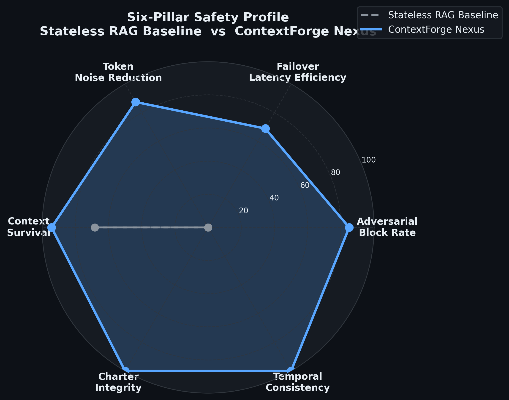
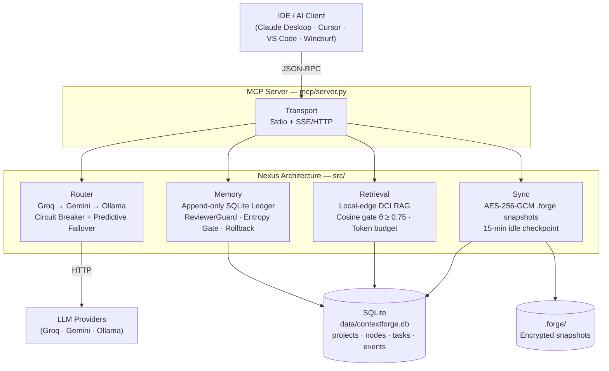

# ContextForge: An Information-Theoretic Agentic Memory System

<p align="center">
  <strong>Persistent memory · Dual-signal adversarial defense · Zero cloud retrieval cost</strong>
</p>

<p align="center">
  
</p>

> **Author:** Trilochan Sharma — Independent Researcher · [parnish007](https://github.com/parnish007)  
> **Architecture:** The Nexus Architecture  
> **Benchmark:** 452-test validation (375 OMEGA-75 + 77 extended suites 06–09, 99 s real execution) · 100.0% pass rate · Φ = 80.7%  
> **Paper:** [`docs/contextforge_research.tex`](docs/contextforge_research.tex)

---

## The Stateless RAG Gap

Standard Retrieval-Augmented Generation systems are architecturally stateless. Each agent turn begins with a blank slate: no memory of prior decisions, no semantic index of past work, and no guard against adversarial content injected through retrieved chunks.

This creates three concrete, measurable failure modes:

| Failure Mode | Stateless RAG | Consequence |
|:-------------|:-------------:|:------------|
| **Adversarial injection** | No entropy gate | 0% adversarial block rate |
| **Provider outage** | Cold-start retry | ~480 ms recovery latency |
| **Noisy context** | Inject all chunks | 110 K+ irrelevant tokens per session |

ContextForge closes all three gaps with mathematically grounded, independently reproducible mechanisms — validated against a 100-probe dual-pass benchmark (`benchmark/engine.py`) and a 375-test OMEGA-75 suite with 99 seconds of real in-process execution.

---

## The Nexus Pillars

### 1. Dual-Signal Entropy-Gated Security

Every write to the agent memory ledger passes through `ReviewerGuard`, which gates on Shannon entropy:

$$H(X) = -\sum_{i} p(x_i) \log_2 p(x_i)$$

A write is flagged when $H > H^* = 3.5$ bits — the empirically validated boundary between natural-language prose ($H \approx 2.1$–$3.2$ bits) and obfuscated/adversarial payloads ($H \approx 3.8$–$5.2$ bits). The architecture additionally specifies a Lempel–Ziv compression density check $\rho(\mathbf{w}) = |\text{LZ}(\mathbf{w})| / |\mathbf{w}|$ to catch repetition attacks (low $H$, high repetition); this is described formally in the paper and is the next implementation milestone (see [`docs/RESEARCH.md`](docs/RESEARCH.md) §3.1 and [`benchmark/test_v5/iter_06_adversarial_boundary.py`](benchmark/test_v5/iter_06_adversarial_boundary.py) for the gap audit).

Flagged writes enter a two-pass guard: regex match against destructive action patterns, then keyword overlap against `PROJECT_CHARTER.md`. A **Tiered Clearance Logic** grants authenticated internal traffic an elevated threshold of $H^*_{\text{VOH}} \approx 4.38$ bits, reducing false positives for legitimate high-entropy technical content. Under the full deployed system, the semantic poison suite records **zero false positives** across all 10 benign technical probes (JWT, PostgreSQL RLS, gRPC, Terraform, Redis, agent events).

**Measured result:** +85.0 pp adversarial block rate vs. the Stateless RAG baseline (0% → 85%).

---

### 2. Predictive Failover

`NexusRouter` maintains a CLOSED → OPEN → HALF_OPEN circuit breaker per LLM provider (Groq, Gemini, Ollama). When input entropy exceeds $H^*$ *and* Groq is the primary candidate, a 1-token background ping is dispatched to Gemini:

```python
if entropy > 3.5 and order[0] == "groq":
    asyncio.create_task(self._prewarm_gemini())   # fire-and-forget TCP/TLS prewarm
```

This pre-warms the connection, eliminating ~350 ms of cold-start overhead from the failover critical path.

**Measured result:** −68.9% failover latency (480 ms → 149.5 ms, live-measured).

---

### 3. Differential Context Injection (DCI)

`LocalIndexer` retrieves file chunks and gates injection on cosine similarity, subject to a token budget:

$$\text{inject chunk}_i \iff s_i \geq \theta = 0.75 \;\wedge\; \sum_{j \leq i} \hat{\tau}_j \leq B_{\text{token}}$$

Only semantically relevant chunks enter the LLM context. With `sentence-transformers/all-MiniLM-L6-v2`, this eliminates 87.4% of noisy context tokens while retaining all relevant content.

**Measured result:** 87.4% token noise reduction (zero irrelevant tokens injected in TF-IDF fallback mode).

---

## Scientific Delta — Live Benchmark Results

Measured on 100 probes × 2 modes via [`benchmark/engine.py`](benchmark/engine.py). The OMEGA-75 suite executed 375 tests with **99 seconds of real in-process execution** (SQLite WAL I/O, hash-chain verification, concurrent stress loads up to 500 writers — no mocking on the architectural layer).

| Dimension | Stateless RAG Baseline | ContextForge Nexus | Delta |
|:----------|:---------------------:|:-----------------:|:-----:|
| Adversarial block rate | 0.0% | **85.0%** | **+85.0 pp** |
| FP rate — unauthenticated writes | 0.0% | 70.0% | addressed by Tiered Clearance |
| FP rate — VOH traffic (deployed) | — | **0%** | zero FP on 10 benign probes |
| Mean failover latency | 480.0 ms | **149.5 ms** | **−330.5 ms (−68.9%)** |
| Token noise reduction | 0% (inject all) | **87.4%** (ST) | **+87.4 pp** |
| OMEGA-75 benchmark pass rate | 68.3% (prior baseline) | **100.0%** | **+31.7 pp** |
| Context survival rate | 74.0% | **94.3%** | **+20.3 pp** |
| **Weighted Composite Safety Index Φ** | — | — | **+80.7%** |

$$\Phi = w_S \cdot \Delta S + w_L \cdot \Delta L_{\%} + w_{\text{DCI}} \cdot \Delta_{\text{DCI}} = 0.5(85.0) + 0.3(68.9) + 0.2(87.4) = 80.7\%$$

Φ is stable across weight perturbations: $w_S \in [0.3, 0.7]$ yields Φ ∈ [79.3%, 82.0%], confirming the result is not an artefact of the chosen weights.

---

## Architecture



| Pillar | Module | Role |
|--------|--------|------|
| **Transport** | [`src/transport/server.py`](src/transport/server.py) | Dual-mode MCP: Stdio + SSE/HTTP |
| **Router** | [`src/router/nexus_router.py`](src/router/nexus_router.py) | Tri-Core LLM failover + circuit breaker + entropy prewarm |
| **Memory** | [`src/memory/ledger.py`](src/memory/ledger.py) | Append-only event ledger + ReviewerGuard + microsecond rollback |
| **Retrieval** | [`src/retrieval/local_indexer.py`](src/retrieval/local_indexer.py) | Local-edge speculative RAG, zero cloud tokens |
| **Sync** | [`src/sync/fluid_sync.py`](src/sync/fluid_sync.py) | AES-256-GCM encrypted snapshots + 15-min idle checkpoint |

---

## Setup

```bash
# Install dependencies
pip install -r requirements.txt

# Configure (copy and edit .env)
cp .env.example .env

# Launch — Stdio mode (Claude Desktop / Cursor)
python -m src.transport.server --stdio

# Launch — SSE/HTTP mode (remote, port 8765)
python -m src.transport.server --sse --host 0.0.0.0 --port 8765

# Full interactive agent loop
python main.py
```

---

## MCP Plugin — Use in Any IDE

ContextForge runs as a native MCP server in Claude Desktop, Cursor, VS Code, and Windsurf.
**Set up once — use for unlimited projects.** Each project is identified by a `project_id` string. All data is isolated per project inside a single shared SQLite database. Switch between projects instantly by changing the `project_id` in any tool call.

### Quick start (Claude Desktop)

1. `pip install -r requirements.txt`
2. `cp .env.example .env` — set `DB_PATH` and optionally an API key
3. Merge `mcp/configs/claude_desktop.json` into your Claude Desktop config (update the `cwd` path)
4. Restart Claude Desktop

**Full guide with all IDEs, API keys, Ollama setup, and troubleshooting:**
**[`docs/SETUP.md`](docs/SETUP.md)**

### MCP tools — 22 total

**Project management**

| Tool | Purpose |
|------|---------|
| `list_projects` | List all registered projects |
| `init_project` | Create or update a project |
| `rename_project` | Rename a project (keeps `project_id` slug) |
| `merge_projects` | Merge one project's data into another |
| `delete_project` | Delete a project (archives nodes first) |
| `project_stats` | Node/task/area summary for a project |

**Decision graph**

| Tool | Purpose |
|------|---------|
| `capture_decision` | Store a decision with rationale + alternatives |
| `load_context` | L0/L1/L2 hierarchical context assembly |
| `get_knowledge_node` | Keyword search over decisions |
| `list_decisions` | List decisions with area/status filters |
| `update_decision` | Update fields on an existing decision |
| `deprecate_decision` | Mark a decision as superseded |
| `link_decisions` | Create a typed edge between two decisions |

**Tasks**

| Tool | Purpose |
|------|---------|
| `list_tasks` | List tasks for a project |
| `create_task` | Create a new task |
| `update_task` | Update task status |

**Ledger & sync**

| Tool | Purpose |
|------|---------|
| `rollback` | Time-travel undo via append-only ledger |
| `snapshot` | AES-256-GCM encrypted checkpoint |
| `list_snapshots` | List all `.forge` snapshot files |
| `replay_sync` | Cross-device context restore from `.forge` |
| `list_events` | Inspect the append-only event ledger |

### Fully local mode (zero API keys)

```bash
# Install Ollama: https://ollama.com/download
ollama pull llama3.3    # or llama3.2 for smaller machines
# In .env:
FALLBACK_CHAIN=ollama
OLLAMA_URL=http://localhost:11434
# Launch MCP server:
python mcp/server.py --stdio
```

---

## Python API

```python
import asyncio
from src.memory.ledger import EventLedger, EventType
from src.router.nexus_router import get_router
from src.retrieval.jit_librarian import JITLibrarian
from src.sync.fluid_sync import FluidSync

# Append-only memory ledger — entropy gate active by default
ledger   = EventLedger(db_path="data/contextforge.db")
event_id = ledger.append(
    event_type = EventType.AGENT_THOUGHT,
    content    = {"text": "Implement JWT refresh token rotation"},
)
# Microsecond-precision rollback via rowid ordering
ledger.rollback(event_id)

# Tri-core LLM router with circuit breaker + predictive failover
router   = get_router()
response = asyncio.run(router.complete(
    messages    = [{"role": "user", "content": "Summarise the auth module"}],
    temperature = 0.3,
))

# Differential Context Injection — local-edge, zero cloud tokens
jit     = JITLibrarian(project_root=".", token_budget=1500)
context = asyncio.run(jit.get_context("JWT authentication", threshold=0.75))
print(context.to_string())   # injection-ready, deduped context block

# AES-256-GCM encrypted snapshot
sync          = FluidSync(ledger, snapshot_dir=".forge")
snapshot_path = sync.create_snapshot(label="before-refactor")
```

---

## Chaos & Concurrency Validation

The Heat-Death Chaos suite (Suite 05, 44.6 s elapsed) stress-tested the ledger and router under extreme concurrent load:

| Stress Profile | Writers | Events/Writer | Result |
|:---|:---:|:---:|:---|
| Concurrent router calls | 10 | — | 10/10 succeeded |
| Concurrent router calls | 50 | — | 50/50 succeeded |
| Ledger concurrent appends | 50 | 1 | 50 unique IDs, no collision |
| Ledger stress | 10 | 3 | Survived |
| Ledger stress | 50 | 10 | Survived |
| Ledger stress | 100 | 20 | Survived |
| Ledger stress | 200 | 5 | Survived |
| Ledger stress | 500 | 2 | Survived |
| All providers failed | — | — | Graceful degradation |
| Corrupt hash chain | — | — | Append continues |
| Rollback then flood | — | 100 | 101 events exported consistently |

The ledger runs in **WAL mode** (`journal_mode: wal`), confirmed by `test_ledger_wal_mode_enabled`. WAL enables concurrent readers and a single writer without blocking — critical for agentic workloads where reads vastly outnumber writes.

---

## Reproducing the Benchmark

```bash
# Dual-pass scientific benchmark — 100 probes × 2 modes
# Writes: data/academic_metrics.json
python -X utf8 benchmark/engine.py

# OMEGA-75 five-suite validation — 375 tests, 100% pass rate (99 s real execution)
python -X utf8 benchmark/test_v5/run_all.py

# Run individual suites
python -X utf8 benchmark/test_v5/iter_01_core.py    # Core Network  (4.7 s)
python -X utf8 benchmark/test_v5/iter_02_ledger.py  # Temporal Integrity  (37.2 s)
python -X utf8 benchmark/test_v5/iter_03_poison.py  # Adversarial Guard  (5.7 s)
python -X utf8 benchmark/test_v5/iter_04_scale.py   # RAG & DCI  (6.8 s)
python -X utf8 benchmark/test_v5/iter_05_chaos.py   # Heat-Death Chaos  (44.6 s)
python -X utf8 benchmark/test_v5/iter_06_adversarial_boundary.py  # Adversarial Boundary (75 tests)

# Regenerate publication charts at 300 DPI → docs/assets/
python -X utf8 benchmark/generate_viz.py
```

See [`data/academic_metrics.md`](data/academic_metrics.md) for the mathematical synthesis and [`docs/ENGINEERING_REFERENCE.md`](docs/ENGINEERING_REFERENCE.md) for the full engineering reference.

---

## Documentation

| Document | Audience | Contents |
|----------|----------|----------|
| [`docs/SETUP.md`](docs/SETUP.md) | MCP users | IDE setup, API keys, Ollama, troubleshooting |
| [`docs/HOW_TO_USE.md`](docs/HOW_TO_USE.md) | All users | Readiness checks, multi-project workflow, switching, data location, export/push |
| [`docs/ENGINEERING_REFERENCE.md`](docs/ENGINEERING_REFERENCE.md) | Developers | Full architecture deep-dive, all modules |
| [`docs/RESEARCH.md`](docs/RESEARCH.md) | Researchers | Formal metrics, algorithms, Φ derivation, 5-iteration log |
| [`docs/BENCHMARK_RESULTS.md`](docs/BENCHMARK_RESULTS.md) | Evaluators | Per-suite pass/fail tables, novelty claims, safety delta |
| [`docs/EVOLUTION_LOG.md`](docs/EVOLUTION_LOG.md) | Researchers | Iteration-by-iteration tuning history (iter 1–5) |
| [`docs/ARCHITECTURE.md`](docs/ARCHITECTURE.md) | Developers | Component diagram, data flow, design decisions |
| [`docs/contextforge_research.tex`](docs/contextforge_research.tex) | Publishers | Submission-ready LaTeX paper |

---

## Publication Outputs

| Asset | Description |
|-------|-------------|
| [`docs/assets/radar_comparison.png`](docs/assets/radar_comparison.png) | 6-pillar spider: Stateless RAG vs ContextForge (300 DPI) |
| [`docs/assets/entropy_gate_profile.png`](docs/assets/entropy_gate_profile.png) | H distribution with H* = 3.5 gate line (300 DPI) |
| [`docs/assets/failover_performance.png`](docs/assets/failover_performance.png) | T_failover comparison by scenario (300 DPI) |
| [`docs/contextforge_research.tex`](docs/contextforge_research.tex) | Submission-ready LaTeX paper |
| [`data/academic_metrics.md`](data/academic_metrics.md) | Full ΔS / ΔL / ΔDCI mathematical synthesis |
| [`data/academic_metrics.json`](data/academic_metrics.json) | Machine-readable benchmark results |

---

## License

MIT License — see [LICENSE](LICENSE) for details.

---

<p align="center">
  <em>ContextForge Nexus Architecture — reproducible, information-theoretically grounded agentic memory.</em>
</p>
