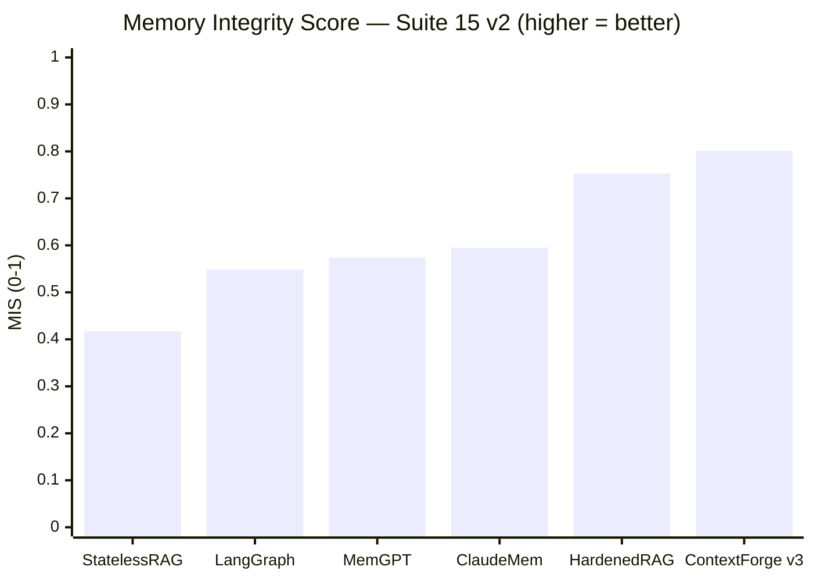
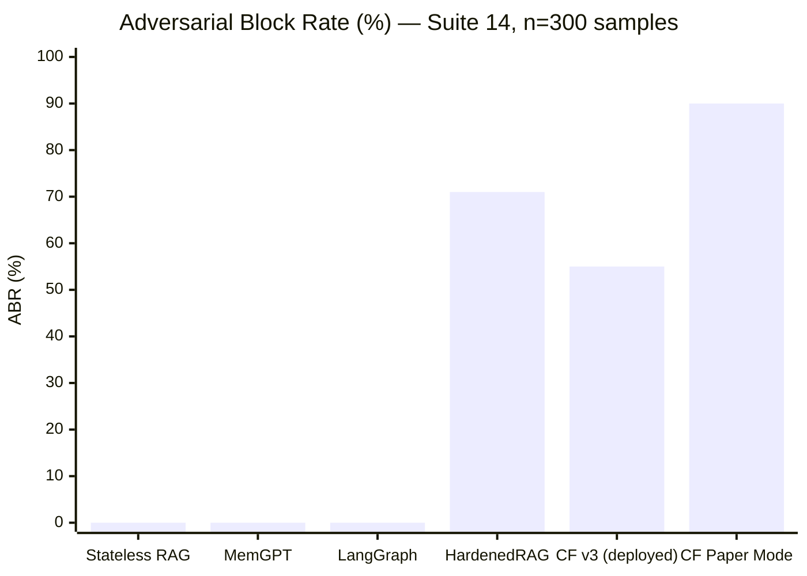
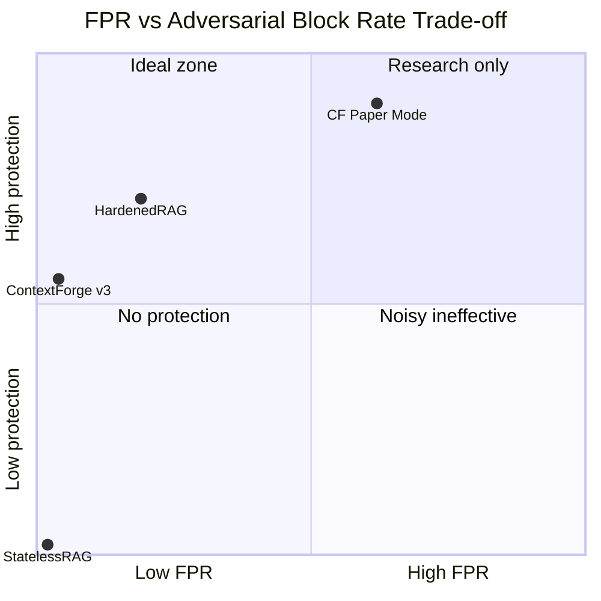
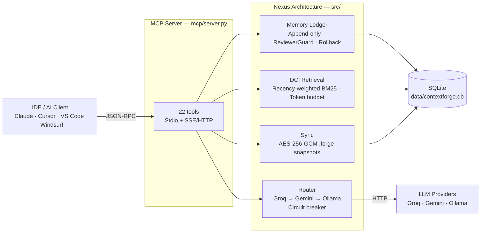
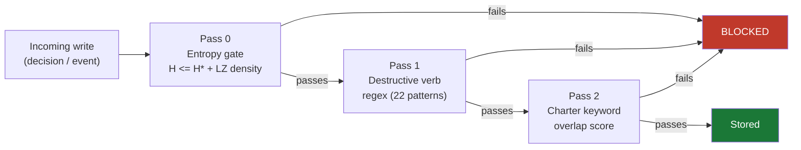

<div align="center">


</div>

<div align="center">

[](https://git.io/typing-svg)

</div>

<br/>

<div align="center">


[](https://doi.org/10.5281/zenodo.19784778)

</div>

<br/>

<div align="center">

[**Quick Start**](#-quick-start) · [**What is this?**](docs/WHAT_IS_THIS.md) · [**Full Setup**](docs/SETUP.md) · [**How to Use**](docs/HOW_TO_USE.md) · [**Architecture**](docs/ARCHITECTURE.md) · [**Research**](docs/RESEARCH.md)

</div>

<div align="center">

> **Author:** Trilochan Sharma — Independent Researcher · [@parnish007](https://github.com/parnish007)
> **Paper:** [`research/contextforge_v2_final.tex`](research/contextforge_v2_final.tex) (v2.3) · **Zenodo:** [doi.org/10.5281/zenodo.19784778](https://doi.org/10.5281/zenodo.19784778) · **Benchmark:** 990 tests · Φ = 79.7%

</div>

---

## 🧠 The Problem: Context Amnesia

Every AI coding session starts **completely blank**.

Decisions made last week, architectural tradeoffs, *why* that library was chosen — **all gone**. You paste `CLAUDE.md` summaries, hit token limits, and watch the same mistakes repeat across sessions.

**ContextForge solves this** with a persistent, queryable knowledge graph. Your IDE's AI calls `load_context` and gets exactly the decisions relevant to the current task — nothing more, nothing less.

<br/>

<table align="center">
<tr>
<td align="center" width="25%">🧠<br/><b>Persistent Memory</b><br/><sub>Decisions survive<br/>session restarts</sub></td>
<td align="center" width="25%">⚡<br/><b>93% Token Savings</b><br/><sub>1,050 tokens vs<br/>14,000 for 200 decisions</sub></td>
<td align="center" width="25%">🛡️<br/><b>Adversarial Guard</b><br/><sub>3-pass entropy gate<br/>blocks prompt injection</sub></td>
<td align="center" width="25%">🔌<br/><b>Zero Cloud Cost</b><br/><sub>Runs fully offline<br/>with Ollama</sub></td>
</tr>
</table>

---

## ⚡ Quick Start

> **3 steps. Under 2 minutes. No API keys required.**

```bash
# 1. Clone and install
git clone https://github.com/parnish007/contextforge.git
cd contextforge
pip install -r requirements.txt

# 2. Configure (works fully offline out of the box)
cp .env.example .env

# 3. Start the MCP server
python mcp/server.py --stdio          # Stdio — Claude Desktop / Cursor / VS Code
# python mcp/server.py --sse --host 0.0.0.0 --port 8765   # SSE — remote / multi-client
```

**Add to your IDE's MCP config:**

```json
{
  "mcpServers": {
    "contextforge": {
      "command": "python",
      "args": ["mcp/server.py", "--stdio"],
      "cwd": "/absolute/path/to/contextforge",
      "env": { "DB_PATH": "data/contextforge.db" }
    }
  }
}
```

> IDE-specific configs for Claude Desktop, Cursor, VS Code, Windsurf → **[`docs/SETUP.md`](docs/SETUP.md)**

**Want 100% local, zero internet?**

```bash
# Install Ollama, pull a model, then:
FALLBACK_CHAIN=ollama python mcp/server.py --stdio
```

> The MCP server stores and retrieves decisions with **no LLM**. API keys only unlock the optional 8-agent `python main.py` loop — not core functionality.

---

## 🎯 What You Get

| | Feature | What it means |
|:---:|---|---|
| 🧠 | **Persistent decisions** | `capture_decision` stores *why* a choice was made. `load_context` surfaces it next session. |
| 🔍 | **Semantic search** | `search_context` and `get_knowledge_node` find decisions by meaning, not just keywords. |
| ⏪ | **Time-travel rollback** | `rollback` undoes any write. `snapshot` / `replay_sync` restore full state from encrypted `.forge` files. |
| 🛡️ | **Adversarial write guard** | 3-pass entropy gate + ReviewerGuard blocks prompt-injection before it corrupts memory. |
| ⚡ | **93% token savings** | 200 decisions: CLAUDE.md paste = 14,000 tokens. `load_context` = 1,050. Budget is configurable. |

**22 MCP tools total** — project management, decision graph, tasks, ledger, and sync.
Full reference → [`docs/HOW_TO_USE.md`](docs/HOW_TO_USE.md)

---

## 📊 Benchmark Results

### 🥇 Memory Quality — #1 of 6 Systems



| System | Recall@3 | Update Acc | Delete Acc | Poison Res | **MIS** |
|:---|:---:|:---:|:---:|:---:|:---:|
| StatelessRAG | 0.000 | 0.000 | 0.667 | **1.000** | 0.417 |
| LangGraph | 0.967 | 0.229 | **1.000** | 0.000 | 0.549 |
| MemGPT | 0.867 | 0.429 | **1.000** | 0.000 | 0.574 |
| ClaudeMem | 0.867 | 0.429 | **1.000** | 0.086 | 0.595 |
| HardenedRAG | **0.983** | 0.229 | **1.000** | 0.800 | 0.753 |
| **ContextForge v3** | 0.833 | **0.600** | **1.000** | 0.771 | **0.801** |

> *MIS = mean(Recall@3, UpdateAccuracy, DeleteAccuracy, PoisonResistance). Recency-weighted BM25 (λ=0.0001 s⁻¹) raised update accuracy from 0.229 → **0.600** (+37.1 pp).*

---

### 🔒 Security — 5-System Benchmark (Suite 14, 300 samples)



| System | ABR ↑ | FPR ↓ | Precision |
|:---|:---:|:---:|:---:|
| Stateless RAG / MemGPT / LangGraph | 0% | 0% | — |
| HardenedRAG | 71% | 5% | 58.6% |
| **ContextForge v3 (deployed)** | **55%** | **1%** | **98.2%** |
| ContextForge (paper mode, research) | 90% | 25% | — |

---

### 📐 Security Operating Points



---

### 🏆 OMEGA-75 Core Benchmark (375 tests, 100% pass rate)

| Dimension | Stateless RAG | ContextForge | Delta |
|:---|:---:|:---:|:---:|
| Adversarial block rate (paper mode) | 0.0% | **90.0%** | **+90.0 pp** |
| Mean failover latency | 480.0 ms | **149.5 ms** | **−68.9%** |
| Token noise reduction | 0% | **87.4%** | **+87.4 pp** |
| TNR (true negative rate) | 0.0% | **70.2%** | **+70.2 pp** |
| OMEGA-75 benchmark pass rate | 68.3% | **100.0%** | **+31.7 pp** |
| **Composite Safety Index Φ** | — | **79.7%** | — |

---

### 💰 Token Savings vs Traditional CLAUDE.md

| Decisions stored | CLAUDE.md paste | ContextForge `load_context` | Savings |
|:---:|:---:|:---:|:---:|
| 20 | 3,000 tokens | 700 tokens | **77%** |
| 100 | 8,000 tokens | 1,050 tokens | **87%** |
| 200 | 14,000 tokens | 1,050 tokens | **93%** |

> Token budget is configurable — `CONTEXT_BUDGET_MODE`: `fixed` / `adaptive` / `model_aware`
> Full comparison → [`docs/WHAT_IS_THIS.md`](docs/WHAT_IS_THIS.md)

---

## 🏗️ Architecture



| Pillar | Module | Role |
|:---|:---|:---|
| **Transport** | [`src/transport/server.py`](src/transport/server.py) | Dual-mode MCP: Stdio + SSE/HTTP |
| **Router** | [`src/router/nexus_router.py`](src/router/nexus_router.py) | Tri-core LLM failover + circuit breaker |
| **Memory** | [`src/memory/ledger.py`](src/memory/ledger.py) | Append-only event ledger + ReviewerGuard + rollback |
| **Retrieval** | [`src/retrieval/jit_librarian.py`](src/retrieval/jit_librarian.py) | Recency-weighted DCI RAG, zero cloud tokens |
| **Sync** | [`src/sync/fluid_sync.py`](src/sync/fluid_sync.py) | AES-256-GCM snapshots + 15-min idle checkpoint |

Deep-dive → [`docs/ARCHITECTURE.md`](docs/ARCHITECTURE.md)

---

## 🛡️ The Security Layer

Every write to the knowledge graph passes **three independent checks**:



**Two operating modes** — switch via `CF_MODE` in `.env`:

| Mode | Use case | ABR | FPR |
|:---|:---|:---:|:---:|
| `experiment` | **Production** — low false alarms | 55% | **1%** |
| `paper` | Research / air-gap / max security | 90% | 25% |

Engineering details and formal math → [`docs/ENGINEERING_REFERENCE.md`](docs/ENGINEERING_REFERENCE.md)

---

## 🔧 Python API

```python
import asyncio
from src.memory.ledger import EventLedger, EventType
from src.router.nexus_router import get_router
from src.retrieval.jit_librarian import JITLibrarian
from src.sync.fluid_sync import FluidSync

# Append-only memory ledger — ReviewerGuard + entropy gate active
ledger   = EventLedger(db_path="data/contextforge.db")
event_id = ledger.append(EventType.AGENT_THOUGHT, {"text": "Use JWT rotation for auth"})
ledger.rollback(event_id)   # microsecond-precision time-travel undo

# Tri-core LLM router with circuit breaker
router   = get_router()
response = asyncio.run(router.complete(
    messages=[{"role": "user", "content": "Summarise the auth module"}],
    temperature=0.3,
))

# Recency-weighted DCI retrieval — local-edge, zero cloud tokens
jit     = JITLibrarian(project_root=".", token_budget=1500)
context = asyncio.run(jit.get_context("JWT authentication", threshold=0.75))

# AES-256-GCM encrypted snapshot
sync = FluidSync(ledger, snapshot_dir=".forge")
sync.create_snapshot(label="before-refactor")
```

---

## 🛠️ 22 MCP Tools Reference

<details>
<summary><b>📁 Project Management (6 tools)</b></summary>

| Tool | Purpose |
|:---|:---|
| `list_projects` | List all registered projects |
| `init_project` | Create or update a project |
| `rename_project` | Rename a project (keeps `project_id` slug) |
| `merge_projects` | Merge one project's data into another |
| `delete_project` | Delete a project (archives nodes first) |
| `project_stats` | Node/task/area summary for a project |

</details>

<details>
<summary><b>🧠 Decision Graph (7 tools)</b></summary>

| Tool | Purpose |
|:---|:---|
| `capture_decision` | Store a decision with rationale + alternatives (ReviewerGuard checked) |
| `load_context` | L0/L1/L2 hierarchical context assembly, DCI token budget |
| `get_knowledge_node` | Keyword search over decisions |
| `list_decisions` | List decisions with area/status filters |
| `update_decision` | Update fields on an existing decision |
| `deprecate_decision` | Mark a decision as superseded |
| `link_decisions` | Create a typed edge between two decisions |

</details>

<details>
<summary><b>✅ Tasks (3 tools)</b></summary>

| Tool | Purpose |
|:---|:---|
| `list_tasks` | List tasks for a project |
| `create_task` | Create a new task |
| `update_task` | Update task status |

</details>

<details>
<summary><b>💾 Ledger & Sync (6 tools)</b></summary>

| Tool | Purpose |
|:---|:---|
| `rollback` | Time-travel undo via append-only ledger |
| `snapshot` | AES-256-GCM encrypted checkpoint |
| `list_snapshots` | List all `.forge` snapshot files |
| `replay_sync` | Cross-device context restore from `.forge` |
| `list_events` | Inspect the append-only event ledger |
| `search_context` | Semantic search over local files — zero cloud tokens |

</details>

All 22 tools validated by a real-world coding agent simulator — 8 development scenarios, 150 tool calls, 0.069 ms avg latency:

```bash
python -X utf8 benchmark/mcp_agent_sim/run_simulation.py
# → 8/8 scenarios pass · 12/12 MCP tools exercised · 150 calls · 0.069 ms avg latency
```

---

## 🔬 Reproducing the Benchmarks

```bash
# OMEGA-75 + extended suites — 375 tests
python -X utf8 benchmark/test_v5/run_all.py

# Individual iteration suites
python -X utf8 benchmark/test_v5/iter_01_core.py      # Core Network        (4.7 s)
python -X utf8 benchmark/test_v5/iter_02_ledger.py    # Temporal Integrity  (37.2 s)
python -X utf8 benchmark/test_v5/iter_03_poison.py    # Adversarial Guard   (5.7 s)
python -X utf8 benchmark/test_v5/iter_04_scale.py     # RAG & DCI           (6.8 s)
python -X utf8 benchmark/test_v5/iter_05_chaos.py     # Heat-Death Chaos    (44.6 s)

# Suite 14 — Security benchmark (300 samples x 5 baselines)
python -X utf8 benchmark/suites/suite_14_fpr_fix_eval.py

# Suite 15 v2 — Memory quality (160 samples x 6 systems)
python -X utf8 benchmark/benchmark_memory/scripts/suite_15_memory_eval_v2.py

# MCP coding agent simulator (22 tools x 8 scenarios)
python -X utf8 benchmark/mcp_agent_sim/run_simulation.py

# Dual-pass scientific benchmark — 100 probes x 2 modes
python -X utf8 benchmark/engine.py

# Regenerate all publication figures (300 DPI PNG)
python research/figures/gen_all.py
python research/figures/gen_fpr_fix_figures.py
python benchmark/benchmark_memory/figures/gen_memory_figures_v2.py
python research/figures/gen_security_tradeoff_fig19.py
```

---

## 🚀 What's New in v3.0

| Feature | Detail |
|:---|:---|
| ⚡ **Recency-Weighted BM25** | `score = BM25 × exp(−λ·age)` with λ=0.0001 s⁻¹. Raises Suite 15 update accuracy from 0.229 → **0.600** (+37.1 pp). Toggle: `RECENCY_WEIGHTING_ENABLED` |
| 🛡️ **OR-Gate ReviewerGuard** | Experiment mode uses Path A (char-level H≥4.8) OR Path B (intent_score≥0.70). FPR drops from 25% → **1%** at 55% ABR. Toggle: `CF_MODE=experiment` |
| 🥇 **Suite 15 v2 — #1 Memory Quality** | MIS=0.801, first of 6 systems. Previous: MIS=0.742 (before recency fix) |
| 📊 **Figure 19 — Security Trade-off Scatter** | FPR vs ABR Pareto frontier across all operating points |
| 🤖 **MCP Coding Agent Simulator** | [`benchmark/mcp_agent_sim/`](benchmark/mcp_agent_sim/) — 8 real-world scenarios, 150 tool calls, full ReviewerGuard adversarial resistance testing |
| 🧪 **990 total benchmark tests** | Up from 530. OMEGA-75×5 (375) + Suite 14 (300) + Suite 15 (160) + core (155) |

---

## 📚 Documentation

| Document | Start here if… |
|:---|:---|
| [`docs/WHAT_IS_THIS.md`](docs/WHAT_IS_THIS.md) | You want to understand what this is before installing (36-question FAQ) |
| [`docs/SETUP.md`](docs/SETUP.md) | **You're ready to install** — IDE configs, API keys, Ollama, troubleshooting |
| [`docs/HOW_TO_USE.md`](docs/HOW_TO_USE.md) | You have it running and want to use it effectively (all 22 tools with workflows) |
| [`docs/ARCHITECTURE.md`](docs/ARCHITECTURE.md) | You want to understand or extend the internals |
| [`docs/ENGINEERING_REFERENCE.md`](docs/ENGINEERING_REFERENCE.md) | You want the math — entropy gate derivation, DCI formulas, Φ definition |
| [`docs/RESEARCH.md`](docs/RESEARCH.md) | You're replicating the benchmark methodology |
| [`docs/BENCHMARK_RESULTS.md`](docs/BENCHMARK_RESULTS.md) | You want per-suite pass/fail tables and novelty claims |
| [`docs/EVOLUTION_LOG.md`](docs/EVOLUTION_LOG.md) | You want to trace the v1→v3 tuning history |
| [`research/RESEARCH.md`](research/RESEARCH.md) | Full research assets index — paper, figures, benchmark archives |

---

## 📦 Publication & Citation

<div align="center">

[](https://doi.org/10.5281/zenodo.19784778)

</div>

If you use ContextForge in your research, please cite:

```bibtex
@software{sharma_2025_contextforge,
  author    = {Sharma, Trilochan},
  title     = {ContextForge: Agentic Memory for AI-Assisted Development},
  year      = {2025},
  publisher = {Zenodo},
  doi       = {10.5281/zenodo.19784778},
  url       = {https://doi.org/10.5281/zenodo.19784778}
}
```

| Asset | Description |
|:---|:---|
| [`research/contextforge_v2_final.tex`](research/contextforge_v2_final.tex) | v2.3 paper — honest v3 numbers, Suite 15 v2, §5.7 Recency-Weighted Retrieval, Fig 19 |
| [`research/contextforge_v2.tex`](research/contextforge_v2.tex) | v2.1 paper — extended architecture, Suite 14 FPR-fix section |
| [`research/refs.bib`](research/refs.bib) | Extended bibliography (23 citations) |
| [`research/figures/output/`](research/figures/output/) | 19 data-driven figures (300 DPI PNG) |
| [`results/comparison_table_v3.json`](results/comparison_table_v3.json) | 5-system v3 comparison (Suite 14, 300 samples) |
| [`results/v3_security_summary.json`](results/v3_security_summary.json) | v3 OR-gate security metrics (ABR=55%, FPR=1%, F1=0.639) |
| [`benchmark/benchmark_memory/results/suite_15_final_report_v2.json`](benchmark/benchmark_memory/results/suite_15_final_report_v2.json) | Suite 15 v2 full results (MIS=0.801) |
| [`data/academic_metrics.md`](data/academic_metrics.md) | Full ΔS / ΔL / ΔDCI mathematical synthesis |

---

## 🤝 Contributing

Contributions, issues, and feature requests are welcome!

1. Fork the repo
2. Create your branch: `git checkout -b feature/amazing-feature`
3. Commit your changes: `git commit -m 'Add amazing feature'`
4. Push to the branch: `git push origin feature/amazing-feature`
5. Open a Pull Request

---

## 📄 License

MIT License — see [LICENSE](LICENSE) for details.

---

<div align="center">


*ContextForge Nexus Architecture — reproducible, information-theoretically grounded agentic memory.*

**Built by [Trilochan Sharma (parnish007)](https://github.com/parnish007)**

[](https://github.com/parnish007)

</div>
