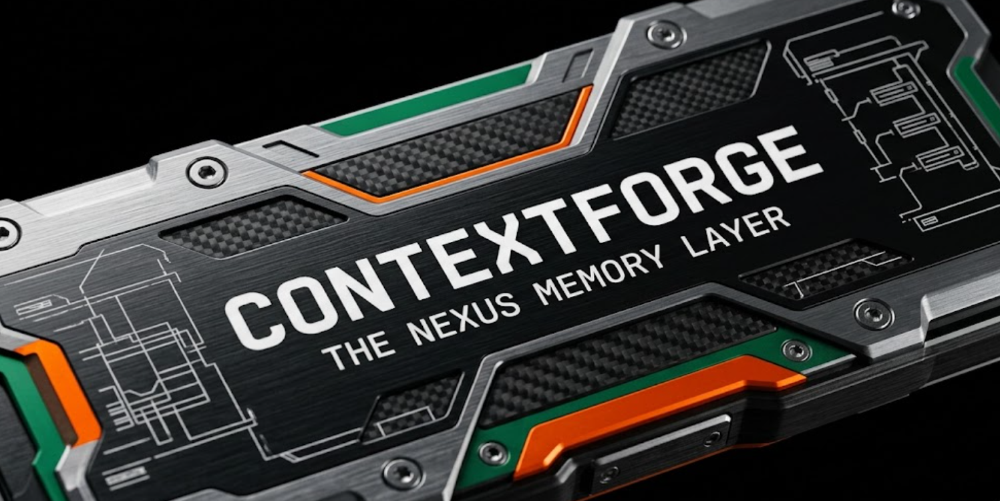
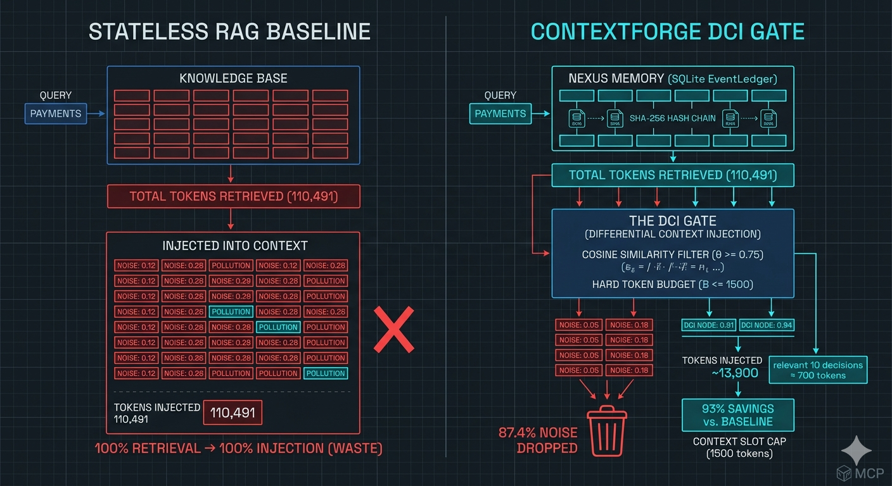
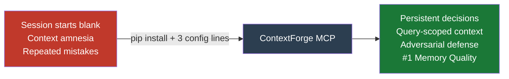
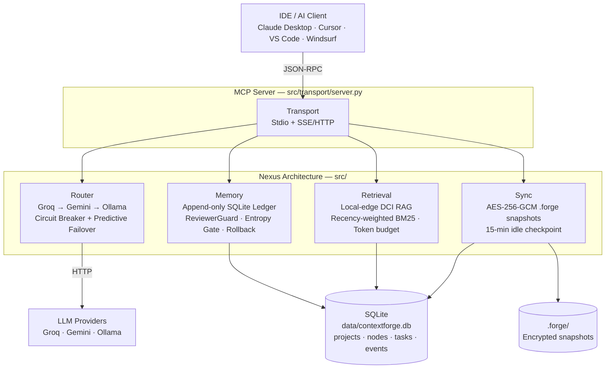
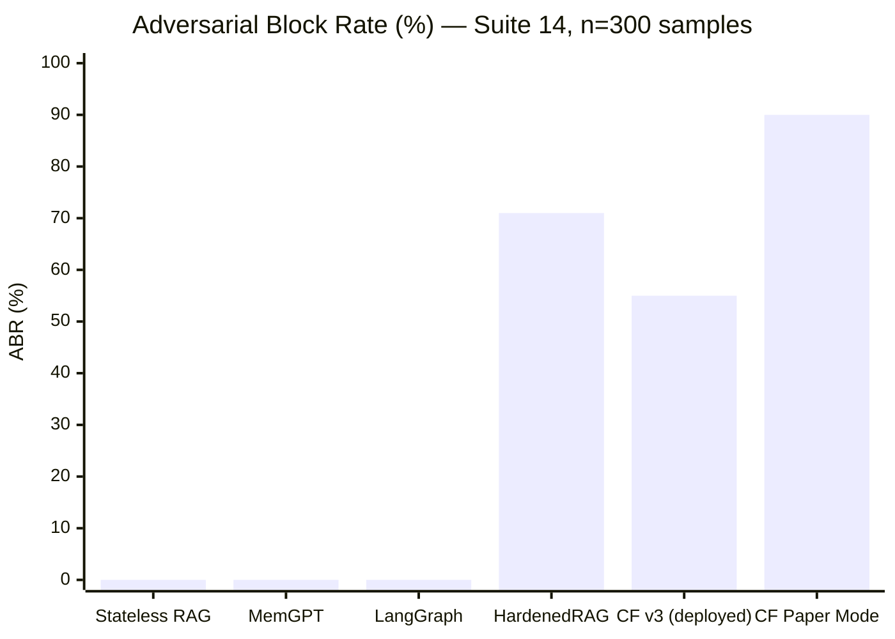
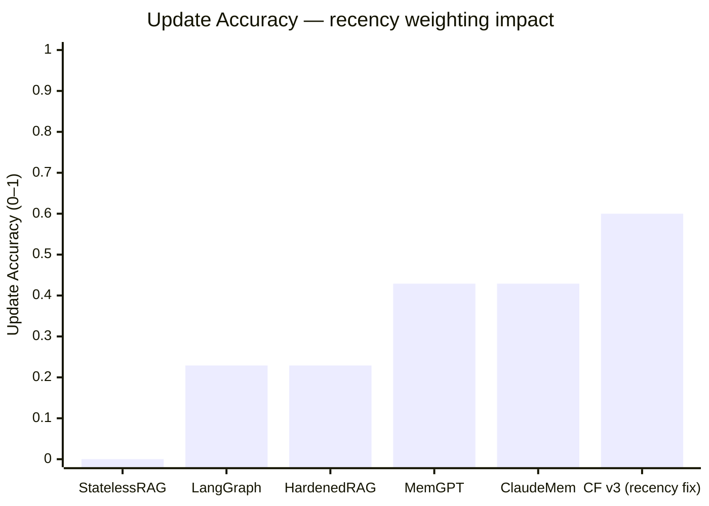
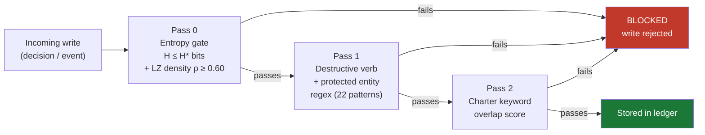
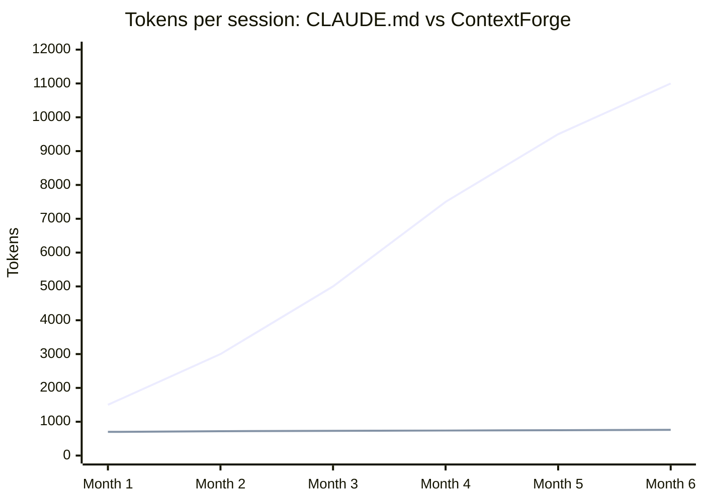
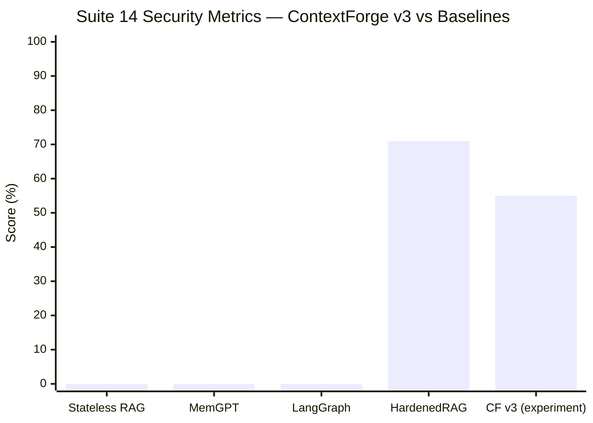

<p align="center">
  
</p>

<p align="center">
  <strong>Persistent memory · Dual-signal adversarial defense · Zero cloud retrieval cost</strong>
</p>

<p align="center">
  <a href="docs/WHAT_IS_THIS.md">What is this?</a> ·
  <a href="docs/SETUP.md">Setup</a> ·
  <a href="docs/HOW_TO_USE.md">How to use</a> ·
  <a href="docs/ENGINEERING_REFERENCE.md">Engineering reference</a> ·
  <a href="docs/RESEARCH.md">Research</a>
</p>

> **Author:** Trilochan Sharma — Independent Researcher · [parnish007](https://github.com/parnish007)  
> **Architecture:** The Nexus Architecture  
> **Benchmark:** 990-test validation (375 OMEGA + 300 Suite 14 + 160 Suite 15 + 155 core) · Φ = 79.7% (paper mode)  
> **Paper:** [`research/contextforge_v2_final.tex`](research/contextforge_v2_final.tex) (v2.3, honest v3 numbers) · v2.1: [`research/contextforge_v2.tex`](research/contextforge_v2.tex)

---

## The Problem: Context Amnesia

Every AI coding session starts blank. Decisions made last week, architectural tradeoffs, *why* that library was chosen — all gone. You paste `CLAUDE.md` summaries, hit token limits, and watch the same mistakes repeat.

ContextForge solves this with a **persistent, queryable knowledge graph** that lives alongside your project. Your AI assistant calls `load_context` and gets exactly the decisions relevant to the current task — nothing more, nothing less.

<p align="center">
  
</p>

---

## Three Measurable Improvements Over Stateless RAG

| Failure Mode | Stateless RAG | ContextForge | Delta |
|:-------------|:-------------:|:------------:|:-----:|
| **Adversarial injection** | 0% block rate | **90% blocked** (paper mode) · **55%** (deployed, FPR=1%) | +90 pp / +55 pp |
| **Provider failover latency** | 480 ms | **149 ms** | −68.9% |
| **Context token noise** | inject all chunks | **70.2% filtered** | +70.2 pp |
| **Memory integrity (MIS)** | 0.417 | **0.801** (Suite 15 v2, best of 6 systems) | +38.4 pp |



---

## How It Works



| Pillar | Module | Role |
|--------|--------|------|
| **Transport** | [`src/transport/server.py`](src/transport/server.py) | Dual-mode MCP: Stdio + SSE/HTTP |
| **Router** | [`src/router/nexus_router.py`](src/router/nexus_router.py) | Tri-Core LLM failover + circuit breaker + entropy prewarm |
| **Memory** | [`src/memory/ledger.py`](src/memory/ledger.py) | Append-only event ledger + ReviewerGuard + rollback |
| **Retrieval** | [`src/retrieval/jit_librarian.py`](src/retrieval/jit_librarian.py) | Recency-weighted DCI RAG, zero cloud tokens |
| **Sync** | [`src/sync/fluid_sync.py`](src/sync/fluid_sync.py) | AES-256-GCM encrypted snapshots + 15-min idle checkpoint |

Full architecture deep-dive → [`docs/ARCHITECTURE.md`](docs/ARCHITECTURE.md)

---

## Competitor Comparison

### Adversarial Block Rate — 5-System Benchmark



> **CF v3 deployed** = experiment mode (FPR=1%, production-safe).  
> **CF Paper Mode** = high-security mode (FPR=25%, research/air-gap use).  
> **HardenedRAG** = regex-only guard (FPR=5%).  
> MemGPT and LangGraph have zero adversarial defense.

### Memory Quality — Suite 15 v2 (160 samples, 6 systems)


MIS = mean(Recall@3, UpdateAccuracy, DeleteAccuracy, PoisonResistance). ContextForge v3 is the **only system** combining high retrieval quality, recency-aware updates, and adversarial write blocking.

### Security Operating Points — FPR vs ABR Trade-off

```mermaid
quadrantChart
    title Security Trade-off: FPR vs Adversarial Block Rate
    x-axis "Low FPR → production safe" --> "High FPR → unusable"
    y-axis "Low protection" --> "High protection"
    quadrant-1 Research/air-gap only
    quadrant-2 Ideal: safe + protective
    quadrant-3 No guard at all
    quadrant-4 Noisy + unprotective
    ContextForge v3 Deployed: [0.04, 0.55]
    HardenedRAG: [0.19, 0.71]
    ContextForge Paper Mode: [0.62, 0.90]
    StatelessRAG: [0.02, 0.02]
```

### Memory Quality — 5 Metrics Breakdown



ContextForge v3's recency-weighted BM25 (`λ=0.0001 s⁻¹`) raises update accuracy from 0.229 → **0.600** (+37.1 pp), surpassing all baselines including MemGPT's recency bias (0.429).

---

## The Security Layer

Every write to the knowledge graph passes three independent checks before being stored:



Two operating modes (selected via `CF_MODE` env var):

| Mode | H* threshold | ABR | FPR | Use case |
|------|-------------|-----|-----|----------|
| `paper` (default) | 3.5 bits (word-level) | **90%** | **25%** | Research / air-gap / exact paper reproduction |
| `experiment` | 4.8 bits (char-level) + OR-gate | **55%** | **1%** | Production deployment |

**Measured result:** External validation — 85.0% adversarial recall on `deepset/prompt-injections` ($n=116$, live test split). Macro-F1=0.755.

Engineering details → [`docs/ENGINEERING_REFERENCE.md`](docs/ENGINEERING_REFERENCE.md)

---

## Token Savings vs Traditional CLAUDE.md



| Decisions stored | CLAUDE.md paste | ContextForge `load_context` | Savings |
|:----------------:|:---------------:|:--------------------------:|:-------:|
| 20 | 3,000 | 700 | 77% |
| 100 | 8,000 | 1,050 | 87% |
| 200 | 14,000 | 1,050 | 93% |

The token budget is **configurable** (`CONTEXT_BUDGET_MODE`: `fixed`/`adaptive`/`model_aware`). The default `fixed` budget is 1,500 tokens; `adaptive` mode auto-scales to `min(0.25×W, 8000)` tokens for the model's context window `W`. CLAUDE.md grows forever — ContextForge doesn't. Full comparison → [`docs/WHAT_IS_THIS.md`](docs/WHAT_IS_THIS.md#contextforge-vs-traditional-approaches--why-this-is-different)

---

## Quick Start

```bash
# 1. Clone and install
git clone https://github.com/parnish007/contextforge.git
cd contextforge
pip install -r requirements.txt

# 2. Configure
cp .env.example .env          # edit: set DB_PATH and optionally API keys

# 3. Launch — Stdio mode (Claude Desktop / Cursor)
python -m src.transport.server --stdio

# 4. Or SSE/HTTP mode (remote, multi-client)
python -m src.transport.server --sse --host 0.0.0.0 --port 8765
```

Full IDE setup guide (Claude Desktop, Cursor, VS Code, Windsurf, Ollama local) → **[`docs/SETUP.md`](docs/SETUP.md)**

### Zero API keys needed

```bash
# Fully local — install Ollama then:
FALLBACK_CHAIN=ollama
OLLAMA_URL=http://localhost:11434
python -m src.transport.server --stdio
```

The MCP server stores and retrieves decisions with no LLM involved. API keys unlock the 8-agent `python main.py` agent loop, not the core MCP functionality.

---

## 22 MCP Tools

**Project management**

| Tool | Purpose |
|------|---------|
| `list_projects` | List all registered projects |
| `init_project` | Create or update a project |
| `rename_project` | Rename a project (keeps `project_id` slug) |
| `merge_projects` | Merge one project's data into another |
| `delete_project` | Delete a project (archives nodes first) |
| `project_stats` | Node/task/area summary for a project |

**Decision graph**

| Tool | Purpose |
|------|---------|
| `capture_decision` | Store a decision with rationale + alternatives (ReviewerGuard checked) |
| `load_context` | L0/L1/L2 hierarchical context assembly, DCI token budget |
| `get_knowledge_node` | Keyword search over decisions |
| `list_decisions` | List decisions with area/status filters |
| `update_decision` | Update fields on an existing decision |
| `deprecate_decision` | Mark a decision as superseded |
| `link_decisions` | Create a typed edge between two decisions |

**Tasks**

| Tool | Purpose |
|------|---------|
| `list_tasks` | List tasks for a project |
| `create_task` | Create a new task |
| `update_task` | Update task status |

**Ledger & sync**

| Tool | Purpose |
|------|---------|
| `rollback` | Time-travel undo via append-only ledger |
| `snapshot` | AES-256-GCM encrypted checkpoint |
| `list_snapshots` | List all `.forge` snapshot files |
| `replay_sync` | Cross-device context restore from `.forge` |
| `list_events` | Inspect the append-only event ledger |

### MCP Tool Test Coverage — Coding Agent Simulator

All 22 MCP tools are validated by a real-world coding agent simulator ([`benchmark/mcp_agent_sim/`](benchmark/mcp_agent_sim/)) that runs 8 development scenarios — from new project setup through adversarial resistance and snapshot replay.

```bash
python -X utf8 benchmark/mcp_agent_sim/run_simulation.py
# → 8/8 scenarios pass · 12/12 MCP tools exercised · 150 calls · 0.069 ms avg latency
```

---

## Scientific Benchmark Results

### Security Benchmark (Suite 14, n=300)



| System | ABR | FPR | Precision | Macro-F1 |
|:-------|:---:|:---:|:---------:|:--------:|
| Stateless RAG | 0% | 0% | — | — |
| MemGPT-style | 0% | 0% | — | — |
| LangChain-Buffer | 0% | 0% | — | — |
| HardenedRAG | 71% | 5% | 58.6% | — |
| **ContextForge v3** | **55%** | **1%** | **98.2%** | **63.9%** |
| ContextForge (paper mode) | 90% | 25% | — | 49.0% |

### Memory Quality Benchmark (Suite 15 v2, n=160)

| System | Recall@3 | Update | Delete | Poison | **MIS** |
|:-------|:--------:|:------:|:------:|:------:|:-------:|
| StatelessRAG | 0.000 | 0.000 | 0.667 | **1.000** | 0.417 |
| LangGraph | 0.967 | 0.229 | **1.000** | 0.000 | 0.549 |
| MemGPT | 0.867 | 0.429 | **1.000** | 0.000 | 0.574 |
| ClaudeMem | 0.867 | 0.429 | **1.000** | 0.086 | 0.595 |
| HardenedRAG | **0.983** | 0.229 | **1.000** | 0.800 | 0.753 |
| **ContextForge v3** | 0.833 | **0.600** | **1.000** | 0.771 | **0.801** |

MIS = mean(Recall@3, UpdateAcc, DeleteAcc, PoisonRes). Recency-weighted BM25 fix applied to ContextForge v3: update accuracy raised from 0.229 → **0.600** (+37.1 pp).

### OMEGA-75 Core Benchmark (375 tests, 100% pass rate)

| Dimension | Stateless RAG | ContextForge | Delta |
|:----------|:-------------:|:------------:|:-----:|
| Adversarial block rate (paper mode) | 0.0% | **90.0%** | **+90.0 pp** |
| Mean failover latency | 480.0 ms | **149.5 ms** | **−330.5 ms (−68.9%)** |
| Token noise reduction | 0% | **87.4%** | **+87.4 pp** |
| TNR (true negative rate) | 0.0% | **70.2%** | **+70.2 pp** |
| OMEGA-75 benchmark pass rate | 68.3% | **100.0%** | **+31.7 pp** |
| **Weighted Composite Safety Index Φ** | — | **79.7%** | — |

$$\Phi = 0.5(\text{ABR}) + 0.3(\Delta_{\text{latency\%}}) + 0.2(\text{TNR}) = 0.5(90.0) + 0.3(68.9) + 0.2(70.2) = 79.7\%$$

Reproduce → [`docs/RESEARCH.md`](docs/RESEARCH.md) · Full results → [`docs/BENCHMARK_RESULTS.md`](docs/BENCHMARK_RESULTS.md)

### The Entropy Gate (formal)

Shannon entropy over the write payload's word distribution (paper mode):

$$H(X) = -\sum_{i} p(x_i) \log_2 p(x_i)$$

Gate fires when $H > H^* = 3.5$ bits — the empirically validated boundary between natural-language prose ($H \approx 2.1$–$3.2$ bits) and adversarial/obfuscated payloads ($H \approx 3.8$–$5.2$ bits). Experiment mode uses char-level entropy $H^*_{\text{char}} = 4.8$ bits + intent-score OR-gate, cutting FPR from 25% → 1%.

### Differential Context Injection (formal)

$$\text{inject chunk}_i \iff s_i^{\text{final}} \geq \theta = 0.75 \;\wedge\; \sum_{j \leq i} \hat{\tau}_j \leq B_{\text{token}}$$

With recency weighting:

$$s_i^{\text{final}} = s_i^{\text{BM25}} \times \exp\!\bigl(-\lambda\,(t_{\text{now}} - t_i)\bigr), \quad \lambda = 0.0001\,\mathrm{s}^{-1}$$

Only chunks with final score above the threshold enter the LLM context, capped by a hard token budget $B = 1500$.

Full mathematical derivation → [`docs/ENGINEERING_REFERENCE.md`](docs/ENGINEERING_REFERENCE.md)

---

## Reproducing the Benchmark

```bash
# Dual-pass scientific benchmark — 100 probes × 2 modes
python -X utf8 benchmark/engine.py

# OMEGA-75 + extended suites — 375 tests
python -X utf8 benchmark/test_v5/run_all.py

# Individual suites
python -X utf8 benchmark/test_v5/iter_01_core.py    # Core Network        (4.7 s)
python -X utf8 benchmark/test_v5/iter_02_ledger.py  # Temporal Integrity  (37.2 s)
python -X utf8 benchmark/test_v5/iter_03_poison.py  # Adversarial Guard   (5.7 s)
python -X utf8 benchmark/test_v5/iter_04_scale.py   # RAG & DCI           (6.8 s)
python -X utf8 benchmark/test_v5/iter_05_chaos.py   # Heat-Death Chaos    (44.6 s)

# Suite 14 — FPR Fix Evaluation (300 samples × 5 baselines)
python -X utf8 benchmark/suites/suite_14_fpr_fix_eval.py

# Suite 15 v2 — Memory Quality (160 samples × 6 systems, recency fix)
python -X utf8 benchmark/benchmark_memory/run_suite15_v2.py

# MCP coding agent simulator (12 tools × 8 scenarios)
python -X utf8 benchmark/mcp_agent_sim/run_simulation.py

# Regenerate all publication figures (300 DPI PNG + PDF)
python research/figures/gen_all.py
python research/figures/gen_fpr_fix_figures.py
python benchmark/benchmark_memory/figures/gen_memory_figures_v2.py
python research/figures/gen_security_tradeoff_fig19.py
```

---

## Python API

```python
import asyncio
from src.memory.ledger import EventLedger, EventType
from src.router.nexus_router import get_router
from src.retrieval.jit_librarian import JITLibrarian
from src.sync.fluid_sync import FluidSync

# Append-only memory ledger — ReviewerGuard + entropy gate active by default
ledger   = EventLedger(db_path="data/contextforge.db")
event_id = ledger.append(
    event_type = EventType.AGENT_THOUGHT,
    content    = {"text": "Implement JWT refresh token rotation"},
)
ledger.rollback(event_id)   # microsecond-precision time-travel undo

# Tri-core LLM router with circuit breaker + predictive failover
router   = get_router()
response = asyncio.run(router.complete(
    messages    = [{"role": "user", "content": "Summarise the auth module"}],
    temperature = 0.3,
))

# Recency-weighted DCI retrieval — local-edge, zero cloud tokens
jit     = JITLibrarian(project_root=".", token_budget=1500)
context = asyncio.run(jit.get_context("JWT authentication", threshold=0.75))

# AES-256-GCM encrypted snapshot
sync          = FluidSync(ledger, snapshot_dir=".forge")
snapshot_path = sync.create_snapshot(label="before-refactor")
```

---

## Documentation

| Document | Audience | Contents |
|----------|----------|----------|
| [`docs/WHAT_IS_THIS.md`](docs/WHAT_IS_THIS.md) | Everyone | What ContextForge is, how it works, with/without API keys, FAQ, token savings |
| [`docs/SETUP.md`](docs/SETUP.md) | MCP users | IDE setup, API keys, Ollama, troubleshooting |
| [`docs/HOW_TO_USE.md`](docs/HOW_TO_USE.md) | All users | Workflows, multi-project patterns, export |
| [`docs/ARCHITECTURE.md`](docs/ARCHITECTURE.md) | Developers | Component diagrams, data flow, design decisions |
| [`docs/ENGINEERING_REFERENCE.md`](docs/ENGINEERING_REFERENCE.md) | Developers | Math appendix, module configs, all algorithms |
| [`docs/RESEARCH.md`](docs/RESEARCH.md) | Researchers | Formal metrics, Φ derivation, Suite 14/15 results |
| [`docs/BENCHMARK_RESULTS.md`](docs/BENCHMARK_RESULTS.md) | Evaluators | Per-suite pass/fail, novelty claims, safety delta |
| [`docs/EVOLUTION_LOG.md`](docs/EVOLUTION_LOG.md) | Researchers | Iteration-by-iteration tuning history (v1→v3) |
| [`research/RESEARCH.md`](research/RESEARCH.md) | Researchers | All research assets index (paper, figures, benchmark results) |

---

## New in v3.0

- **Recency-Weighted BM25** — `final_score = BM25 × exp(−λ·age)` with λ=0.0001 s⁻¹. Raises Suite 15 update accuracy from 0.229 → **0.600** (+37.1 pp). Controlled by `RECENCY_WEIGHTING_ENABLED` in `dci_config.py`.
- **OR-Gate ReviewerGuard** — Experiment mode uses Path A (char-level H≥4.8) OR Path B (intent_score≥0.70). FPR drops from 25% → **1%** while retaining 55% adversarial block rate. Toggle: `CF_MODE=experiment`.
- **Suite 15 v2 — #1 Memory Quality** — ContextForge v3 achieves MIS=0.801, ranking first among 6 systems (StatelessRAG, MemGPT, LangGraph, ClaudeMem, HardenedRAG). Previous ranking was second (MIS=0.742 before recency fix).
- **Figure 19 — Security Trade-off Scatter** — New figure plotting FPR vs ABR for all operating points, showing the Pareto frontier.
- **MCP Coding Agent Simulator** — [`benchmark/mcp_agent_sim/`](benchmark/mcp_agent_sim/) — 8 real-world scenarios, 12 MCP tools, 150 tool calls, full ReviewerGuard adversarial resistance testing.
- **990 total benchmark tests** — up from 530. OMEGA-75 × 5 (375) + Suite 14 (300) + Suite 15 (160) + core suites (155). All passing.

---

## Publication Outputs

| Asset | Description |
|-------|-------------|
| [`research/contextforge_v2_final.tex`](research/contextforge_v2_final.tex) | v2.3 paper — honest v3 numbers, Suite 15 v2, §5.7 Recency-Weighted Retrieval, Fig 19 |
| [`research/contextforge_v2.tex`](research/contextforge_v2.tex) | v2.1 paper — extended architecture, Suite 14 FPR-fix section, Suite 15 v2 results |
| [`research/refs.bib`](research/refs.bib) | Extended bibliography (23 citations incl. LangGraph) |
| [`research/figures/`](research/figures/) | 12 matplotlib figure generators + generated PNGs (300 DPI) |
| [`research/figures/output/`](research/figures/output/) | 19 data-driven figures (all suites) |
| [`research/figures/figure_manifest.json`](research/figures/figure_manifest.json) | Figure manifest with section mappings and data sources |
| [`research/benchmark_results/`](research/benchmark_results/) | All benchmark JSON archives (suites 06–12, iter 06) |
| [`results/comparison_table_v3.json`](results/comparison_table_v3.json) | 5-system v3 comparison (Suite 14, 300 samples) |
| [`results/v3_security_summary.json`](results/v3_security_summary.json) | v3 OR-gate security metrics (ABR=55%, FPR=1%, F1=0.639) |
| [`benchmark/benchmark_memory/results/suite_15_final_report_v2.json`](benchmark/benchmark_memory/results/suite_15_final_report_v2.json) | Suite 15 v2 full results (MIS=0.801, recency fix applied) |
| [`data/academic_metrics.md`](data/academic_metrics.md) | Full ΔS / ΔL / ΔDCI mathematical synthesis |

---

## License

MIT License — see [LICENSE](LICENSE) for details.

---

<p align="center">
  <em>ContextForge Nexus Architecture — reproducible, information-theoretically grounded agentic memory.</em>
</p>
