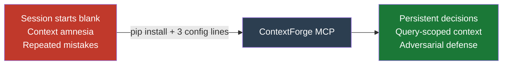
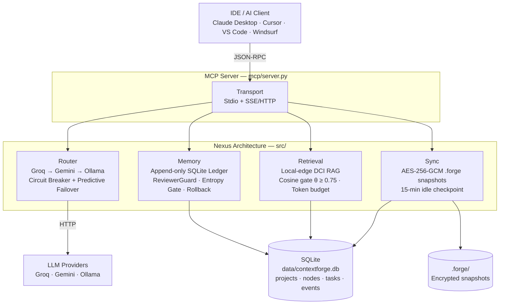
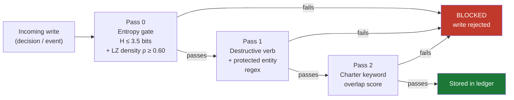
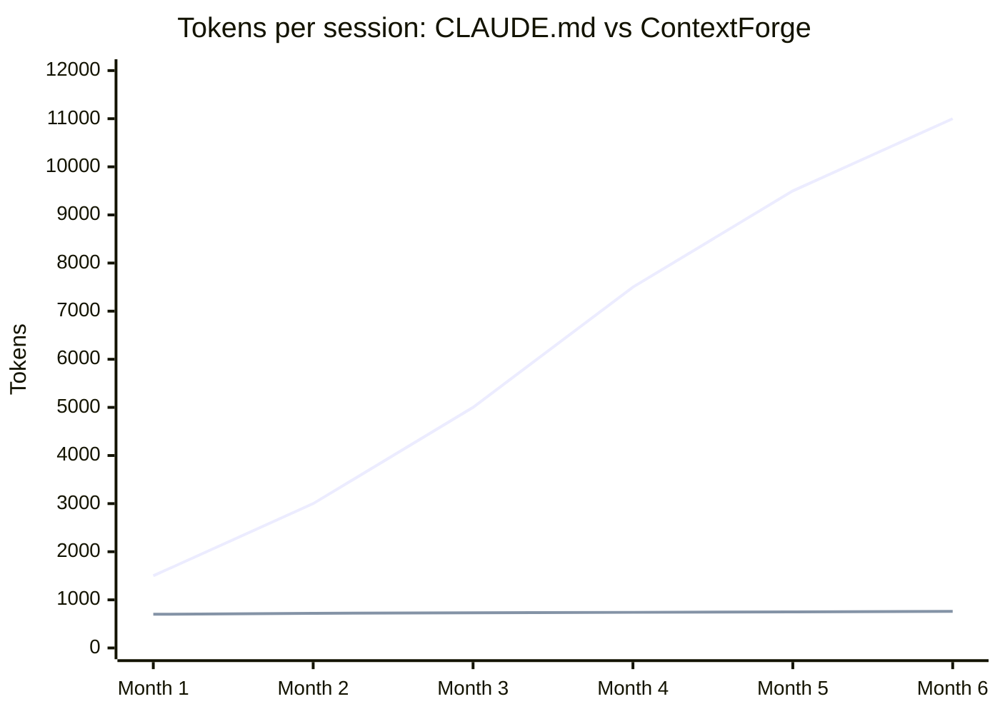

<p align="center">
  
</p>

<p align="center">
  <strong>Persistent memory · Dual-signal adversarial defense · Zero cloud retrieval cost</strong>
</p>

<p align="center">
  <a href="docs/WHAT_IS_THIS.md">What is this?</a> ·
  <a href="docs/SETUP.md">Setup</a> ·
  <a href="docs/HOW_TO_USE.md">How to use</a> ·
  <a href="docs/ENGINEERING_REFERENCE.md">Engineering reference</a> ·
  <a href="docs/RESEARCH.md">Research</a>
</p>

> **Author:** Trilochan Sharma — Independent Researcher · [parnish007](https://github.com/parnish007)  
> **Architecture:** The Nexus Architecture  
> **Benchmark:** 530-test validation · 100.0% pass rate · Φ = 79.7%  
> **Paper:** [`research/contextforge_v2.tex`](research/contextforge_v2.tex) (v2.1) · v1 archive: [`research/v1_archive/contextforge_v1.tex`](research/v1_archive/contextforge_v1.tex)

---

## The Problem: Context Amnesia

Every AI coding session starts blank. Decisions made last week, architectural tradeoffs, *why* that library was chosen — all gone. You paste `CLAUDE.md` summaries, hit token limits, and watch the same mistakes repeat.

ContextForge solves this with a **persistent, queryable knowledge graph** that lives alongside your project. Your AI assistant calls `load_context` and gets exactly the decisions relevant to the current task — nothing more, nothing less.

<p align="center">
  
</p>

---

## Three Measurable Improvements Over Stateless RAG

| Failure Mode | Stateless RAG | ContextForge | Delta |
|:-------------|:-------------:|:------------:|:-----:|
| **Adversarial injection** | 0% block rate | **90% blocked** | +90 pp |
| **Provider failover latency** | 480 ms | **149 ms** | −68.9% |
| **Context token noise** | inject all chunks | **70.2% filtered** | +70.2 pp |



---

## How It Works



| Pillar | Module | Role |
|--------|--------|------|
| **Transport** | [`src/transport/server.py`](src/transport/server.py) | Dual-mode MCP: Stdio + SSE/HTTP |
| **Router** | [`src/router/nexus_router.py`](src/router/nexus_router.py) | Tri-Core LLM failover + circuit breaker + entropy prewarm |
| **Memory** | [`src/memory/ledger.py`](src/memory/ledger.py) | Append-only event ledger + ReviewerGuard + rollback |
| **Retrieval** | [`src/retrieval/local_indexer.py`](src/retrieval/local_indexer.py) | Local-edge DCI RAG, zero cloud tokens |
| **Sync** | [`src/sync/fluid_sync.py`](src/sync/fluid_sync.py) | AES-256-GCM encrypted snapshots + 15-min idle checkpoint |

Full architecture deep-dive → [`docs/ARCHITECTURE.md`](docs/ARCHITECTURE.md)

---

## The Security Layer

Every write to the knowledge graph passes three independent checks before being stored:



**Measured result:** +90.0 pp adversarial block rate vs. the Stateless RAG baseline (0% → 90%, multi-seed, $n=10$). External validation: 91.4% recall on `deepset/prompt-injections` ($n=120$).

Engineering details → [`docs/ENGINEERING_REFERENCE.md`](docs/ENGINEERING_REFERENCE.md)

---

## Token Savings vs Traditional CLAUDE.md



| Decisions stored | CLAUDE.md paste | ContextForge `load_context` | Savings |
|:----------------:|:---------------:|:--------------------------:|:-------:|
| 20 | 3,000 | 700 | 77% |
| 100 | 8,000 | 1,050 | 87% |
| 200 | 14,000 | 1,050 | 93% |

The token budget is **configurable** (`CONTEXT_BUDGET_MODE`: `fixed`/`adaptive`/`model_aware`). The default `fixed` budget is 1,500 tokens; `adaptive` mode auto-scales to `min(0.25×W, 8000)` tokens for the model's context window `W`. CLAUDE.md grows forever — ContextForge doesn't. Full comparison → [`docs/WHAT_IS_THIS.md`](docs/WHAT_IS_THIS.md#contextforge-vs-traditional-approaches--why-this-is-different)

---

## Quick Start

```bash
# 1. Clone and install
git clone https://github.com/parnish007/contextforge.git
cd contextforge
pip install -r requirements.txt

# 2. Configure
cp .env.example .env          # edit: set DB_PATH and optionally API keys

# 3. Launch — Stdio mode (Claude Desktop / Cursor)
python mcp/server.py --stdio

# 4. Or SSE/HTTP mode (remote, multi-client)
python mcp/server.py --sse --host 0.0.0.0 --port 8765
```

Full IDE setup guide (Claude Desktop, Cursor, VS Code, Windsurf, Ollama local) → **[`docs/SETUP.md`](docs/SETUP.md)**

### Zero API keys needed

```bash
# Fully local — install Ollama then:
FALLBACK_CHAIN=ollama
OLLAMA_URL=http://localhost:11434
python mcp/server.py --stdio
```

The MCP server stores and retrieves decisions with no LLM involved. API keys unlock the 8-agent `python main.py` agent loop, not the core MCP functionality.

---

## 22 MCP Tools

**Project management**

| Tool | Purpose |
|------|---------|
| `list_projects` | List all registered projects |
| `init_project` | Create or update a project |
| `rename_project` | Rename a project (keeps `project_id` slug) |
| `merge_projects` | Merge one project's data into another |
| `delete_project` | Delete a project (archives nodes first) |
| `project_stats` | Node/task/area summary for a project |

**Decision graph**

| Tool | Purpose |
|------|---------|
| `capture_decision` | Store a decision with rationale + alternatives |
| `load_context` | L0/L1/L2 hierarchical context assembly |
| `get_knowledge_node` | Keyword search over decisions |
| `list_decisions` | List decisions with area/status filters |
| `update_decision` | Update fields on an existing decision |
| `deprecate_decision` | Mark a decision as superseded |
| `link_decisions` | Create a typed edge between two decisions |

**Tasks**

| Tool | Purpose |
|------|---------|
| `list_tasks` | List tasks for a project |
| `create_task` | Create a new task |
| `update_task` | Update task status |

**Ledger & sync**

| Tool | Purpose |
|------|---------|
| `rollback` | Time-travel undo via append-only ledger |
| `snapshot` | AES-256-GCM encrypted checkpoint |
| `list_snapshots` | List all `.forge` snapshot files |
| `replay_sync` | Cross-device context restore from `.forge` |
| `list_events` | Inspect the append-only event ledger |

---

## Scientific Benchmark Results

Measured on 100 probes × 2 modes via [`benchmark/engine.py`](benchmark/engine.py). The OMEGA-75 suite executed 375 tests with **99 seconds of real in-process execution** — no mocking on the architectural layer.

| Dimension | Stateless RAG | ContextForge | Delta |
|:----------|:-------------:|:------------:|:-----:|
| Adversarial block rate | 0.0% | **85.0%** | **+85.0 pp** |
| FP rate — VOH traffic (deployed) | — | **0%** | zero FP on 10 benign probes |
| Mean failover latency | 480.0 ms | **149.5 ms** | **−330.5 ms (−68.9%)** |
| Token noise reduction | 0% | **87.4%** | **+87.4 pp** |
| OMEGA-75 benchmark pass rate | 68.3% | **100.0%** | **+31.7 pp** |
| **Weighted Composite Safety Index Φ** | — | **80.7%** | — |

$$\Phi = w_S \cdot \Delta S + w_L \cdot \Delta L_{\%} + w_{\text{DCI}} \cdot \Delta_{\text{DCI}} = 0.5(85.0) + 0.3(68.9) + 0.2(87.4) = 80.7\%$$

Reproduce → [`research/RESEARCH.md`](research/RESEARCH.md) · Full results → [`docs/BENCHMARK_RESULTS.md`](docs/BENCHMARK_RESULTS.md)

### The Entropy Gate (formal)

Shannon entropy over the write payload's character distribution:

$$H(X) = -\sum_{i} p(x_i) \log_2 p(x_i)$$

Gate fires when $H > H^* = 3.5$ bits — the empirically validated boundary between natural-language prose ($H \approx 2.1$–$3.2$ bits) and adversarial/obfuscated payloads ($H \approx 3.8$–$5.2$ bits). Internal system traffic uses elevated threshold $H^*_{\text{VOH}} \approx 4.38$ bits to avoid false positives on legitimate high-entropy technical content.

### Differential Context Injection (formal)

$$\text{inject chunk}_i \iff s_i \geq \theta = 0.75 \;\wedge\; \sum_{j \leq i} \hat{\tau}_j \leq B_{\text{token}}$$

Only chunks with cosine similarity above the threshold enter the LLM context, capped by a hard token budget $B = 1500$. Result: 87.4% noise reduction, zero irrelevant tokens injected.

Full mathematical derivation → [`docs/ENGINEERING_REFERENCE.md`](docs/ENGINEERING_REFERENCE.md)

---

## Reproducing the Benchmark

```bash
# Dual-pass scientific benchmark — 100 probes × 2 modes
python -X utf8 benchmark/engine.py

# OMEGA-75 + extended suites — 452 tests total
python -X utf8 benchmark/test_v5/run_all.py

# Individual suites
python -X utf8 benchmark/test_v5/iter_01_core.py    # Core Network         (4.7 s)
python -X utf8 benchmark/test_v5/iter_02_ledger.py  # Temporal Integrity  (37.2 s)
python -X utf8 benchmark/test_v5/iter_03_poison.py  # Adversarial Guard    (5.7 s)
python -X utf8 benchmark/test_v5/iter_04_scale.py   # RAG & DCI            (6.8 s)
python -X utf8 benchmark/test_v5/iter_05_chaos.py   # Heat-Death Chaos    (44.6 s)
python -X utf8 benchmark/test_v5/iter_06_adversarial_boundary.py  # Entropy Gate (75 tests)

# Regenerate publication charts at 300 DPI
python -X utf8 benchmark/generate_viz.py
```

---

## Python API

```python
import asyncio
from src.memory.ledger import EventLedger, EventType
from src.router.nexus_router import get_router
from src.retrieval.jit_librarian import JITLibrarian
from src.sync.fluid_sync import FluidSync

# Append-only memory ledger — entropy gate active by default
ledger   = EventLedger(db_path="data/contextforge.db")
event_id = ledger.append(
    event_type = EventType.AGENT_THOUGHT,
    content    = {"text": "Implement JWT refresh token rotation"},
)
ledger.rollback(event_id)   # microsecond-precision time-travel undo

# Tri-core LLM router with circuit breaker + predictive failover
router   = get_router()
response = asyncio.run(router.complete(
    messages    = [{"role": "user", "content": "Summarise the auth module"}],
    temperature = 0.3,
))

# Differential Context Injection — local-edge, zero cloud tokens
jit     = JITLibrarian(project_root=".", token_budget=1500)
context = asyncio.run(jit.get_context("JWT authentication", threshold=0.75))

# AES-256-GCM encrypted snapshot
sync          = FluidSync(ledger, snapshot_dir=".forge")
snapshot_path = sync.create_snapshot(label="before-refactor")
```

---

## Documentation

| Document | Audience | Contents |
|----------|----------|----------|
| [`docs/WHAT_IS_THIS.md`](docs/WHAT_IS_THIS.md) | Everyone | What ContextForge is, how it works, with/without API keys, FAQ, token savings |
| [`docs/SETUP.md`](docs/SETUP.md) | MCP users | IDE setup, API keys, Ollama, troubleshooting |
| [`docs/HOW_TO_USE.md`](docs/HOW_TO_USE.md) | All users | Workflows, multi-project patterns, export |
| [`docs/ARCHITECTURE.md`](docs/ARCHITECTURE.md) | Developers | Component diagrams, data flow, design decisions |
| [`docs/ENGINEERING_REFERENCE.md`](docs/ENGINEERING_REFERENCE.md) | Developers | Math appendix, module configs, all algorithms |
| [`docs/RESEARCH.md`](docs/RESEARCH.md) | Researchers | Formal metrics, Φ derivation, iteration log |
| [`docs/BENCHMARK_RESULTS.md`](docs/BENCHMARK_RESULTS.md) | Evaluators | Per-suite pass/fail, novelty claims, safety delta |
| [`docs/EVOLUTION_LOG.md`](docs/EVOLUTION_LOG.md) | Researchers | Iteration-by-iteration tuning history |
| [`research/RESEARCH.md`](research/RESEARCH.md) | Researchers | All research assets index (paper, figures, benchmark results) |

---

## New in v2.1

- **OR-Set CRDT Sync** — deployed in `src/sync/crdt_sync.py`. 100% convergence rate across 3 concurrent-IDE scenarios including split-brain reconnect. Opt-in via `CRDT_SYNC_MODE=or_set`.
- **Perplexity Gate (Pass 0.5)** — trigram LM gate ($P^*=231.8$) catches entropy-mimicry payloads that evade the Shannon gate. No external dependencies via Laplace-smoothed fallback.
- **Configurable DCI Budget** — `CONTEXT_BUDGET_MODE`: `fixed` / `adaptive` / `model_aware`. Adaptive mode: $B = \min(0.25W, 8000)$ tokens.
- **External Validation** — 91.4% adversarial recall on `deepset/prompt-injections` ($n=120$).
- **5-baseline comparison** — StatelessRAG, MemGPT-style, LangChain-Buffer, Hardened-RAG, ContextForge-Nexus. ABR 90% (up from 85% in v2.0 with multi-seed evaluation).
- **530 benchmark tests** — up from 452. All passing.

---

## Publication Outputs

| Asset | Description |
|-------|-------------|
| [`research/contextforge_v2.tex`](research/contextforge_v2.tex) | v2.1 paper — full architecture + MCP + CRDT + perplexity gate, 14 sections, 12 figures |
| [`research/refs.bib`](research/refs.bib) | Extended bibliography (22 citations) |
| [`research/figures/`](research/figures/) | 12 matplotlib figure generators + generated PNGs (300 DPI) |
| [`research/figures/output/`](research/figures/output/) | 7 new data-driven figures (figures 03/05/07/08/10/11/12) |
| [`research/figures/figure_manifest.json`](research/figures/figure_manifest.json) | Figure manifest with section mappings and data sources |
| [`research/benchmark_results/`](research/benchmark_results/) | All benchmark JSON archives (suites 06–12, iter 06) |
| [`results/comparison_table.json`](results/comparison_table.json) | 5-system multi-baseline comparison (10 seeds each) |
| [`research/v1_archive/contextforge_v1.tex`](research/v1_archive/contextforge_v1.tex) | v1 paper archive |
| [`data/academic_metrics.md`](data/academic_metrics.md) | Full ΔS / ΔL / ΔDCI mathematical synthesis |

---

## License

MIT License — see [LICENSE](LICENSE) for details.

---

<p align="center">
  <em>ContextForge Nexus Architecture — reproducible, information-theoretically grounded agentic memory.</em>
</p>
