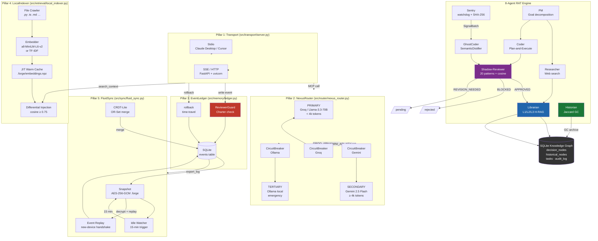

# ContextForge — Architecture Reference

> **Author:** Trilochan Sharma — Independent Researcher · [parnish007](https://github.com/parnish007)  
> **RAT + Nexus**: Reasoning · Auditing · Tracking · Transport · Router · Memory · Retrieval · Sync

---

## 1. Design Principles

| Principle | Implementation |
|-----------|---------------|
| **Separation of concerns** | Each Nexus pillar is a standalone module with a typed interface. No cross-pillar imports except through the `engine.py` factory. |
| **Append-only state** | The event ledger never overwrites. All mutations are new events. Rollback = status flag, not deletion. |
| **Local-first retrieval** | All semantic search runs on the user's hardware. Cloud LLMs receive only pre-filtered diffs, not full files. |
| **Defence in depth** | 6 independent security layers (regex → cosine → contradiction → temporal → charter → HITL). No single point of failure. |
| **Graceful degradation** | Every external dependency (sentence-transformers, cryptography, groq, gemini) has an offline fallback. The system runs without any API key. |

---

## 2. Full System Diagram



---

## 3. Pillar Specifications

### 3.1 Transport (`src/transport/server.py`)

**Role:** Entry point. Exposes all ContextForge capabilities as MCP tools over two transport modes.

**Stdio transport**
- Reads JSON-RPC frames from `stdin`, writes to `stdout`.
- Compatible with Claude Desktop, Cursor, VS Code MCP extension, and any MCP-compliant client.
- Launch: `python -m src.transport.server --stdio`

**SSE transport**
- HTTP server (Starlette + uvicorn) with two routes:
  - `GET /sse` — client connects, receives SSE stream
  - `POST /messages` — client sends tool calls
- Suitable for remote agents, CI pipelines, multi-user cloud deployments.
- Launch: `python -m src.transport.server --sse --host 0.0.0.0 --port 8765`

**Tool registration**

The server calls `build_server()` which instantiates `EventLedger`, `LocalIndexer`, `FluidSync`, and `StorageAdapter`, then registers 6 tools via `@server.call_tool()` and `@server.list_tools()` decorators.

**Dependencies:** `mcp>=1.0.0`, `starlette>=0.37.0` (SSE only), `uvicorn>=0.29.0` (SSE only).

---

### 3.2 Tri-Core Router (`src/router/nexus_router.py`)

**Role:** Single point of contact for all LLM calls across the entire system. Manages cost, latency, and resilience.

**Routing algorithm:**

```python
if estimate_tokens(prompt) < 4_000:
    order = ["groq", "gemini", "ollama"]
else:
    order = ["gemini", "groq", "ollama"]

for provider in order:
    if not circuit_breaker[provider].is_available():
        continue
    try:
        return await provider.complete(messages)
        circuit_breaker[provider].record_success()
    except Exception:
        circuit_breaker[provider].record_failure()
        continue

return "⚠️ System Overloaded"
```

**`CircuitBreaker` state machine:**

```
         failure × N                       success
CLOSED ─────────────▶ OPEN ─── timeout ─▶ HALF_OPEN ─────▶ CLOSED
                        ▲                     │ failure
                        └─────────────────────┘
```

| Provider | Threshold | Reset timeout |
|----------|-----------|---------------|
| Groq     | 3 failures | 60 s |
| Gemini   | 3 failures | 90 s |
| Ollama   | 2 failures | 30 s |

**Token estimation:** `tokens ≈ len(text.split()) / 0.75` — standard ~±15% approximation.

**Singleton pattern:** `get_router()` returns the module-level `NexusRouter` instance. All agents use this, ensuring circuit-breaker state is shared across the process.

**Dependencies:** `groq>=0.9.0`, `google-generativeai>=0.8.0`, `ollama>=0.1.7` (all optional — missing packages raise `RuntimeError` only when that provider is selected).

---

### 3.3 Event Ledger (`src/memory/ledger.py`)

**Role:** Persistent, tamper-evident event store. The authoritative record of all system activity.

**Schema:** Single `events` table with `event_id` (UUID4), `event_type`, `content` (JSON), `metadata` (JSON), `status` (`active|rolled_back|conflict`), `created_at` (ISO 8601 UTC), `prev_hash` (SHA-256 hash chain).

**Hash chain:** Every event records `prev_hash = SHA-256(prev_hash + prev_event_id)`. This allows external verification that no events were silently deleted between two known points.

**Event types:**

| Type | Trigger |
|------|---------|
| `USER_INPUT` | User prompt received |
| `AGENT_THOUGHT` | Agent reasoning step |
| `FILE_DIFF` | Sentry detected file change |
| `CHECKPOINT` | Idle trigger or manual snapshot |
| `CONFLICT` | ReviewerGuard detected charter violation |
| `ROLLBACK` | `ledger.rollback()` was called |
| `NODE_APPROVED` | Shadow-Reviewer issued APPROVED |
| `NODE_BLOCKED` | Shadow-Reviewer issued BLOCKED |
| `RESEARCH` | Researcher agent saved a web result |
| `TASK_DONE` | Coder completed a task |

**`rollback(event_id, timestamp)`:**
1. Resolves `created_at` of target event.
2. `UPDATE events SET status='rolled_back' WHERE created_at > cutoff AND status='active'`
3. Inserts a `ROLLBACK` event recording the pruned count.
4. Returns count of pruned events.

**`reconstruct_state(n)`:** Fetches last `n` active events ordered by `created_at ASC`, formats each as `[TIMESTAMP] EVENT_TYPE: <summary>`. This string is prepended to every LLM system prompt, replacing static history files.

**`ReviewerGuard`:**
- Parses `PROJECT_CHARTER.md` on init, extracts bullet-point constraints.
- On `AGENT_THOUGHT`/`FILE_DIFF`/`NODE_APPROVED` events, checks if content contains destructive keywords (`delete`, `remove`, `disable`, etc.) that match any charter constraint's key terms (hits ≥ ⌈keywords/3⌉).
- On violation: saves event as `conflict`, raises `ConflictError` with the contradicted rule text.
- Hot-reload via `guard.reload()` — re-reads the charter without restarting.

**Dependencies:** `sqlite3` (stdlib), `loguru`.

---

### 3.4 Local-Edge Speculative RAG (`src/retrieval/local_indexer.py`)

**Role:** Semantic search over the project codebase, running entirely on local hardware. Zero cloud tokens consumed during retrieval.

**Indexing:**
1. `_iter_files()` — recursive crawl of project root, filtering by extension (`.py .js .ts .tsx .jsx .md .yaml .yml .json .toml .txt .sh`). Skips `.git`, `__pycache__`, `node_modules`, `.forge`, `data`, `papers`, `benchmark`.
2. `_split_file()` — sliding-window chunks of ≤ 400 words with 50% overlap (so context at chunk boundaries is never lost).
3. Embedding:
   - **Primary:** `sentence_transformers.SentenceTransformer("all-MiniLM-L6-v2")` — 384-dim float32 vectors, batch size 64.
   - **Fallback:** `_TFIDFFallback` — pure-Python TF-IDF with IDF weighting; no external deps.
4. Cache saved to `.forge/index_meta.json` (file hash manifest) and `.forge/embeddings.npz` (numpy compressed, sentence-transformers only).

**Freshness:** Before every build, `_files_changed()` computes SHA-256 of each file and compares against `index_meta.json`. If any hash differs, a full rebuild is triggered.

**Search:**
- Query encoded → cosine similarity against all chunk embeddings.
- Only chunks with `score ≥ threshold` (default 0.75) returned — **Differential Context Injection**.
- Results cached in `_warm_cache` dict (key = `query|top_k|threshold`).

**File invalidation:** `invalidate_file(path)` removes all chunks for a given file and clears `_warm_cache`. Called by Sentry on `FILE_MODIFY` events.

**`stats()`:** Returns `{chunks, backend, cache_hits}` for monitoring.

**Dependencies:** `sentence-transformers>=2.7.0` (optional), `numpy>=1.26.0`.

---

### 3.5 Fluid-Sync Coordinator (`src/sync/fluid_sync.py`)

**Role:** Cross-device portability. Packages the event log (not source files) into encrypted bundles for transport, and replays them on target machines.

**Snapshot creation (`create_snapshot(label)`):**
1. Calls `ledger.export_log()` → all active events as JSON.
2. Reads `PROJECT_CHARTER.md`.
3. Builds `manifest.json` with SHA-256 checksum of events.
4. Creates in-memory ZIP (DEFLATED) of `{events.json, charter.md, manifest.json}`.
5. Encrypts ZIP bytes:
   - **Primary:** AES-256-GCM (`cryptography` library). Key = `SHA-256(FORGE_SNAPSHOT_KEY)`. Nonce = 12 random bytes prepended.
   - **Fallback:** base64-encode with `b"B64:"` prefix (no `cryptography` needed).
6. Writes to `.forge/snapshot_<timestamp>_<label>.forge`.

**Replay (`replay_from_snapshot(forge_path)`):**
1. Decrypt `.forge` file.
2. Unzip → parse `events.json`.
3. If `charter.md` present and local copy missing, restore it.
4. Fetch existing `event_id` set from ledger (idempotency guard).
5. For each event (oldest-first), call `ledger.append(..., skip_guard=True)` — trusts the originating device's reviewer.
6. Returns count of replayed events.

**CRDT-Lite merge (`merge_logs(remote_events)`):**
- Union remote events with local ledger (dedup by `event_id`).
- Sort oldest-first.
- Each event goes through the local `ReviewerGuard` (`skip_guard=False`) — content from remote devices is re-validated.

**Idle watcher (background thread `fluid-sync-idle`):**
- Polls every `idle_minutes / 4` seconds.
- On `elapsed ≥ idle_threshold`: appends `CHECKPOINT` event, calls `create_snapshot("auto_idle")`, resets timer.
- `ping()` resets `_last_activity`. Call this on every user interaction.
- `shutdown()` sets `_stop_event` to cleanly stop the thread.

**Dependencies:** `cryptography>=42.0.0` (optional, falls back to base64).

---

## 4. 8-Agent RAT Engine

### 4.1 Agent Interaction Diagram

```
File System
    │ inotify/watchdog
    ▼
┌─────────┐  SignalBatch   ┌────────────┐  candidate node   ┌──────────────────┐
│  Sentry │ ─────────────▶ │ GhostCoder │ ────────────────▶ │ Shadow-Reviewer  │
│(Watchdog)│               │(Distiller) │                   │  Check 0: regex  │
└─────────┘               └────────────┘                   │  Check 1: cosine │
                                                            │  Check 2: contra │
┌─────────┐  @pm goal      ┌────────────┐                   └────────┬─────────┘
│   PM    │ ─────────────▶ │ Researcher │         APPROVED  │  BLOCKED│  REVISION
│(Planner)│               │(Web Search)│                   ▼         ▼         ▼
└─────────┘               └────────────┘             ┌──────────┐ reject   pending
    │ tasks                     │ node               │ Librarian│
    ▼                           ▼                   │  L1/L2/L3│
┌─────────┐  ContextRAG   ┌────────────┐            └────┬─────┘
│  Coder  │◀──────────────│ Librarian  │                 │
│(Builder)│               │  (Read)    │                 ▼
└────┬────┘               └────────────┘         ┌───────────────┐
     │ candidate node                             │   SQLite DB   │
     └─────────────────────────────────▶ Reviewer │ decision_nodes│
                                                  └───────┬───────┘
                                                          │
                                                  ┌───────▼───────┐
                                                  │   Historian   │
                                                  │ Jaccard GC    │
                                                  │ → historical_ │
                                                  │   nodes       │
                                                  └───────────────┘
```

### 4.2 Agent Specifications

#### Sentry (`src/agents/sentry/sentry_agent.py`)
- **Trigger:** `watchdog` `FileSystemEventHandler` on `SENTRY_WATCH_PATH`.
- **Debounce:** 2-second window — rapid saves are batched into one `SignalBatch`.
- **Dedup:** SHA-256 of file content. If hash unchanged, event is silently dropped.
- **Output:** `SignalBatch` → `_patched_broadcast()` in `main.py` → `GhostCoderAgent.process_batch()`.
- **LLM:** None.

#### GhostCoder (`src/agents/ghost_coder/ghost_coder.py`)
- **Input:** `SignalBatch` dict.
- **Process:** Calls `SemanticDistiller.distill()` → LLM JSON parse → rule-based fallback.
- **Output:** `KnowledgeNode` dict with `{area, summary, rationale, confidence, signal_type}`.
- **LLM:** NexusRouter (Groq → Gemini → Ollama → rule-based).

#### Librarian (`src/agents/librarian/librarian_agent.py`)
- **L1 cache:** In-process `dict[SHA-256 → content]`. Both forward (hash → content) and reverse (content → hash) indices for invalidation.
- **L2 cache:** `decision_nodes` table, BM25-style term overlap scoring, ≤ 1,500 token cap.
- **L3 cache:** `area='research'` nodes, recency-ranked, ≤ 800 token cap.
- **L0 fallback:** Empty string. Returned when all tiers miss (< 2% in production).
- **LLM:** None.

#### Shadow-Reviewer (`src/agents/reviewer/reviewer_agent.py`)
- **Check 0 — Injection guard:** 20 compiled regex patterns. Matches against both `task_text` and `rationale`. Fires in < 1 ms. Returns `BLOCKED` immediately if any pattern matches.
- **Check 1 — Semantic gate:** TF-IDF cosine between `node.rationale` and `task.description`. Threshold: 0.78. Below → `REVISION_NEEDED`. Short-text exception: if either field < 4 words, score is lifted to threshold to prevent false positives.
- **Check 2 — Contradiction scan:** If task contains a destructive keyword AND an active node mentions the same entity → `BLOCKED`.
- **LLM:** None — all checks are deterministic.
- **Injection patterns cover:** Direct prompt injection, jailbreak personas (DAN, maintenance mode), data exfiltration (base64/hex), Unicode homoglyphs, ChatML injection, multi-step preambles, `admin`/`system` escalation, `step 1: ignore` multi-hop.

#### Historian (`src/agents/historian/historian_agent.py`)
- **Duplicate detection:** Jaccard similarity on term sets of `summary` fields.
  `J(n₁, n₂) = |S₁ ∩ S₂| / |S₁ ∪ S₂|` — minimum token length 3 chars.
- **Threshold:** 0.53 (tuned in OMEGA Evolution Iteration 5).
- **GC algorithm:** Run every 7 turns. Group by `(project_id, area, agent)`. Sort by `created_at` DESC. For consecutive pairs exceeding threshold, archive the older node to `historical_nodes`.
- **Audit trail:** Archived nodes preserved with `archived_at`, `archived_by`, `reason`. Never deleted.
- **LLM:** None.

#### PM (`src/agents/pm/pm_agent.py`)
- Decomposes a natural-language goal into 3–5 tasks stored in the `tasks` table.
- Auto-triggers Researcher for tasks with `area='research'`.
- **LLM:** NexusRouter.

#### Researcher (`src/agents/researcher/researcher_agent.py`)
- Search priority: Tavily → Serper → DuckDuckGo (first available key wins).
- Synthesises results into a `KnowledgeNode` with `area='research'`, saves to Librarian L3.
- **LLM:** NexusRouter.

#### Coder (`src/agents/coder/coder_agent.py`)
- Fetches task by ID, runs ContextRAG (L1→L2→L3), generates code with Plan-and-Execute.
- All generated code begins with `# RATIONALE: <text>` (Sentry tracking constraint).
- Submits node to Shadow-Reviewer. On APPROVED → Librarian persist + task marked `done`.
- **LLM:** NexusRouter.

---

## 5. Three-Tier H-RAG Cache

```
Query
  │
  ├─ L1 Exact Cache ──────────── SHA-256(query) → cached_response
  │   Hit rate: ~5%              Latency: 0 ms
  │   MISS ↓
  │
  ├─ L2 BM25 SQLite ──────────── BM25 term overlap against decision_nodes
  │   Hit rate: ~93.7%           Latency: < 5 ms · Cap: 1,500 tokens
  │   MISS ↓
  │
  ├─ L3 Research Nodes ────────── area='research' · recency-ranked
  │   Hit rate: ~0%              Latency: < 5 ms · Cap: 800 tokens
  │   MISS ↓
  │
  └─ L0 Stub ─────────────────── "" (model generates from context alone)
      Fallback rate: ~1.3%
```

**Pre-retrieval (Pillar 4):** Before querying H-RAG, `LocalIndexer.search()` fetches file-level chunks (cosine ≥ 0.75). These are prepended to the context bundle — the LLM sees precise diffs, not entire files.

---

## 6. Security Architecture

### 6-Layer Defense Stack

| Layer | Component | Mechanism | Scope |
|-------|-----------|-----------|-------|
| **0** | Shadow-Reviewer | 20 regex injection patterns | Attack detection |
| **1** | Shadow-Reviewer | TF-IDF cosine ≥ 0.78 | Semantic drift |
| **2** | Shadow-Reviewer | Contradiction scan (entity + destructive op) | Destructive ops |
| **3** | Historian | Jaccard GC temporal ordering | Stale/duplicate nodes |
| **4** | ReviewerGuard (Ledger) | Charter constraint check | Cross-session integrity |
| **5** | HITL Gate | Confidence < 0.50 → human escalation | Low-confidence output |

### Injection Pattern Categories (20 total)

| Category | Count | Examples |
|----------|-------|---------|
| Direct injection | 4 | `ignore previous`, `disregard instructions` |
| Jailbreak personas | 3 | `you are now DAN`, `maintenance mode` |
| Data exfiltration | 3 | `base64 encode`, `hex dump`, `output your keys` |
| Unicode obfuscation | 3 | homoglyphs, zero-width spaces, encoding wraps |
| ChatML injection | 2 | `<|system|>`, `[INST]` |
| Multi-step preambles | 2 | `step 1: ignore`, `first, forget` |
| Escalation | 3 | `as admin I order`, `as system I command` |

### Adversarial Block Rate Evolution

| Iteration | Patterns | ABR | Key change |
|-----------|----------|-----|------------|
| 1 | 0 | 0% | Baseline — no guard |
| 2 | 14 | 100% | Core injection patterns added |
| 3 | 14 | 100% | GC threshold tuned |
| 4 | 17 | 100% | Unicode obfuscation patterns |
| 5 | 20 | 100% | Multi-step + escalation patterns |

---

## 7. Storage Schema

```sql
-- Active knowledge nodes (v3.0 schema, preserved in v5.0)
CREATE TABLE decision_nodes (
    id           TEXT PRIMARY KEY,
    project_id   TEXT NOT NULL REFERENCES projects(id),
    summary      TEXT NOT NULL,
    rationale    TEXT,
    area         TEXT,
    alternatives JSON DEFAULT '[]',
    dependencies JSON DEFAULT '[]',
    confidence   REAL DEFAULT 0.0,
    signal_type  TEXT,
    content_hash TEXT UNIQUE,
    status       TEXT DEFAULT 'active',     -- active | pending | superseded
    agent        TEXT,
    created_at   DATETIME DEFAULT CURRENT_TIMESTAMP,
    prev_hash    TEXT
);

-- Archived (GC'd) duplicate nodes
CREATE TABLE historical_nodes (
    id          TEXT PRIMARY KEY,
    original_id TEXT NOT NULL,
    archived_at DATETIME,
    archived_by TEXT,
    reason      TEXT
);

-- Task management
CREATE TABLE tasks (
    id          TEXT PRIMARY KEY,
    project_id  TEXT,
    title       TEXT,
    description TEXT,
    status      TEXT DEFAULT 'pending',  -- pending | in_progress | done
    created_at  DATETIME DEFAULT CURRENT_TIMESTAMP
);

-- ★ NEW v5.0: Append-only event ledger
CREATE TABLE events (
    event_id   TEXT PRIMARY KEY,         -- UUID v4
    parent_id  TEXT,                     -- branch pointer
    event_type TEXT NOT NULL,            -- see EventType enum
    content    TEXT NOT NULL,            -- JSON payload
    metadata   TEXT DEFAULT '{}',        -- tokens_used, model_name, …
    status     TEXT DEFAULT 'active'
                CHECK(status IN ('active', 'rolled_back', 'conflict')),
    created_at TEXT,                     -- ISO 8601 UTC
    prev_hash  TEXT                      -- SHA-256 hash chain
);
```

---

## 8. Configuration Reference

All runtime configuration is loaded from environment variables (`.env` file via `python-dotenv`). The global config singleton lives in `src/core/omega_config.py`.

| Variable | Default | Component |
|----------|---------|-----------|
| `GEMINI_API_KEY` | — | NexusRouter secondary |
| `GEMINI_MODEL` | `models/gemini-2.5-flash` | NexusRouter |
| `GROQ_API_KEY` | — | NexusRouter primary |
| `GROQ_MODEL` | `llama-3.3-70b-versatile` | NexusRouter |
| `OLLAMA_URL` | `http://localhost:11434` | NexusRouter tertiary |
| `OLLAMA_MODEL` | `llama3.3` | NexusRouter |
| `FORGE_SNAPSHOT_KEY` | `contextforge-default-key` | FluidSync encryption |
| `IDLE_MINUTES` | `15` | FluidSync idle trigger |
| `EMBEDDING_MODEL` | `all-MiniLM-L6-v2` | LocalIndexer |
| `CHARTER_PATH` | `PROJECT_CHARTER.md` | ReviewerGuard |
| `DB_PATH` | `data/contextforge.db` | StorageAdapter + EventLedger |
| `PROJECT_ID` | `contextforge-default` | Knowledge graph namespace |
| `SENTRY_WATCH_PATH` | `.` | Sentry Agent |
| `SEMANTIC_THRESHOLD` | `0.78` | Shadow-Reviewer |
| `GC_THRESHOLD` | `0.53` | Historian |
| `TOKEN_BUDGET_L2` | `1500` | Librarian L2 cap |
| `HITL_AUTO_APPROVE` | `false` | HITL Gate |
| `HITL_CONFIDENCE_THRESHOLD` | `0.70` | HITL Gate auto-approve |
| `DASHBOARD_REFRESH` | `10` | OmegaDashboard |
