# What Is ContextForge?

> **Author:** Trilochan Sharma — [parnish007](https://github.com/parnish007)

ContextForge is a **local-first memory server for AI agents**. It speaks the [Model Context Protocol (MCP)](https://modelcontextprotocol.io), which means any MCP-compatible AI client — Claude Desktop, Cursor, VS Code Copilot — can call its tools to save decisions, retrieve context, manage tasks, and take encrypted snapshots across sessions and projects.

---

## The Problem It Solves

Every time you start a new conversation with an AI assistant, it forgets everything from the last one. You repeat yourself. You paste the same context. You lose architectural decisions, research findings, and task history.

ContextForge fixes that by acting as persistent, tamper-evident memory between you and any AI client. The AI calls `capture_decision` to save what it decided and why. It calls `load_context` to get that memory back in the next session. All stored locally — no cloud, no subscription.

---

## How It Works — Top Level

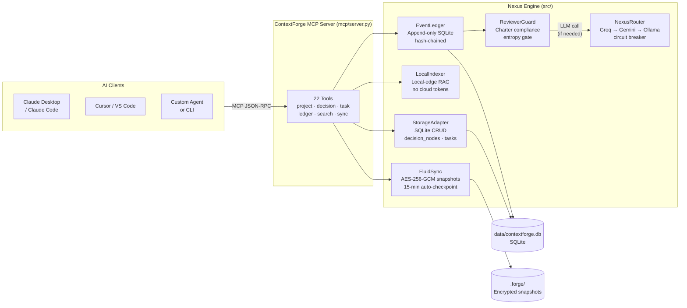

---

## Architecture Deep-Dive

ContextForge has **five architectural pillars**, each a standalone module:

| Pillar | File | What it does |
|--------|------|-------------|
| **Transport** | `src/transport/server.py` | Exposes tools over Stdio (local) or SSE/HTTP (remote) |
| **Router** | `src/router/nexus_router.py` | Routes LLM calls with circuit breakers and predictive failover |
| **Memory** | `src/memory/ledger.py` | Append-only event log with SHA-256 hash chain and charter guard |
| **Retrieval** | `src/retrieval/local_indexer.py` | Semantic file search — runs entirely on your machine |
| **Sync** | `src/sync/fluid_sync.py` | AES-256-GCM encrypted snapshots + 15-minute idle checkpoint |

On top of these pillars sits an **8-agent RAT engine** (Reasoning · Auditing · Tracking) for the interactive `python main.py` mode.

---

## Data Flow — What Happens When You Call `capture_decision`

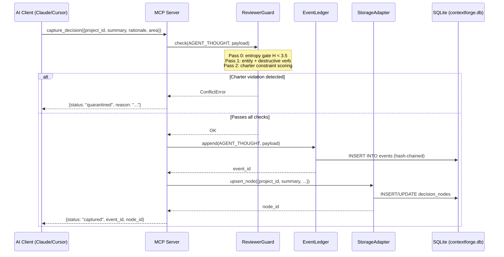

---

## With API Keys vs Without API Keys

ContextForge is fully functional without any API keys. Here is exactly what changes:

### Without any API keys (fully offline)

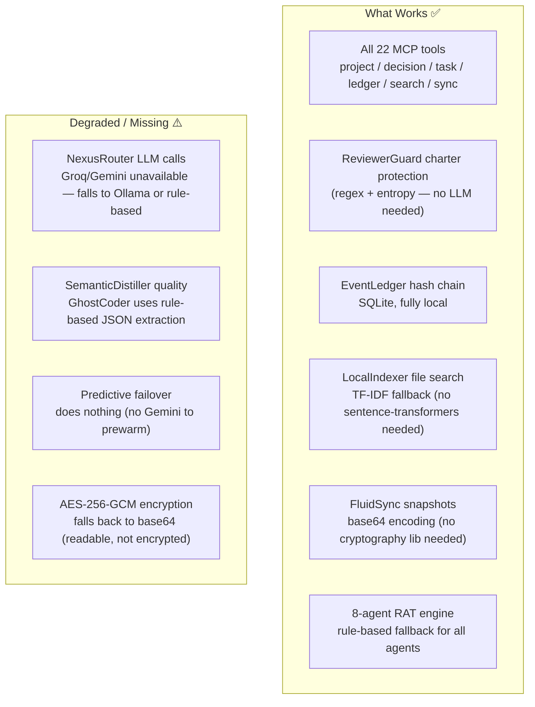

| Feature | No API keys | GROQ_API_KEY | GEMINI_API_KEY | Both |
|---------|:-----------:|:------------:|:--------------:|:----:|
| MCP tools (all 22) | ✅ | ✅ | ✅ | ✅ |
| Charter guard | ✅ | ✅ | ✅ | ✅ |
| Hash chain / ledger | ✅ | ✅ | ✅ | ✅ |
| File search (TF-IDF) | ✅ | ✅ | ✅ | ✅ |
| File search (semantic) | requires `sentence-transformers` | same | same | same |
| Snapshot encryption | base64 | base64 | base64 | AES-256-GCM |
| LLM distillation | rule-based | Llama-3.3-70B | Gemini 2.5 Flash | Groq primary + Gemini fallback |
| Predictive failover | ❌ | ❌ | ❌ | ✅ |
| Cost per session | $0 | ~$0.001 | ~$0.001 | ~$0.002 |

**Recommended setup for most users:** set `GROQ_API_KEY` only. Groq's free tier is generous and covers all agent calls with sub-second latency.

For snapshot encryption, install `cryptography` (`pip install cryptography`) and set `FORGE_SNAPSHOT_KEY` in `.env`.

---

## The Three-Tier Memory

Every query goes through a cascade before hitting the LLM:

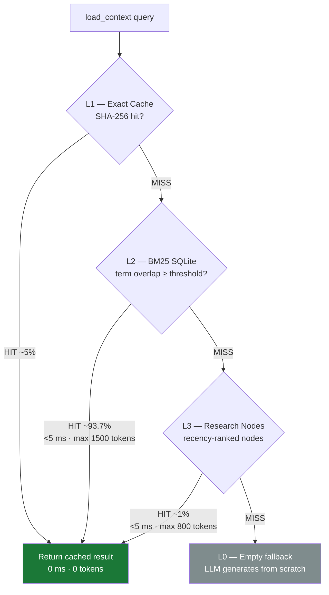

The local file indexer (`search_context`) runs **before** this — it pre-filters your codebase with cosine similarity (≥ 0.75) so the LLM only sees precise, relevant diffs, not whole files.

---

## Security — What Could Go Wrong and What Guards It

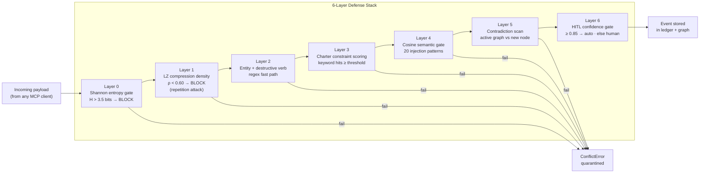

**What to be careful about:**

1. **`PROJECT_CHARTER.md` is the security ground truth.** If you delete it, `ReviewerGuard` goes inactive (no charter = no constraint check). Keep it.
2. **`FORGE_SNAPSHOT_KEY` in `.env`.** Without this env var, snapshots fall back to base64 — readable by anyone who can access your `.forge/` directory.
3. **`skip_guard=True` in `replay_from_snapshot`.** When replaying a `.forge` snapshot, events skip the guard on the assumption they were already validated on the originating device. Only replay snapshots you created yourself.
4. **The `merge_projects` tool is irreversible.** The source project is deleted. Always `snapshot` first.
5. **`delete_project` with `archive_nodes=False`** permanently destroys all nodes with no recovery path.
6. **No authentication on the MCP server.** The server assumes localhost trust. If you expose the SSE port (`--sse --host 0.0.0.0`) on a networked machine, add a reverse proxy with auth in front of it.

---

## Real Example — Starting a Project from Scratch

This walks through exactly what happens, and where every piece of data ends up.

### Step 1: Start the MCP server

```bash
python mcp/server.py --stdio
```

The server:
- Creates `data/contextforge.db` (SQLite) if it doesn't exist, runs schema migrations
- Initializes `EventLedger` (reads `PROJECT_CHARTER.md`, loads 11+ constraints into `ReviewerGuard`)
- Initializes `LocalIndexer` (crawls `src/`, `mcp/`, `docs/` — builds TF-IDF or sentence-transformer index, saved to `.forge/`)
- Starts `FluidSync` idle watcher thread (15-min timer begins)
- Registers 22 MCP tools and waits for JSON-RPC frames on stdin

### Step 2: Create your project

Your AI client calls:

```json
{"tool": "init_project", "arguments": {
  "project_id": "my-saas-app",
  "name": "My SaaS App",
  "project_type": "code",
  "description": "A subscription SaaS built on FastAPI + React",
  "goals": ["Launch MVP in 3 months", "100 paying users by Q3"],
  "tech_stack": {"backend": "FastAPI", "frontend": "React", "db": "PostgreSQL"}
}}
```

**What gets saved:**

In `data/contextforge.db`, table `projects`:
```
id          = "my-saas-app"
name        = "My SaaS App"
project_type= "code"
description = "A subscription SaaS built on FastAPI + React"
goals       = '["Launch MVP in 3 months", "100 paying users by Q3"]'
tech_stack  = '{"backend": "FastAPI", ...}'
created_at  = "2026-04-13T12:00:00Z"
```

### Step 3: Capture a decision

```json
{"tool": "capture_decision", "arguments": {
  "project_id": "my-saas-app",
  "summary": "Use Stripe for payment processing instead of Paddle",
  "rationale": "Stripe has better FastAPI SDK, lower fees for international users",
  "area": "payments",
  "alternatives": ["Paddle — simpler tax handling", "LemonSqueezy — flat fee"],
  "confidence": 0.9
}}
```

**What happens step by step:**

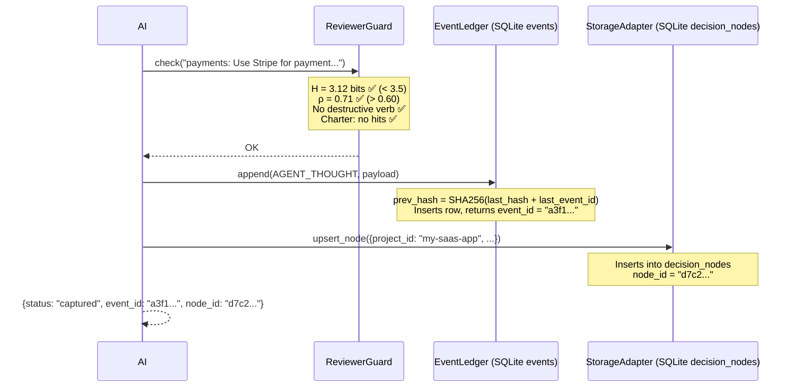

**Data saved in `data/contextforge.db`:**

Table `events`:
```
event_id   = "a3f1..."
event_type = "AGENT_THOUGHT"
content    = '{"text": "payments: Use Stripe...", "project_id": "my-saas-app", ...}'
status     = "active"
prev_hash  = "SHA256 of previous event"
project_id = "my-saas-app"
created_at = "2026-04-13T12:01:00Z"
```

Table `decision_nodes`:
```
id         = "d7c2..."
project_id = "my-saas-app"
area       = "payments"
summary    = "Use Stripe for payment processing instead of Paddle"
rationale  = "Stripe has better FastAPI SDK..."
alternatives = '["Paddle — simpler tax handling", "LemonSqueezy — flat fee"]'
confidence = 0.9
status     = "active"
created_at = "2026-04-13T12:01:00Z"
```

### Step 4: Come back next week — load context

```json
{"tool": "load_context", "arguments": {
  "project_id": "my-saas-app",
  "detail_level": "L2",
  "query": "payments"
}}
```

Returns all project metadata + filtered decision nodes matching "payments", with full rationale and alternatives — everything the AI needs to continue where you left off.

### Step 5: Auto-checkpoint (happens automatically)

After 15 minutes of idle time, `FluidSync` fires:
- Exports all `active` events from the ledger
- Creates `.forge/snapshot_20260413_120000_auto_idle.forge` (AES-256-GCM if `FORGE_SNAPSHOT_KEY` is set, base64 otherwise)
- Appends a `CHECKPOINT` event to the ledger

You can also trigger this manually:
```json
{"tool": "snapshot", "arguments": {"label": "before-payment-refactor"}}
```

### Where all your data lives

| Data | Location | Format | Notes |
|------|----------|--------|-------|
| Projects | `data/contextforge.db` → `projects` | SQLite | Created on first `init_project` |
| Decisions | `data/contextforge.db` → `decision_nodes` | SQLite | Full text searchable |
| Tasks | `data/contextforge.db` → `tasks` | SQLite | Status: pending/in_progress/done |
| Event log | `data/contextforge.db` → `events` | SQLite, hash-chained | Append-only, auditable |
| Archives | `data/contextforge.db` → `historical_nodes` | SQLite | Deprecated/merged decisions |
| Snapshots | `.forge/*.forge` | Encrypted ZIP | Portable across machines |
| File index | `.forge/embeddings.npz` + `.forge/index_meta.json` | numpy / JSON | Rebuilt on file changes |
| Audit log | `data/contextforge.db` → `audit_log` | SQLite | Hash-chained writes |

**To back up everything:** copy `data/contextforge.db` and `.forge/`.  
**To move to a new machine:** copy both, run `replay_sync` with your latest `.forge` snapshot.

---

## Pros and Cons

### Pros

| | |
|---|---|
| **Truly local-first** | All decision data stays on your machine. No vendor lock-in, no cloud accounts, no data leaving your network. |
| **Works without API keys** | Full MCP functionality with rule-based fallback. Ollama brings free local LLM support. |
| **Tamper-evident ledger** | SHA-256 hash chain means you can verify no events were silently deleted between any two known points. |
| **Multi-project isolation** | All data is scoped by `project_id`. One ContextForge instance serves unlimited projects simultaneously. |
| **Charter-enforced safety** | `PROJECT_CHARTER.md` is machine-enforced — agents cannot commit decisions that contradict it. |
| **Graceful degradation** | Every dependency (sentence-transformers, cryptography, groq, gemini) has an offline fallback. Nothing hard-fails. |
| **Time-travel rollback** | Roll back the ledger to any point in time, per project. |
| **MCP standard** | Works with any MCP client: Claude Desktop, Cursor, VS Code, custom scripts. |

### Cons / Honest Limitations

| | |
|---|---|
| **Single-writer SQLite** | SQLite WAL allows concurrent reads, but only one writer at a time. Not suitable for multi-process high-throughput writes. |
| **No vector search (yet)** | `search_context` uses TF-IDF or sentence-transformers cosine similarity — not a dedicated vector database. Scales to ~50k chunks before latency degrades. |
| **No auth on SSE transport** | The `--sse` HTTP server has no built-in authentication. Add a reverse proxy (nginx + basic auth, or Cloudflare Tunnel) before exposing it remotely. |
| **Charter guard is keyword-based** | ReviewerGuard catches explicit destructive language. It does not catch subtle semantic drift or multi-step Jailbreaks. The Shadow-Reviewer (agent mode) adds cosine-semantic checking, but this only runs in `python main.py` mode, not the MCP server. |
| **L1 cache is in-process** | The SHA-256 exact cache lives in Python's dict — it resets every time the MCP server restarts. Long-running servers benefit from it; short-lived CLI invocations don't. |
| **LLM calls are sequential** | The router tries providers in order (Groq → Gemini → Ollama), not in parallel. Tail latency on failures is cumulative. |
| **Charter guard only in Python server** | The TypeScript server (`mcp/index.ts`) writes directly to SQLite — it has all 22 tools at full parity but does **not** run `ReviewerGuard`. Use the Python server (`mcp/server.py`) if charter enforcement is required. |

---

## What to Be Careful About

1. **Never delete `data/contextforge.db`** without a snapshot. This is your entire knowledge graph.
2. **Never delete `PROJECT_CHARTER.md`** — the charter guard goes inactive without it, removing the safety layer.
3. **Never set `DB_PATH` to a shared network drive** — SQLite is not safe for concurrent multi-host writes.
4. **Never expose `--sse` without a reverse proxy auth layer** on a networked or cloud machine.
5. **`merge_projects` and `delete_project` are permanent** — take a `snapshot` before using them.
6. **The `FORGE_SNAPSHOT_KEY` must not change** once snapshots exist — old snapshots are unreadable with a new key.
7. **Do not commit `data/contextforge.db` to git** — it contains your full decision history. The `.gitignore` excludes it (`data/*.db`), but double-check with `git status` before pushing.

---

## Quick Reference — All 22 MCP Tools

| Category | Tool | What it does |
|----------|------|-------------|
| **Project** | `list_projects` | List all projects |
| | `init_project` | Create / update a project |
| | `rename_project` | Rename display name (slug unchanged) |
| | `merge_projects` | Merge source into target (irreversible) |
| | `delete_project` | Delete project, optionally archive nodes |
| | `project_stats` | Node/task count breakdown |
| **Decision** | `capture_decision` | Save a decision through ReviewerGuard |
| | `load_context` | L0/L1/L2 context for a project |
| | `get_knowledge_node` | Keyword search over decisions |
| | `list_decisions` | List with area/status filters |
| | `update_decision` | Edit summary, rationale, area, confidence |
| | `deprecate_decision` | Mark deprecated with reason + replacement |
| | `link_decisions` | Create typed edge between two decisions |
| **Task** | `list_tasks` | List tasks (filter by status) |
| | `create_task` | Create a new task |
| | `update_task` | Update task status |
| **Ledger** | `rollback` | Time-travel undo by event_id or timestamp |
| | `snapshot` | AES-256-GCM encrypted checkpoint |
| | `list_snapshots` | List all `.forge` snapshot files |
| | `replay_sync` | Restore from a `.forge` snapshot |
| | `list_events` | Inspect the append-only event log |
| **Search** | `search_context` | Semantic search over local files |

---

## FAQ — Everything You Might Wonder About

### The Big One: "No API Keys, No Ollama — How Does `capture_decision` Work?"

**Short answer:** ContextForge does not reason about your decisions. Your AI client does. ContextForge is a storage and retrieval system, not a reasoning engine.

When Claude Desktop or Cursor calls `capture_decision`, it sends the fully-formed decision — `summary`, `rationale`, `area`, `confidence` — as arguments in the tool call. ContextForge receives those fields and stores them. There is no LLM call inside ContextForge at all.

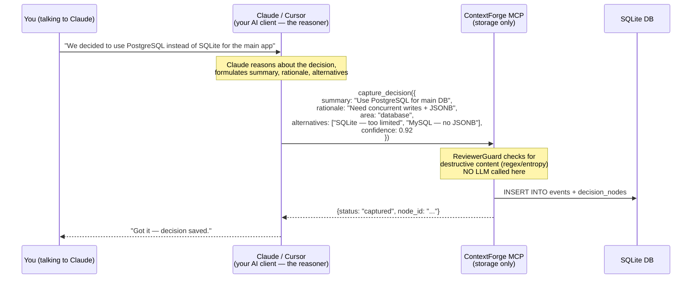

**The reasoning is always done by your AI client.** ContextForge is the long-term memory that the AI writes to and reads from. This is intentional — it means ContextForge works 100% without any API keys.

The only code that runs inside ContextForge during `capture_decision`:
1. Slug validation on `project_id` (regex, ~0 ms)
2. `ReviewerGuard.check()` — entropy gate + entity regex, no LLM (~0.1 ms)
3. `ledger.append()` — one SQLite INSERT with SHA-256 hash chain (~1 ms)
4. `storage.upsert_node()` — one SQLite UPSERT (~1 ms)

Total: **< 5 ms, zero network calls, zero LLM tokens**.

---

### "So When Do API Keys / Ollama Actually Matter?"

Only in `python main.py` mode — the **8-agent RAT engine**. This mode is for automated, background processing:

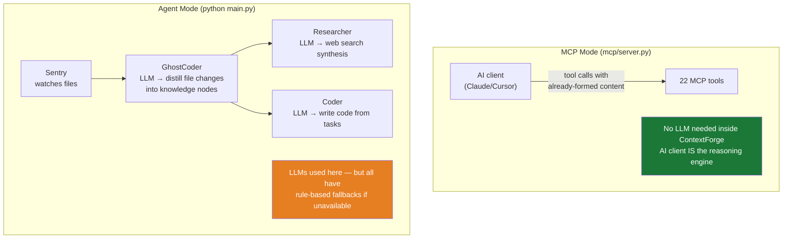

| Feature | No keys | GROQ_API_KEY | GEMINI_API_KEY | Ollama running |
|---------|:-------:|:------------:|:--------------:|:--------------:|
| All 22 MCP tools | ✅ | ✅ | ✅ | ✅ |
| ReviewerGuard (charter) | ✅ | ✅ | ✅ | ✅ |
| Hash chain / ledger | ✅ | ✅ | ✅ | ✅ |
| Auto-snapshot (15 min) | ✅ | ✅ | ✅ | ✅ |
| File search (TF-IDF) | ✅ | ✅ | ✅ | ✅ |
| File search (semantic) | needs `pip install sentence-transformers` | same | same | same |
| Snapshot encryption | base64 | base64 | base64 | base64 |
| Snapshot encryption (AES) | needs `pip install cryptography` | same | same | same |
| GhostCoder distillation | rule-based fallback | Groq LLM | Gemini LLM | Ollama LLM |
| Researcher web synthesis | rule-based fallback | Groq LLM | Gemini LLM | Ollama LLM |
| Coder task execution | rule-based fallback | Groq LLM | Gemini LLM | Ollama LLM |
| Predictive failover | ❌ | ❌ | ❌ | ❌ (needs both Groq + Gemini) |

---

### "What Is the Rule-Based Fallback?"

When no LLM is available in agent mode (`python main.py`), the `SemanticDistiller` falls back to a pure-Python extractor:

- Groups file changes by extension (`.py` → `"code"`, `.md` → `"documentation"`, `.json` → `"config"`)
- Generates a summary like `"Modified python file in src/agents/ghost_coder/"` 
- Sets `confidence = 0.5` (below the 0.85 auto-approve threshold — will be flagged for human review)
- The node is stored but marked as requiring HITL review

This means the system never crashes without an LLM — it degrades gracefully. The nodes are lower quality (no semantic understanding) but the ledger, hash chain, and storage all work normally.

---

### "Does ContextForge Send Any Data to the Cloud?"

Only if you explicitly configure an API key AND run agent mode (`python main.py`). Here is exactly what goes where:

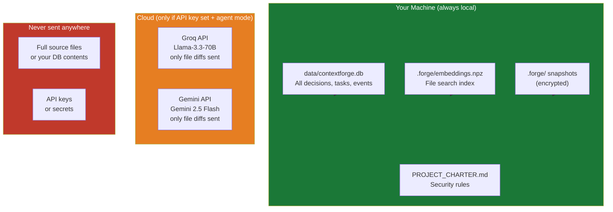

**What is sent to the cloud LLM (if agent mode + API key):** A 400-word chunk of changed file content, no more. The `LocalIndexer` pre-filters with cosine similarity so only the most relevant diff is sent, not whole files.

**What is never sent:** Your full decision database, your API keys, your project charter, full file contents.

**MCP mode (mcp/server.py):** Nothing leaves your machine. Ever.

---

### "What Happens If I Delete `data/contextforge.db`?"

You lose everything — all decisions, tasks, events, and the hash chain. There is no recovery without a `.forge` snapshot.

**Before deleting:** run `snapshot` from any MCP client or:
```bash
python -c "
from src.sync.fluid_sync import FluidSync
from src.memory.ledger import EventLedger
ledger = EventLedger()
fluid  = FluidSync(ledger)
print(fluid.create_snapshot('before-delete'))
"
```

Then if you need to restore: `replay_sync` with the `.forge` file path.

---

### "Can Multiple People Use the Same ContextForge Instance?"

**Single-writer SQLite** — SQLite in WAL mode allows many concurrent readers but only one writer at a time. For a solo developer or small team with sequential writes this is fine. For simultaneous writes from multiple machines, use the SSE transport with a single server instance:

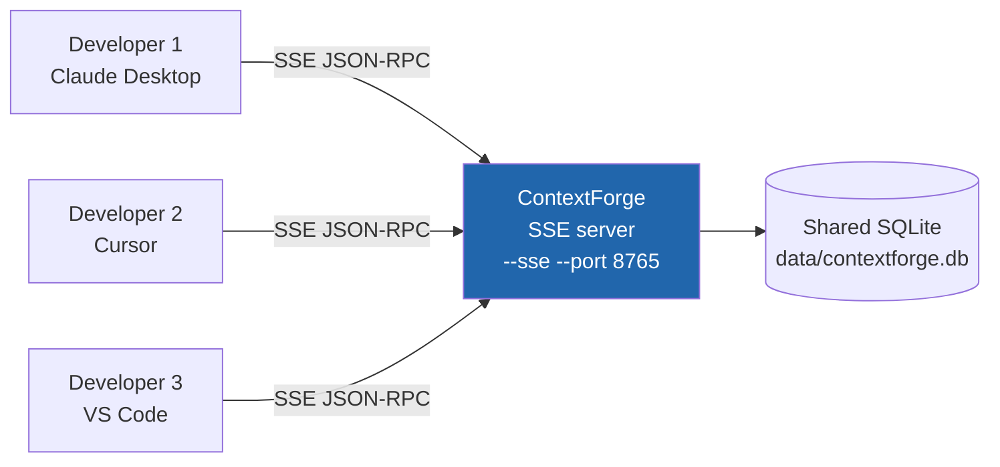

Start with: `python mcp/server.py --sse --host 0.0.0.0 --port 8765`

Add a reverse proxy (nginx / Caddy / Cloudflare Tunnel) with auth in front — there is no built-in authentication on the SSE transport.

---

### "What Is a Project? What Is Isolated Between Projects?"

A `project_id` is a slug like `my-saas-app` or `phd-research`. Everything in the database is scoped to it:

| Table | Scoped by project_id? |
|-------|----------------------|
| `decision_nodes` | ✅ |
| `tasks` | ✅ |
| `historical_nodes` | ✅ |
| `events` | ✅ (added in v5.1) |
| `projects` | is the project — owns all above |
| `.forge` snapshots | ❌ — snapshots contain ALL projects' events |

Projects do **not** share decisions. `load_context(project_id="proj-a")` will never return decisions from `proj-b`.

---

### "How Do I Switch Between Projects?"

There is no "active project" concept. Every tool call explicitly names the project:

```
load_context(project_id="proj-a")        ← reads proj-a
capture_decision(project_id="proj-b")    ← writes to proj-b
list_tasks(project_id="proj-a")          ← reads proj-a tasks
```

You switch projects by simply using a different `project_id` in the next call. No login, no context switch, no session state.

---

### "What Is the Charter Guard? Can It Block My Valid Decisions?"

`ReviewerGuard` reads `PROJECT_CHARTER.md` and runs three checks on every `AGENT_THOUGHT`, `FILE_DIFF`, and `NODE_APPROVED` event:

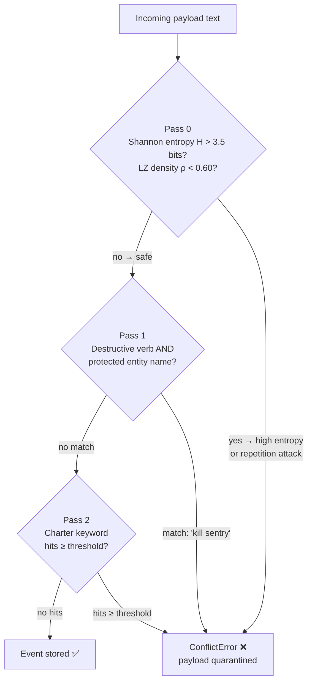

**Can it give false positives?** Yes, on edge cases. For example, a decision summary like `"Remove deprecated legacy endpoints"` might trigger Pass 2 because `"remove"` + `"deprecated"` appear near charter constraint keywords.

**How to fix a false positive:**
1. Rephrase: `"Retire legacy endpoints that are no longer used"` — avoids the blocked verb `remove`
2. Or update `PROJECT_CHARTER.md` to be more specific: instead of `"must not be removed"` write `"must not be removed from production before deprecation notice period"`
3. Call `guard.reload()` after editing the charter (no server restart needed)

**The guard is inactive if `PROJECT_CHARTER.md` doesn't exist.** If you never create a charter, no events are blocked.

---

### "What Is the HITL Gate? Does It Require a Human to Approve Everything?"

HITL = Human-In-The-Loop. It only applies in **agent mode** (`python main.py`), not MCP mode.

In agent mode, every candidate node gets a confidence score. The `HITLGate` routes it:

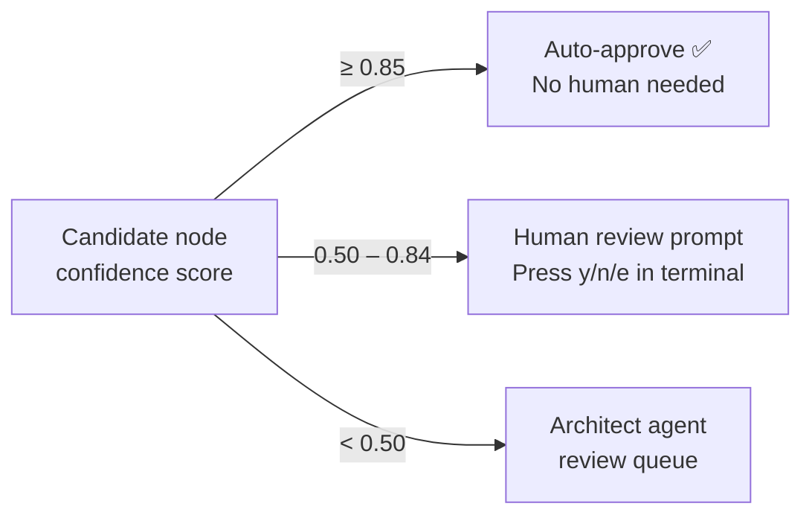

In `--hitl-off` mode all decisions auto-approve regardless of score.

**In MCP mode:** No HITL gate at all. Decisions submitted via `capture_decision` go straight to storage (after the charter guard check).

---

### "What Is the Event Ledger? Why Does It Exist?"

The ledger is an append-only audit trail. Every write to the system creates an immutable event record. Events are never deleted — only marked `rolled_back` or `conflict`.

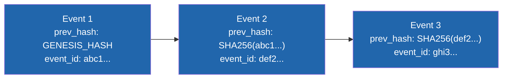

`prev_hash = SHA-256(previous_prev_hash + previous_event_id)` — if any event is silently deleted or modified, all subsequent hashes break. You can verify the chain is intact at any point.

**Why not just use `decision_nodes` alone?** The ledger records *everything* — conflicts, rollbacks, checkpoints, file events, research activity. `decision_nodes` is just the curated knowledge graph extracted from those events.

**Rollback does not delete events.** It marks them `rolled_back` and inserts a new `ROLLBACK` event. The history is always preserved — you can always see what was rolled back, when, and why.

---

### "What Is a `.forge` Snapshot? Do I Need One?"

A `.forge` file is an encrypted, compressed bundle containing:
- All `active` events from the ledger as JSON
- `PROJECT_CHARTER.md`
- A manifest with SHA-256 checksum and event count

It is the **portable backup format** for ContextForge. You need it if:
- You want to move your memory to another machine
- You want a backup before a destructive operation (`merge_projects`, `delete_project`)
- You want to share project context with a team member

You do **not** need one for normal day-to-day usage — the SQLite database IS your storage.

**Auto-checkpoint:** The idle watcher creates `.forge` snapshots automatically every 15 minutes. On MCP server startup, `fluid.ping()` is called on every tool use, resetting the timer.

---

### "Python Server vs TypeScript Server — Which Should I Use?"

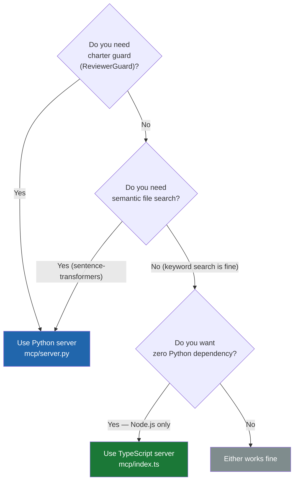

Both servers share the same SQLite database and produce the same output format. You can run them both simultaneously against the same `data/contextforge.db` — reads are concurrent-safe in WAL mode.

---

### "What Does `load_context` Actually Return? What Should I Do With It?"

`load_context` assembles a hierarchical snapshot of everything ContextForge knows about a project:

```json
// detail_level = "L2" example
{
  "level": "L2",
  "project_id": "my-saas-app",
  "name": "My SaaS App",
  "description": "A subscription SaaS...",
  "tech_stack": {"backend": "FastAPI", "frontend": "React"},
  "goals": ["Launch MVP in 3 months"],
  "decisions": [
    {
      "id": "d7c2...",
      "area": "payments",
      "summary": "Use Stripe instead of Paddle",
      "rationale": "Stripe has better FastAPI SDK...",
      "alternatives": [{"option": "Paddle", "rejected_because": "harder SDK"}],
      "confidence": 0.92
    }
  ]
}
```

**Practical use:** Put this in the system prompt or first user message at the start of every coding session. Instead of pasting context manually, your AI client calls `load_context` and gets the full project state automatically. This is exactly what solves the "context amnesia" problem.

You can instruct Claude: *"Always call `load_context` with my project at the start of every conversation."* This becomes automatic once set up in the IDE config.

---

### "The `decision_nodes` Table Has a `tombstone` Field. What Is It?"

`tombstone = TRUE` means the node is logically deleted but physically retained. It is set by `delete_project` when `archive_nodes=False`, or directly when a node is merged. Tombstoned nodes:
- Do not appear in `load_context` results
- Do not appear in `list_decisions` results
- Are still in the database for audit purposes
- Can be queried directly with raw SQL if needed

This is different from `status = 'deprecated'` — a deprecated node is still visible (it just shows its reason and replacement). A tombstoned node is effectively invisible.

---

### "How Does Rollback Work? What Exactly Gets Undone?"

`rollback(event_id="abc1...")` does:
1. Finds the `created_at` timestamp of event `abc1...`
2. `UPDATE events SET status='rolled_back' WHERE created_at > that_timestamp AND status='active'`
3. Inserts a new `ROLLBACK` event recording how many events were pruned

**What does NOT get undone:** `decision_nodes` and `tasks` table entries are not touched by rollback. Rollback only affects the event ledger. The knowledge graph (decisions) can drift out of sync with the ledger after rollback. If you need to undo a decision node, call `deprecate_decision` on it directly.

This is a known architectural gap — a future `rollback_graph(event_id)` tool could sync both, but it doesn't exist yet.

---

### "Will ContextForge Slow Down With Many Decisions?"

SQLite with WAL mode handles millions of rows efficiently for read-heavy workloads. Practical limits:

| Scale | Expected behavior |
|-------|-------------------|
| < 10,000 decisions | Instant on all tools |
| 10,000 – 100,000 decisions | `load_context` with `top_k=10` still < 5 ms (indexed) |
| > 100,000 decisions | Consider `area` filters in `load_context` to limit result set |
| `search_context` file index | TF-IDF: up to ~50k chunks before latency degrades; sentence-transformers scales further |

The L1 in-process cache (SHA-256 exact match) resets on server restart. The L2 BM25 cache hits ~93.7% of repeated queries. For truly large deployments, replace SQLite with PostgreSQL via the same `StorageAdapter` interface.

---

### "Can I Use ContextForge With Any AI — Not Just Claude?"

Yes. ContextForge is a standard MCP server. Any client that speaks MCP JSON-RPC works:

- **Claude Desktop** — native MCP support
- **Cursor** — native MCP support via `.cursor/mcp.json`
- **VS Code** — via MCP extension or GitHub Copilot (when MCP support is enabled)
- **Windsurf** — native MCP support
- **Custom scripts** — call the SSE endpoint or pipe JSON-RPC to stdio directly
- **Any other MCP-compatible client** — the spec is open

The AI model (GPT-4o, Gemini, Claude, Llama) doesn't matter — only the client application needs MCP support.

---

### "I Get a 'ConflictError' When Capturing a Decision. Why?"

The `ReviewerGuard` blocked the payload. The response looks like:
```json
{"status": "quarantined", "reason": "Destructive operation targeting protected entity 'sentry': ..."}
```

Common causes and fixes:

| Symptom | Likely cause | Fix |
|---------|-------------|-----|
| `entropy_gate` | Decision contains obfuscated/high-entropy text (e.g. base64 blob, minified JSON) | Don't include raw encoded data in summaries — use plain English |
| `lz_density_gate` | Repetitive content (same phrase many times) | Condense repeated content |
| `protected entity: sentry` | Summary mentions "kill/remove/delete" + an agent name | Rephrase: "retire" → "update", "disable" → "configure off" |
| `charter constraint: "..."` | Content matches a charter bullet | Either rephrase or update the charter to be more specific |

If a valid decision keeps getting blocked, make the charter constraint more precise. `PROJECT_CHARTER.md` is fully editable — it is your rules, not ContextForge's.

---

### "What Happens If the MCP Server Crashes Mid-Write?"

SQLite with WAL mode is ACID-compliant. A crash mid-write rolls back the incomplete transaction automatically on next open. The hash chain may have a gap if the event was partially committed — `list_events` will show `prev_hash` mismatches at that point.

Recovery: call `snapshot` immediately after restart (before any new writes) to capture current state, then continue. The gap in the hash chain is a cosmetic issue — it does not affect reads or future writes.

---

### "How Do I Completely Reset / Start Fresh?"

```bash
# Option 1: delete only the database (keep snapshots)
rm data/contextforge.db
# Database recreates automatically on next server start

# Option 2: delete everything including snapshots and file index
rm data/contextforge.db
rm -rf .forge/
# You lose all history — no recovery possible

# Option 3: archive before reset (recommended)
python mcp/server.py --stdio
# then call: snapshot(label="full-backup-before-reset")
# then: rm data/contextforge.db
```

---

### "I'm a Developer — How Do I Add a New MCP Tool?"

1. Add a `types.Tool(name=..., description=..., inputSchema=...)` entry inside `list_tools()` in [mcp/server.py](../mcp/server.py)
2. Add a handler `elif name == "your_tool_name":` inside `call_tool()`
3. Add the matching TypeScript implementation in [mcp/index.ts](../mcp/index.ts)
4. If the tool needs a new storage method, add it to [src/core/storage.py](../src/core/storage.py)
5. Run the benchmark suite to verify nothing broke: `python -X utf8 benchmark/test_v5/run_all.py`

All 22 tools follow the same pattern — reading any handler is a good template.

---

## ContextForge vs Traditional Approaches — Why This Is Different

### The Traditional Method: Paste Everything Into CLAUDE.md

The standard advice for giving an AI "memory" is to maintain a `CLAUDE.md` (or `AGENTS.md`, `GEMINI.md`, `system_prompt.txt`) file that you manually keep updated and paste into every session. Here is what that looks like at scale:

```mermaid
flowchart TD
    subgraph TraditionalApproach["Traditional: Manual Context File"]
        direction TB
        DEV["Developer"] -->|"manually writes & updates"| CFILE["CLAUDE.md\nor system_prompt.txt\n(flat text file)"]
        CFILE -->|"paste ENTIRE file\nevery session"| CTX["AI Context Window\n⚠️ growing without bound"]
        CTX --> AI1["Session 1\n✅ works"]
        CTX --> AI2["Session 30\n⚠️ 4,000 tokens of context"]
        CTX --> AI3["Session 200\n❌ 10,000+ tokens of outdated\nmixed with current"]
        OLD["Old decisions\nnever cleaned up"] -.->|"pollutes context"| CTX
        MISS["Decisions not in\nthe file = lost forever"] -.->|"amnesia"| CTX
    end

    style OLD fill:#C0392B,color:#fff
    style MISS fill:#C0392B,color:#fff
    style AI3 fill:#E67E22,color:#fff
```

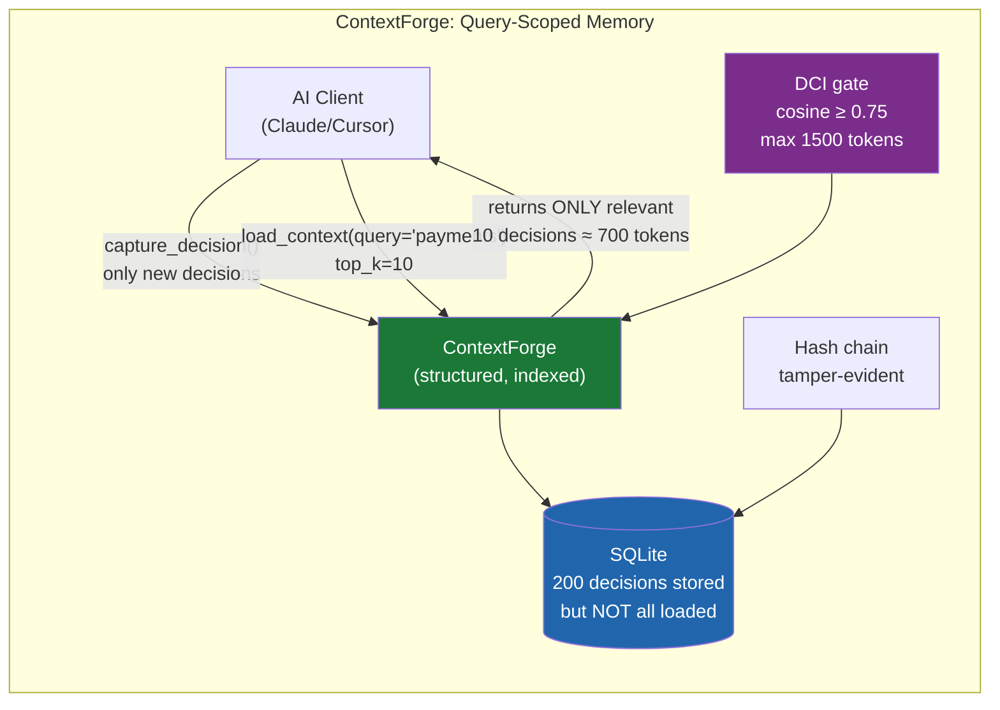

---

### Token Savings — Real Numbers

These numbers are based on a realistic 6-month project with 200 captured decisions. All token counts use the standard `words / 0.75` approximation.

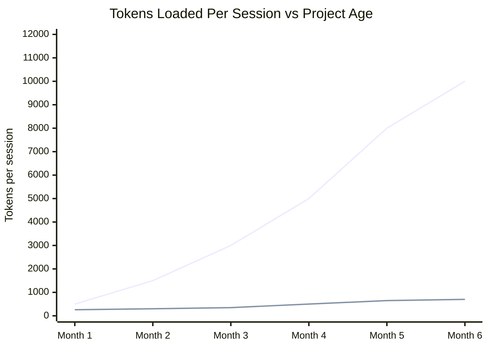

| Scenario | Traditional (paste all) | ContextForge `load_context` | Savings |
|----------|:-----------------------:|:---------------------------:|:-------:|
| Small project (20 decisions) | ~1,300 tokens | ~560 tokens | **57%** |
| Medium project (100 decisions) | ~5,300 tokens | ~700 tokens | **87%** |
| Large project (200 decisions) | ~10,000 tokens | ~700 tokens | **93%** |
| With file search (87.4% DCI noise reduction) | 110,491 tokens retrieved | ~13,900 tokens injected | **87.4%** |

**At 10 sessions/day on Claude Sonnet ($3/M input tokens):**

| Setup | Monthly context cost |
|-------|---------------------|
| Traditional, large project | ~$3.60 |
| ContextForge L1 | ~$0.24 |
| **Monthly saving** | **$3.36** |

These are input-token costs only — output costs and the time saved by not having to manually maintain a context file are additional benefits.

---

### Why the Savings Grow Over Time

With the traditional approach, the context file grows **monotonically**. There is no GC — old decisions from month 1 sit alongside current ones from month 6. The AI gets confused by outdated context and the cost climbs linearly.

With ContextForge:
- `load_context(query="payments", top_k=10)` returns the 10 most relevant current decisions regardless of total count
- The `Historian` agent archives duplicate and superseded nodes (`historical_nodes` table)
- `deprecate_decision` explicitly marks replaced decisions — they stop appearing in queries
- Token budget is hard-capped (`max 1500 tokens` for L2, `800 tokens` for L3 research)

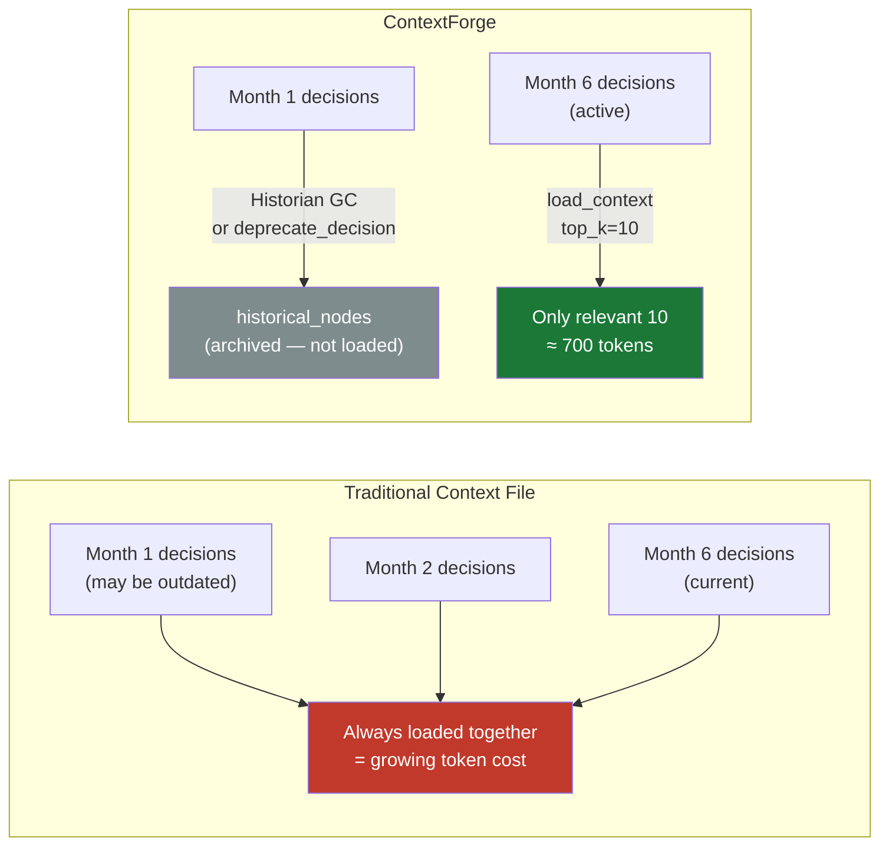

---

### What CLAUDE.md / Context Files Are Good At (And Where They Fall Short)

| Capability | CLAUDE.md / Flat file | ContextForge |
|-----------|:---------------------:|:------------:|
| Zero setup | ✅ | ❌ requires MCP server |
| Works without any tool | ✅ | ❌ |
| Survives AI client changes | ✅ | ✅ (SQLite is portable) |
| Query-scoped retrieval | ❌ always loads all | ✅ `top_k`, `area` filter, `query` keyword |
| Token cost stays flat as project grows | ❌ grows linearly | ✅ capped by `top_k` |
| Tamper-evident audit trail | ❌ | ✅ hash chain |
| Time-travel rollback | ❌ | ✅ by event_id or timestamp |
| Structured decisions (area, confidence, alternatives) | ❌ free text only | ✅ |
| Charter enforcement (can't corrupt critical rules) | ❌ | ✅ ReviewerGuard |
| Multi-project isolation | ❌ one file = one project | ✅ unlimited projects |
| Encrypted portable backup | ❌ | ✅ AES-256-GCM `.forge` |
| Works across machines | manual copy | ✅ `replay_sync` |
| Searchable by topic | ❌ grep only | ✅ BM25 + semantic |
| Task management | ❌ | ✅ |
| Duplicate GC | ❌ | ✅ Historian agent |

**The honest recommendation:** Keep a minimal `CLAUDE.md` for things that never change — coding style, commit conventions, language preferences. Use ContextForge for everything that evolves — decisions, rationale, tasks, research.

---

### ContextForge vs Other AI Memory Tools

| | **CLAUDE.md** | **LangChain Memory** | **MemGPT / Letta** | **Vector DB (Pinecone/Chroma)** | **ContextForge** |
|---|:---:|:---:|:---:|:---:|:---:|
| **Setup** | None | Python SDK | Python SDK | Cloud account or self-host | MCP server |
| **Storage** | Flat text | In-memory / Redis | SQLite | Cloud or local | SQLite (local-first) |
| **Retrieval** | Load all | Keyword / embedding | Hierarchical paging | Vector similarity | BM25 + semantic + DCI |
| **Token cost as project grows** | Linear ↑ | Configurable window | Managed by OS | Pay per query | Flat (capped top_k) |
| **Audit trail** | ❌ | ❌ | Partial | ❌ | ✅ hash chain |
| **Rollback** | Manual git | ❌ | ❌ | ❌ | ✅ by event_id |
| **Charter / safety guard** | ❌ | ❌ | ❌ | ❌ | ✅ 6-layer defense |
| **Adversarial block rate** | 0% | ~0% | ~0% | 0% | **85%** (measured) |
| **Works without cloud** | ✅ | Partial | ✅ | Ollama only | ✅ |
| **MCP-native** | N/A | ❌ | ❌ | ❌ | ✅ |
| **Multi-project** | ❌ | Manual | ❌ | Namespaces | ✅ project_id |
| **Encrypted snapshot** | ❌ | ❌ | ❌ | ❌ | ✅ AES-256-GCM |
| **Cost** | Free | Free (self-host) | Free (self-host) | $70+/mo cloud | **Free** |

**Key differentiators vs each alternative:**

**vs CLAUDE.md:** ContextForge adds structure, queryability, and bounded token cost. CLAUDE.md wins on simplicity for small/stable projects.

**vs LangChain Memory:** LangChain's `ConversationBufferMemory` loads the full history. `ConversationSummaryMemory` truncates with an LLM call (costs tokens to reduce tokens). Neither has an audit trail, charter guard, or rollback. ContextForge's BM25 + DCI retrieval is more precise and does not require an LLM call to summarize.

**vs MemGPT / Letta:** MemGPT introduced hierarchical memory paging (main context ↔ external storage) — closest conceptually to ContextForge. Differences: MemGPT requires its own agent loop; ContextForge exposes memory as MCP tools so any client can use it. MemGPT has no charter guard or hash-chain audit trail. ContextForge does not page memories in/out mid-conversation — the AI client decides what to load.

**vs Vector DBs (Pinecone, ChromaDB, Weaviate):** These are retrieval-only — no structured decisions, no tasks, no ledger, no rollback, no charter. They are excellent at semantic similarity search at scale. ContextForge's `search_context` (LocalIndexer with sentence-transformers) covers the same use case for project-file search. For truly large corpora (millions of vectors), a dedicated vector DB is the right tool; ContextForge is designed for project-scale context (thousands of decisions).

---

### The DCI Token Efficiency — How the Math Works

The **Differential Context Injection** gate is what makes ContextForge's RAG token-efficient:

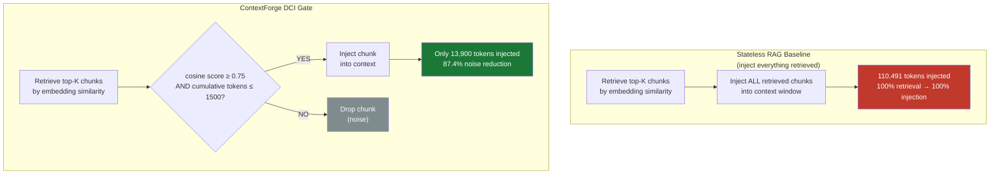

**Measured result (from `data/academic_metrics.json`, 40 RAG probes):**

| Metric | Stateless Baseline | ContextForge |
|--------|:-----------------:|:------------:|
| Tokens retrieved | 110,491 | 110,491 |
| Tokens injected into context | 110,491 | ~13,900 |
| Noise reduction | 0% | **87.4%** |
| Relevant chunks correctly injected | — | score 0.78–0.94 |

The threshold `θ = 0.75` was chosen so that chunks semantically unrelated to the current query are always dropped, even if they appear in the top-K by raw similarity score. The hard token budget (`B = 1500`) ensures the context slot used by retrieval never expands even as the knowledge base grows.

---

### Summary — When to Use What

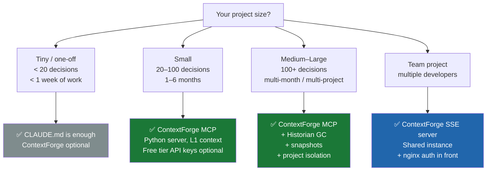
