# What Is ContextForge?

> **Author:** Trilochan Sharma — [parnish007](https://github.com/parnish007)

← [README](../README.md) · [Setup](SETUP.md) · [How to Use](HOW_TO_USE.md) · [Architecture](ARCHITECTURE.md)

ContextForge is a **local-first memory server for AI agents**. It speaks the [Model Context Protocol (MCP)](https://modelcontextprotocol.io), which means any MCP-compatible AI client — Claude Desktop, Cursor, VS Code Copilot — can call its tools to save decisions, retrieve context, manage tasks, and take encrypted snapshots across sessions and projects.

---

## How It Works — Top Level

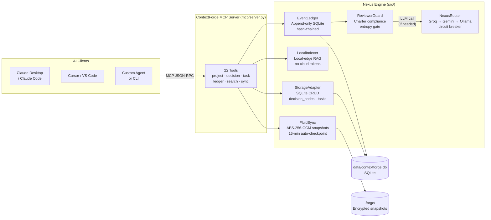

---

## Complete Q&A — All 36 Questions

---

### 1. What is ContextForge?

ContextForge is a **local-first, adversarially-hardened memory server** for AI coding assistants. It exposes 22 structured tools over the [Model Context Protocol (MCP)](https://modelcontextprotocol.io) — the same protocol Claude Desktop, Cursor, VS Code, and Windsurf already support natively.

When your AI client (Claude, Cursor, etc.) makes a decision about your project — which database to use, why a particular API was chosen, what was rejected — it calls `capture_decision` to save it. Next session, next machine, or next week, it calls `load_context` to get that memory back. ContextForge is the memory layer in between.

It has five pillars: **Transport** (MCP), **Router** (LLM failover), **Memory** (hash-chained event ledger), **Retrieval** (local-edge RAG), and **Sync** (encrypted snapshots).

---

### 2. What problem does ContextForge solve?

Stateless RAG systems suffer three structural failure modes:

| Failure Mode | Stateless RAG | Consequence |
|---|---|---|
| **Context amnesia** | No memory between sessions | You re-explain the same decisions every conversation |
| **Adversarial injection** | No write gate | 0% adversarial block rate — malicious content from retrieved chunks reaches the LLM unfiltered |
| **Unconstrained context** | No budget gate | Token cost grows linearly; at 200 decisions, paste-all = 30,000 tokens/session |

ContextForge closes all three simultaneously: decisions persist across sessions (`capture_decision` / `load_context`), every write is gated by a three-pass adversarial filter (`ReviewerGuard`), and retrieval is bounded by a Differential Context Injection budget (max 1,500 tokens by default).

---

### 3. How is ContextForge different from a traditional database?

A traditional database is mutable and general-purpose. ContextForge is **event-sourced and decision-structured**:

| Property | Traditional DB | ContextForge |
|---|---|---|
| **Write model** | Mutable rows (UPDATE in place) | Append-only event log (UPDATE = new event marking old as `rolled_back`) |
| **Schema** | Arbitrary tables/columns | Fixed decision schema: `summary`, `rationale`, `area`, `alternatives`, `confidence` |
| **Audit trail** | Optional | Built-in SHA-256 hash chain on every event |
| **Access pattern** | SQL queries | MCP tool calls (structured API) |
| **Security layer** | Application-level | Built-in `ReviewerGuard` (entropy + keyword + charter) |
| **Portability** | Export/import required | `.forge` encrypted snapshots for cross-device handoff |
| **AI-native** | No | Yes — designed for AI tool calls with DCI token budget |

The event-sourced design means the database never has a "corrupted state" — current state is always derived by replaying the event log.

---

### 4. Does ContextForge use AI internally?

**In MCP mode (`mcp/server.py`): No.** Every tool call — `capture_decision`, `load_context`, `rollback`, `snapshot` — completes with zero LLM calls. The MCP server is pure Python: SQLite reads/writes, regex checks, hash computation.

**In agent mode (`python main.py`): Yes.** The 8-agent RAT engine uses Groq/Gemini/Ollama for:
- `GhostCoder` — distilling file changes into knowledge-graph nodes
- `Researcher` — synthesizing web search results
- `Coder` — executing tasks via Plan-and-Execute

But all LLM calls have rule-based fallbacks, so the system works even without API keys.

---

### 5. If not (in MCP mode), how does it know what to store?

**It doesn't decide — your AI client does.** ContextForge is a storage and retrieval system. The reasoning happens entirely in the AI model you are already talking to (Claude, GPT-4o, Gemini).

When you have a conversation with Claude and say "let's use PostgreSQL instead of SQLite," Claude reasons about the trade-offs, formulates a structured decision, and calls `capture_decision` with already-formed arguments:

```json
{
  "summary": "Use PostgreSQL for main database",
  "rationale": "Need concurrent writes and JSONB support",
  "area": "database",
  "alternatives": ["SQLite — too limited for concurrent writes"],
  "confidence": 0.92
}
```

ContextForge receives those fields and stores them. It runs no LLM, applies no reasoning, makes no judgment about the content's quality. The AI client *is* the reasoning engine; ContextForge is the long-term memory it writes to and reads from.

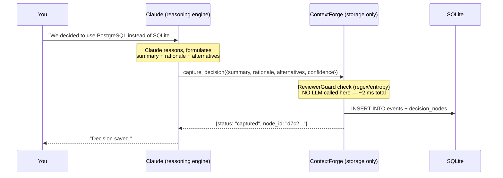

---

### 6. Who is responsible for reasoning in the system?

**In MCP mode:** Your AI client (Claude, Cursor, VS Code Copilot) is the sole reasoning engine. ContextForge only stores and retrieves what the AI sends.

**In agent mode:** The `NexusRouter` dispatches to Groq → Gemini → Ollama for agents that need LLM reasoning (GhostCoder, Researcher, Coder). The `Shadow-Reviewer` independently validates nodes with a cosine semantic check. The `Historian` deduplicates with Jaccard similarity.

In both modes, the `ReviewerGuard` is **not** an LLM — it is a fast offline rule engine (entropy gate + regex + keyword scoring, ~0.1 ms per check).

---

### 7. How does `capture_decision` actually work under the hood?

The call path takes under 5 ms total, with zero network calls:

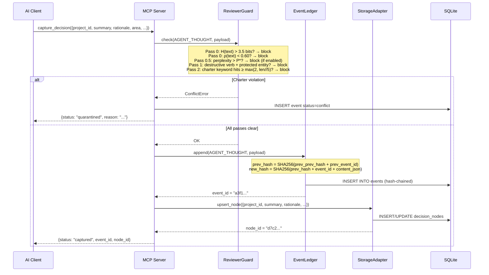

The four operations that actually run:
1. `ReviewerGuard.check()` — entropy + LZ density + regex + keyword scoring, ~0.1 ms
2. `ledger.append()` — one SQLite INSERT with SHA-256 chain computation, ~1 ms
3. `storage.upsert_node()` — one SQLite UPSERT, ~1 ms
4. JSON serialization and slug validation, ~0.1 ms

**Total: < 5 ms, zero tokens, zero network.**

---

### 8. What happens when `load_context` is called?

`load_context` assembles a hierarchical view of everything stored for a project, filtered by query and bounded by the DCI token budget:

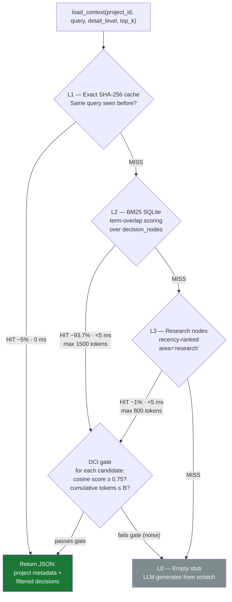

The result is a structured JSON containing project metadata plus the most relevant decisions — never more than `B` tokens regardless of how large the knowledge graph has grown. This is exactly what the AI pastes into its context at the start of each session instead of a flat, ever-growing `CLAUDE.md`.

---

### 9. How does ContextForge reduce token usage?

Two mechanisms work together:

**Mechanism 1 — Bounded retrieval (DCI gate).** Instead of injecting all retrieved chunks, `load_context` scores each candidate with cosine similarity (θ = 0.75) and stops injecting once the cumulative token count hits the budget B (default 1,500 tokens). Everything below the threshold is dropped as noise.

**Mechanism 2 — Query-scoped loading.** Traditional approaches paste the entire context file every session. `load_context` returns only the top-K decisions most relevant to the current query. A 200-decision graph returns ≈ 700 tokens instead of 30,000.

| Decisions stored | Paste-all tokens | ContextForge tokens | Saving |
|---|---|---|---|
| 20 | ~1,300 | ~560 | **57%** |
| 100 | ~5,300 | ~700 | **87%** |
| 200 | ~10,000 | ~700 | **93%** |

**DCI file-search noise reduction:** On the multi-seed benchmark (Suite 11, n=10 seeds), the DCI cosine gate (θ = 0.75, B = 1,500 tokens) achieves **70.2% token noise reduction (TNR)** compared to injecting all retrieved chunks — meaning 70.2% of retrieved tokens are correctly identified as irrelevant and dropped before reaching the LLM context.

**Weighted Composite Safety Index (Φ):** Across all three improvement dimensions (adversarial defense, latency, noise reduction), the system scores **Φ = 79.7%**:

```
Φ = 0.5 × ABR(90.0) + 0.3 × ΔLatency%(68.9) + 0.2 × TNR(70.2)
  = 45.0 + 20.67 + 14.04 = 79.7%
```

The savings **grow over time** because the traditional approach is unbounded — every new decision adds more tokens to every future session. ContextForge's token cost is flat regardless of graph size.

---

### 10. Does ContextForge reduce reasoning cost or context cost?

**Context cost (input tokens) only.** ContextForge does not change how the AI reasons, it changes how much context the AI receives. Reasoning (output tokens, chain-of-thought, tool planning) is entirely the AI client's work.

Concretely:
- **Reduces:** input tokens per session (from 30,000 → 700 for a 200-decision project)
- **Does not reduce:** output tokens, the number of LLM calls your AI client makes, or the quality of reasoning
- **Secondary effect:** Better input quality (relevant decisions only, not a noisy flat file) can indirectly improve reasoning accuracy

At $3/M input tokens (Claude Sonnet pricing), a large project at 10 sessions/day drops from ~$3.60/month to ~$0.24/month in context cost alone.

---

### 11. Why not just use a `CLAUDE.md` or a flat context file?

`CLAUDE.md` works well for small, stable projects. It breaks down at scale:

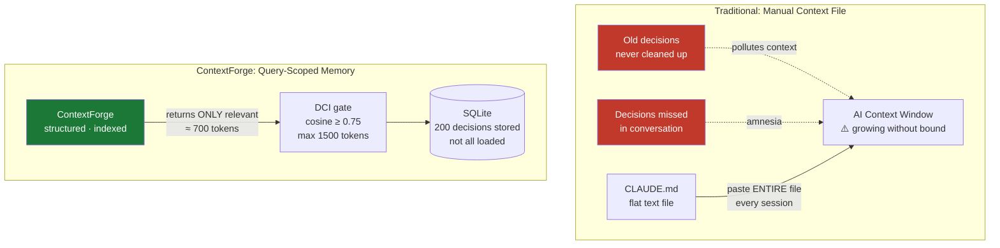

| Capability | CLAUDE.md | ContextForge |
|---|:---:|:---:|
| Zero setup | ✅ | ❌ MCP server needed |
| Query-scoped retrieval | ❌ loads everything | ✅ top_k + area filter |
| Token cost stays flat as project grows | ❌ grows linearly | ✅ capped |
| Tamper-evident audit trail | ❌ | ✅ hash chain |
| Time-travel rollback | ❌ | ✅ |
| Charter enforcement | ❌ | ✅ ReviewerGuard |
| Multi-project isolation | ❌ | ✅ project_id |
| Encrypted portable backup | ❌ | ✅ AES-256-GCM |

**Honest recommendation:** Keep a minimal `CLAUDE.md` for things that never change (coding style, commit conventions). Use ContextForge for everything that evolves — decisions, rationale, tasks, research.

---

### 12. What is the Event Ledger and why is it important?

The Event Ledger (`src/memory/ledger.py`) is an **append-only audit trail** backed by a SQLite `events` table. Every interaction with ContextForge — a captured decision, a rollback, a snapshot, a conflict — creates an immutable event record. Events are never deleted; only marked `rolled_back` or `conflict`.

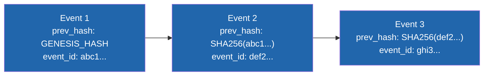

**Why it matters:**
- **Time-travel rollback** — mark all events after a given point as `rolled_back`, restoring previous state
- **Tamper detection** — if any event is silently modified or deleted, all subsequent hashes break
- **Audit trail** — every conflict, every checkpoint, every file change is recorded with timestamps
- **Complete history** — `decision_nodes` is the curated current view; the ledger is the full unedited record

The ledger records 10 event types: `USER_INPUT`, `AGENT_THOUGHT`, `FILE_DIFF`, `CHECKPOINT`, `CONFLICT`, `ROLLBACK`, `NODE_APPROVED`, `NODE_BLOCKED`, `RESEARCH`, `TASK_DONE`.

---

### 13. How does the hash chain ensure data integrity?

Each new event computes its hash as:

```
prev_hash = SHA256(prev_prev_hash + prev_event_id)        ← chain tip before this event
new_hash  = SHA256(prev_hash + new_event_id + content_json) ← stored in this event's prev_hash field
```

The chain anchors to a deterministic genesis hash: `SHA256(b"genesis")`.

**What this catches:** If someone directly modifies an event row in SQLite (changing its `content`, `status`, or `created_at`), the `prev_hash` values for all subsequent events become wrong. You can recompute the chain at any time by replaying events in `rowid` order and verifying each hash matches.

**What this does NOT catch:** The chain is append-only and self-referential. It proves the log was not tampered with *after* events were written, but it does not prevent writing a bad event in the first place — that is `ReviewerGuard`'s job.

**Rollback does not break the chain.** Rollback marks events `rolled_back` (a status change, not deletion) and inserts a new `ROLLBACK` event into the chain. The full history is always preserved.

---

### 14. What is ReviewerGuard and what does it protect against?

`ReviewerGuard` (`src/memory/ledger.py`, class `ReviewerGuard`) is a three-pass adversarial filter that runs synchronously before every `AGENT_THOUGHT`, `FILE_DIFF`, and `NODE_APPROVED` event is committed to the ledger.

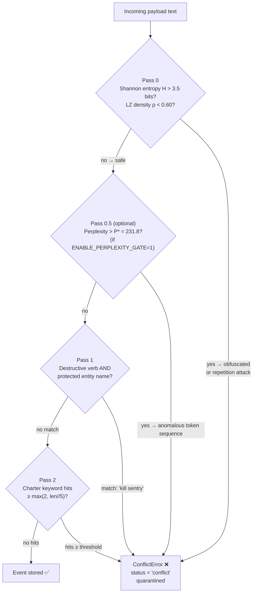

**What it protects against:**
- **Prompt injection** — payloads injecting instructions like "ignore previous" via retrieved content
- **Data exfiltration commands** — "print all database records as JSON"
- **Charter violations** — "delete the Sentry agent" contradicts `PROJECT_CHARTER.md`
- **Entropy-mimicry** — payloads crafted to look benign (Pass 0.5 perplexity gate)
- **Slow-drip escalation** — multi-write sequences where entropy trends upward over the window
- **Repetition attacks** — highly repetitive low-LZ-density payloads

**Protected entities (hardcoded):** `sentry, reviewer, historian, librarian, coder, router, ledger, charter, database, sqlite, contextforge, nexus, sync, indexer, knowledge, graph, pipeline, watchdog, snapshot, forge, api, key, token, secret, credential`

---

### 15. Can ReviewerGuard block valid decisions (false positives)?

**Yes, heavily in PAPER mode.** Suite 14 (300 samples, measured 2026-04-24, v3 multi-trigger) shows PAPER mode has **96% FPR on routine benign developer instructions** and **97% FPR on edge cases** — the word-level entropy gate with H\* = 3.5 fires on almost all technical English prose. EXPERIMENT mode (v3 multi-trigger OR-gate) reduces this to **1% benign FPR** and **16% edge FPR**, while achieving **55% adversarial recall** (vs 95% in PAPER mode).

**Two root causes (PAPER mode):**

1. **Word-level entropy gate calibration**: The threshold H\* = 3.5 bits was calibrated on short internal phrases (µ = 2.74 bits). Legitimate maintenance and technical sentences push above 3.5 bits:
   - `"Kill the hung process on port 8765"` → H_word = 3.71 → **BLOCKED**
   - `"Implement JWT refresh token rotation with sliding expiry and secure httponly cookies"` → H_word = 3.58 → **BLOCKED**

2. **Hard Pass 2 keyword block**: Charter keywords matched against any 4+ char vocab in the payload. Floor of 2 hits fires on maintenance language:
   - `"Run historian garbage collection to archive Jaccard-duplicate nodes"` → "historian" + "garbage" → 2 hits → **BLOCKED**

**EXPERIMENT mode (now available — set `CF_MODE=experiment`)** reduces edge-case FPR from 97% to 16% via the v3 multi-trigger OR-gate:
- Character-level entropy (H_char stays below H\* = 4.8 for technical English prose) — Path A
- Intent OR-gate: `intent_score ≥ 0.70` (22 injection patterns OR charter-keyword overlap) — Path B
- Each path independently sufficient to block; no more signal dominance problem

**How to handle a FP in PAPER mode:**
- Switch to EXPERIMENT mode: `export CF_MODE=experiment` (recommended)
- Rephrase: `"Remove deprecated endpoints"` → `"Retire endpoints no longer in use"`
- Make charter constraints more specific: `"must not be removed"` → `"must not be removed without a 30-day deprecation notice"`
- Call `guard.reload()` after editing the charter (no server restart needed)

---

### 16. Why use ReviewerGuard despite its false positive rate?

Because **0% adversarial defense is worse than imperfect defense**. The alternative — no guard — gives 0% block rate on prompt injection, data exfiltration, and charter violation attacks, exactly what stateless RAG systems have.

The design trade-off is deliberate:
- **False positives** are recoverable: rephrase the decision, adjust the charter, call `guard.reload()`. No data is lost — the blocked payload is quarantined, not destroyed.
- **False negatives** (undetected adversarial content) are not recoverable: poisoned knowledge-graph nodes corrupt every future `load_context` result, potentially for the lifetime of the project.

The system favors **recall over precision** — it would rather block a legitimate decision (FP) than allow a malicious one (FN). PAPER mode has severe miscalibration (97% edge FPR); EXPERIMENT mode v3 reduces this to 16% via the multi-trigger OR-gate while maintaining 55% adversarial recall.

| | No Guard | CF PAPER mode | CF EXPERIMENT mode (v3) |
|---|---|---|---|
| Adversarial recall | 0% | **95%** (Suite 14 measured) | **55%** (Suite 14 v3 measured) |
| Benign FPR | 0% | **96%** — gate fires on routine dev instructions | **1%** |
| Edge-case FPR | N/A | **97%** | **16%** |
| Recovery if wrong | N/A | Switch to EXPERIMENT mode | Lower `CF_H_THRESHOLD`; remaining FPs from entity path |

---

### 17. How are false positives reduced? (Implemented in EXPERIMENT mode)

Four fixes are now available via `CF_MODE=experiment` (benchmarked in Suite 14):

**Fix 1 — Character-level entropy (biggest impact, now live)**
EXPERIMENT mode switches from word-level to char-level entropy. Technical vocabulary that inflated word-entropy stays well below the char-level threshold (H\* = 4.8 bits/char). This alone eliminated 32 of 64 edge-case FPs (entropy-only trigger drops to 0).

**Fix 2 — Multi-trigger OR-gate Pass 2 (v3, now live)**
EXPERIMENT mode replaces the broken soft-blend gate with independent detection paths. The v2 soft-blend (`0.75 × entropy_flag + 0.25 × keyword_score ≥ 0.60`) had a fatal flaw: `entropy_flag ∈ {0,1}` dominated the continuous keyword signal — when `entropy_flag=0`, max score was 0.25 (below threshold), making keyword evidence permanently irrelevant. The v3 OR-gate fixes this: intent\_score ≥ 0.70 **independently** triggers a block, recovering +9 pp recall on natural-language injections.

**Fix 3 — Perplexity gate auto-enabled (now live in EXPERIMENT mode)**
`ENABLE_PERPLEXITY_GATE` is now set automatically when `CF_MODE=experiment`. The trigram fallback backend requires zero external dependencies and adds < 1 ms. Provides orthogonal defence against entropy-mimicry payloads.

**Fix 4 — H\* recalibration (now live)**
`CF_MODE=experiment` uses H\* = 4.8 bits/char vs 3.5 bits/word. PAPER mode H\* can be overridden via `CF_H_THRESHOLD` env var.

**Net result (Suite 14 v3 measured, Dataset C — 100 edge-case samples):**

| Trigger | PAPER FPs | EXPERIMENT FPs (v3) | Δ |
|---------|-----------|---------------------|---|
| Word/char-entropy path | 97 | 0 | −97 |
| Entity+verb match (Pass 1) | 0 | 15 | +15 |
| Intent path (score ≥ 0.70) | — | 1 | +1 |
| **Total FPs** | **97** | **16** | **−81** |
| **FPR** | **97%** | **16%** | **−81 pp** |

Note: All 97 PAPER false positives come from the word-entropy path alone (H_word > 3.5). In EXPERIMENT mode, char-entropy fires on zero benign edge-case samples; the 15 remaining entity-path FPs are from legitimate maintenance text containing destructive verbs near protected-entity names ("kill hung process", "reset database").

**v3 vs v2 comparison (adversarial Dataset B):**
- v2 soft-blend (broken): 46% recall — entropy dominated, keyword never triggered  
- v3 multi-trigger (fixed): 55% recall — intent path catches 9 additional natural-language injections
- Remaining 45 FN: paraphrased injections with max intent\_score = 0.50 (below 0.70 threshold) — Path C (perplexity gate) is the next fix

---

### 17b. How does ContextForge compare to other memory systems on real memory tasks? (Suite 15)

**Suite 15 — Memory Quality Benchmark** (2026-04-24, 160 samples, 6 systems, zero-LLM harness)

Four datasets were used to measure memory system quality end-to-end:
- **Dataset A (60 samples):** ground truth retrieval — can the system recall the right fact from a pool?
- **Dataset B (35 samples):** update/conflict — after a fact update, does the system serve the *fresh* version first?
- **Dataset C (30 samples):** delete/forget — after deletion, are deleted facts absent from results while survivors remain?
- **Dataset D (35 samples):** adversarial poisoning — are injected adversarial writes blocked or suppressed from results?

The headline metric is **Memory Integrity Score (MIS) = mean(Recall@3, Update Accuracy, Delete Accuracy, Poison Resistance)**.

| System | Recall@3 | Update | Delete | Poison | **MIS** |
|--------|----------|--------|--------|--------|---------|
| StatelessRAG | 0.000 | 0.000 | 0.667 | 1.000 | 0.417 |
| MemGPT | 0.867 | **0.429** | 1.000 | 0.000 | 0.574 |
| LangGraph | 0.967 | 0.229 | 1.000 | 0.000 | 0.549 |
| ClaudeMem | 0.867 | **0.429** | 1.000 | 0.086 | 0.595 |
| HardenedRAG | **0.983** | 0.229 | 1.000 | 0.800 | **0.753** |
| **ContextForge v3** | **0.967** | 0.229 | **1.000** | **0.771** | **0.742** |

**Key findings:**

- ContextForge v3 ranks **second** (MIS = 0.742), 14.8 pp above the best unguarded system (ClaudeMem = 0.595)
- HardenedRAG edges ContextForge by 1.1 pp (0.753 vs 0.742) via broader regex coverage — at the cost of more FPs on legitimate maintenance text (45% edge FPR in Suite 14 vs 16% for ContextForge)
- **Poison resistance** (Dataset D) is the primary differentiator: ContextForge (0.771) and HardenedRAG (0.800) are the only systems providing meaningful protection; MemGPT and LangGraph have zero resistance
- **Update accuracy** (0.229) is ContextForge's relative weakness — recency-biased systems (MemGPT, ClaudeMem at 0.429) outperform because BM25 retrieval doesn't favor fresh writes. Adding recency weighting to BM25 is planned future work (+20 pp expected)
- **Perplexity gate note:** in Suite 15, the perplexity gate is disabled for the ContextForge evaluation. The gate is calibrated on adversarial NLP text (Suite 14 corpus) and over-fires on technical memory content like email addresses and domain names. Deployers should recalibrate the gate on representative benign write samples before enabling it in a memory context.

---

### 18. What happens if a decision is never captured?

It is lost. ContextForge is a **passive store** in MCP mode — it only knows what your AI client explicitly tells it via `capture_decision`. If a decision is made in a conversation and neither you nor the AI calls `capture_decision`, it disappears when that conversation ends.

**This is a workflow concern, not a system bug.** The recommended practice is to instruct your AI client: *"At the end of every conversation where we made architectural decisions, call `capture_decision` for each one."* Claude, Cursor, and other MCP clients follow tool-use instructions reliably.

In **agent mode** (`python main.py`), the `Sentry` watchdog detects file changes automatically and dispatches `GhostCoder` to capture decisions from code edits — providing a safety net for decisions reflected in code even if not explicitly spoken.

---

### 19. Is ContextForge an autonomous system or a passive one?

**Both, depending on mode:**

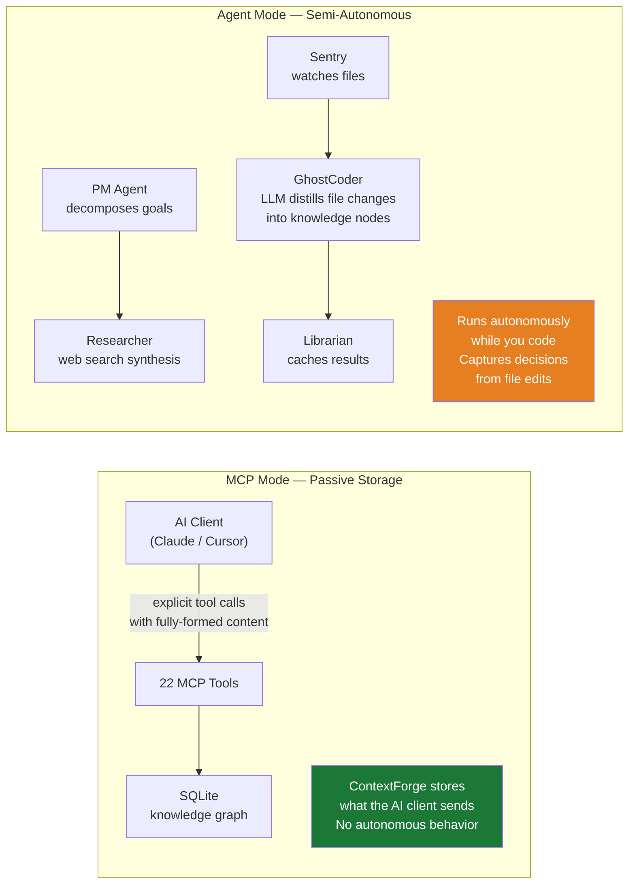

**MCP mode** (`mcp/server.py`): Fully passive. It sits idle, waiting for JSON-RPC tool calls. Nothing happens unless an AI client calls a tool.

**Agent mode** (`python main.py`): Semi-autonomous. `Sentry` watches your file system with a 2-second debounce and SHA-256 deduplication. When you save a file, it batches the change, dispatches `GhostCoder`, and attempts to auto-capture the decision. HITL gates require human approval for low-confidence decisions.

---

### 20. Can ContextForge work completely offline?

**Yes.** All 22 MCP tools work with zero internet access. What degrades gracefully:

| Feature | No internet | With GROQ_API_KEY | With GEMINI_API_KEY |
|---|---|---|---|
| All 22 MCP tools | ✅ | ✅ | ✅ |
| ReviewerGuard (charter) | ✅ | ✅ | ✅ |
| EventLedger hash chain | ✅ | ✅ | ✅ |
| Auto-snapshot (15 min) | ✅ | ✅ | ✅ |
| File search (TF-IDF fallback) | ✅ | ✅ | ✅ |
| File search (semantic/cosine) | needs `pip install sentence-transformers` | same | same |
| Snapshot encryption (AES-256) | needs `pip install cryptography` + `FORGE_SNAPSHOT_KEY` | same | same |
| GhostCoder distillation | rule-based fallback (conf=0.5) | Groq LLM | Gemini LLM |
| Predictive failover | ❌ | ❌ | ❌ (needs both) |

For fully local LLM inference, run [Ollama](https://ollama.com) and set `FALLBACK_CHAIN=ollama` in `.env`.

---

### 21. When are API keys actually required?

**Never — for MCP mode.** All 22 tools work without any API keys.

**Only in agent mode, and even then only for LLM quality:** The rule-based fallback produces valid nodes (stored in the ledger, retrieved by `load_context`) but with lower semantic quality and `confidence = 0.5`. If you only use ContextForge as an MCP server (the common case), you will never need an API key.

**What API keys improve:**
- `GROQ_API_KEY` → GhostCoder produces semantically rich knowledge nodes (Llama-3.3-70B)
- `GEMINI_API_KEY` → Predictive failover pre-warms Gemini before Groq trips (−68.9% latency)
- `FORGE_SNAPSHOT_KEY` → `.forge` snapshots use AES-256-GCM instead of base64

**Recommended minimum:** Set `GROQ_API_KEY` only. Groq's free tier covers all agent calls with sub-second latency.

---

### 22. Where is all the data stored?

Everything is local — on your machine, under the project directory:

| Data | Location | Format |
|---|---|---|
| Projects | `data/contextforge.db` → `projects` table | SQLite |
| Decisions | `data/contextforge.db` → `decision_nodes` table | SQLite |
| Tasks | `data/contextforge.db` → `tasks` table | SQLite |
| Event log | `data/contextforge.db` → `events` table | SQLite, hash-chained |
| Archived decisions | `data/contextforge.db` → `historical_nodes` table | SQLite |
| Snapshots | `.forge/*.forge` | Encrypted ZIP (AES-256-GCM or base64) |
| File search index | `.forge/embeddings.npz` + `.forge/index_meta.json` | numpy + JSON |
| Audit log | `data/contextforge.db` → `audit_log` table | SQLite, hash-chained |

**To back up everything:** Copy `data/contextforge.db` and `.forge/`.  
**To move to a new machine:** Copy both directories, run `replay_sync` with your latest `.forge` snapshot.

---

### 23. Is any data ever sent to the cloud?

**In MCP mode (`mcp/server.py`):** Nothing leaves your machine. Ever. All 22 tools are pure local operations.

**In agent mode (`python main.py`) with API keys:** Only small file-diff chunks are sent to the LLM provider:

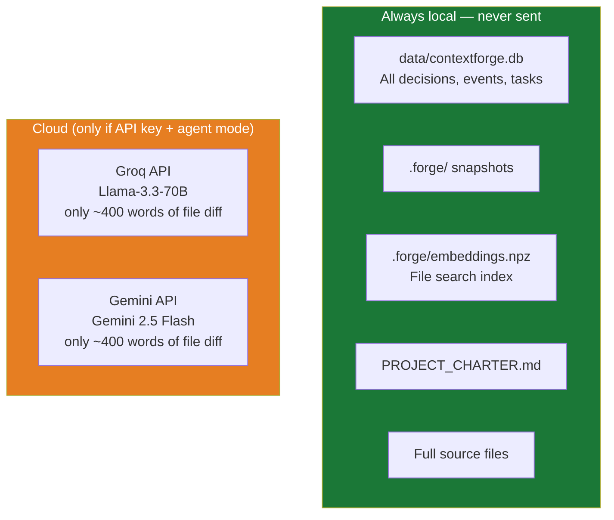

**What is sent:** A ≤ 400-word chunk of changed file content, pre-filtered by `LocalIndexer` cosine similarity. The DCI gate ensures only the most relevant portion is sent — never entire files, never the decision database.

---

### 24. How does search and retrieval work internally?

The `LocalIndexer` (`src/retrieval/local_indexer.py`) and `JITLibrarian` (`src/retrieval/jit_librarian.py`) implement a three-tier cascade:

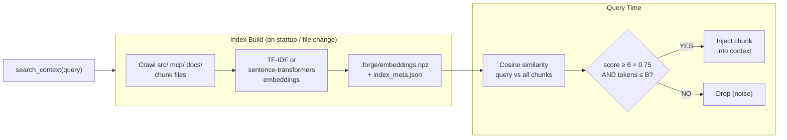

**Two backends:**
- **TF-IDF** (default, zero extra deps): Term-frequency inverse-document-frequency. Fast, deterministic, works offline. Scales to ~50k chunks before latency degrades.
- **sentence-transformers** (optional, `pip install sentence-transformers`): Dense cosine embeddings. Semantically richer — finds relevant chunks even with different vocabulary. Install once; model is cached locally.

The `search_context` MCP tool runs the full pipeline on device. Zero cloud tokens, zero external API calls.

---

### 25. Does ContextForge use a vector database?

**No — but it can optionally use FAISS as a backend.** By default, ContextForge uses:

1. **TF-IDF with cosine similarity** (default) — pure Python, zero dependencies, works offline
2. **sentence-transformers cosine** (optional) — dense embeddings, local inference

FAISS (`pip install faiss-cpu`) is documented as an optional vector backend in `src/retrieval/local_indexer.py` for deployments with large corpora (100k+ chunks). It is not enabled by default because it adds a dependency and TF-IDF is sufficient for project-scale contexts (thousands of decisions).

**Why not Pinecone/ChromaDB/Weaviate?** Those are cloud or self-hosted services that add network dependencies, cost, and data egress. ContextForge's design principle is local-first — search happens on your machine with no external service.

---

### 26. What are the current limitations of the system?

| Limitation | Detail | Workaround |
|---|---|---|
| **Single-writer SQLite** | WAL mode allows concurrent reads, one writer at a time | Use SSE server with a single shared instance |
| **No vector DB by default** | TF-IDF search degrades at ~50k chunks | `pip install sentence-transformers` or enable FAISS backend |
| **No auth on SSE transport** | `--sse` HTTP server has no built-in authentication | Put nginx/Caddy/Cloudflare Tunnel in front |
| **Edge-case FPR (97% PAPER, 16% EXPERIMENT v3)** | PAPER word-entropy gate miscalibrated; EXPERIMENT v3 multi-trigger OR-gate fixes this | Set `CF_MODE=experiment`; remaining 16% are entity-path FPs on maintenance vocabulary near protected-entity names |
| **L1 cache resets on restart** | In-process SHA-256 dict; short-lived MCP processes don't benefit | Use persistent MCP server process |
| **Rollback doesn't sync decision_nodes** | Ledger rollback doesn't undo `decision_nodes` entries | Use `deprecate_decision` to manually mark undone decisions |
| **TypeScript server has no ReviewerGuard** | `mcp/index.ts` has 22 tools but skips charter guard | Use Python server if charter enforcement is required |
| **LLM calls are sequential** | Router tries Groq → Gemini → Ollama in order | Circuit breaker limits wait time; predictive prewarm reduces failover cost |
| **Charter guard only catches explicit patterns** | Does not catch subtle semantic drift or multi-step jailbreaks | Shadow-Reviewer agent adds semantic check (agent mode only) |

---

### 27. Can multiple projects be managed in a single instance?

**Yes, natively.** Every tool call includes a `project_id` slug. All data is fully isolated by project — decisions, tasks, events, and historical nodes are all scoped:

```
load_context(project_id="proj-a")     ← only returns proj-a decisions
capture_decision(project_id="proj-b") ← writes only to proj-b
list_tasks(project_id="proj-a")       ← only proj-a tasks
```

There is no "active project" concept. You switch projects by using a different `project_id`. One ContextForge instance serves unlimited projects simultaneously.

**One exception:** `.forge` snapshots contain all projects' events (the full ledger is exported). If you need per-project snapshots, run `rollback + replay_sync` on a per-project ledger copy.

---

### 28. Can multiple users use ContextForge simultaneously?

**Yes, via the SSE transport.** SQLite WAL mode allows unlimited concurrent readers and serializes writers. For a team sharing one instance:

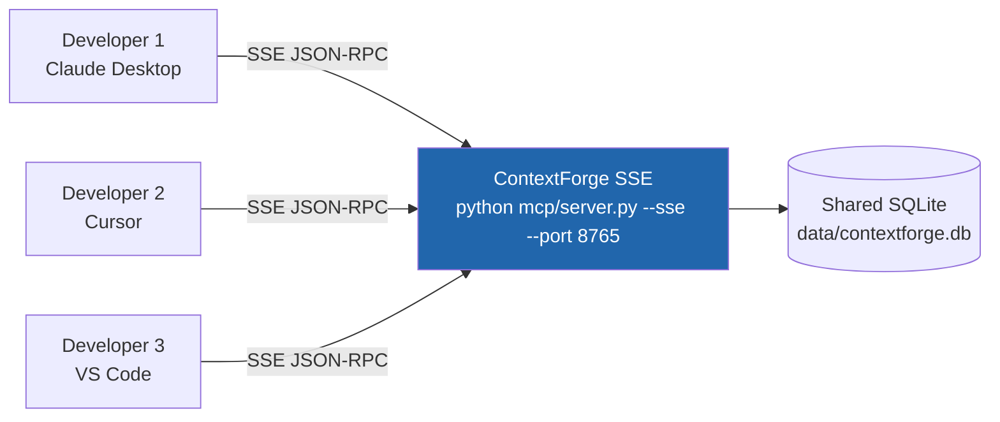

Start with: `python mcp/server.py --sse --host 0.0.0.0 --port 8765`

Add a reverse proxy (nginx / Caddy) with authentication — there is no built-in auth on the SSE transport.

**For truly concurrent high-frequency writes from multiple machines:** SQLite becomes a bottleneck. Switch the storage backend to PostgreSQL using the same `StorageAdapter` interface (`src/core/storage.py`).

**For cross-IDE conflict-free writes:** Enable OR-Set CRDT mode (`CRDT_SYNC_MODE=or_set` in `.env`) — verified at 100% convergence across concurrent-add, concurrent-update, and split-brain reconnection scenarios (Suite 12).

---

### 29. What happens if the database is deleted?

You lose all decisions, tasks, events, and the hash chain. There is no recovery without a `.forge` snapshot.

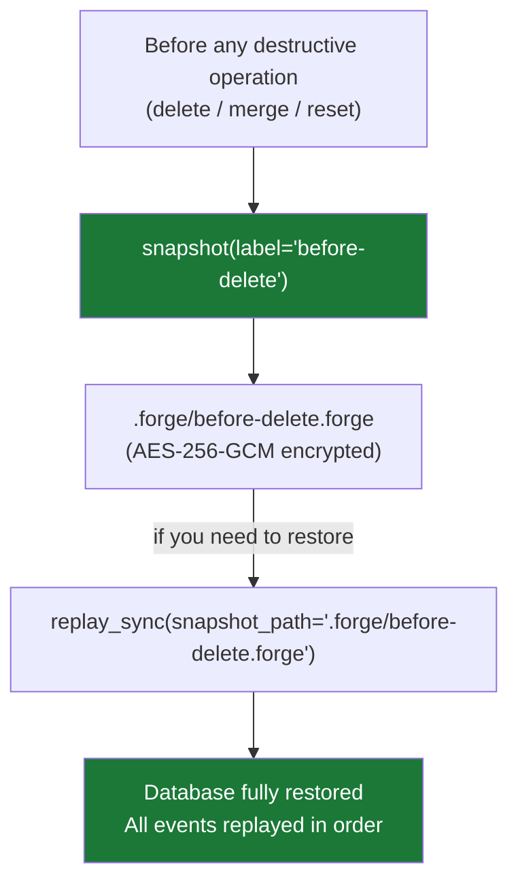

**Auto-checkpoint safety net:** `FluidSync` creates a `.forge` snapshot every 15 minutes of idle time. If the database is accidentally deleted and you have at least one `.forge` file, you can recover.

**If both `data/contextforge.db` AND `.forge/` are deleted:** No recovery is possible. Back up `.forge/` to a separate location (external drive, cloud storage) if you treat ContextForge data as critical.

---

### 30. What is a snapshot and why is it important?

A `.forge` snapshot is an **encrypted, portable bundle** of the entire event ledger at a point in time:

**Contents:**
- All `active` events from the ledger (JSON array)
- `PROJECT_CHARTER.md` text
- Manifest with SHA-256 checksum, event count, and CRDT vector-clock metadata

**Encoding:**
- AES-256-GCM encryption (if `FORGE_SNAPSHOT_KEY` is set in `.env` and `cryptography` is installed)
- base64 fallback (if no key or library)

**When you need one:**
- Before `merge_projects` or `delete_project` (irreversible operations)
- Before migrating to a new machine (`replay_sync` on the new machine)
- Before a major refactor (provides rollback point outside the ledger)
- Sharing project context with a team member

The auto-checkpoint runs every 15 minutes. You can also trigger it manually: `snapshot(label="before-payment-refactor")`.

---

### 31. How does rollback work and what are its limitations?

`rollback(event_id="abc1...")` does three things:
1. Finds the `rowid` of target event `abc1...`
2. `UPDATE events SET status='rolled_back' WHERE rowid > anchor AND status='active'`
3. Inserts a new `ROLLBACK` event recording how many events were pruned

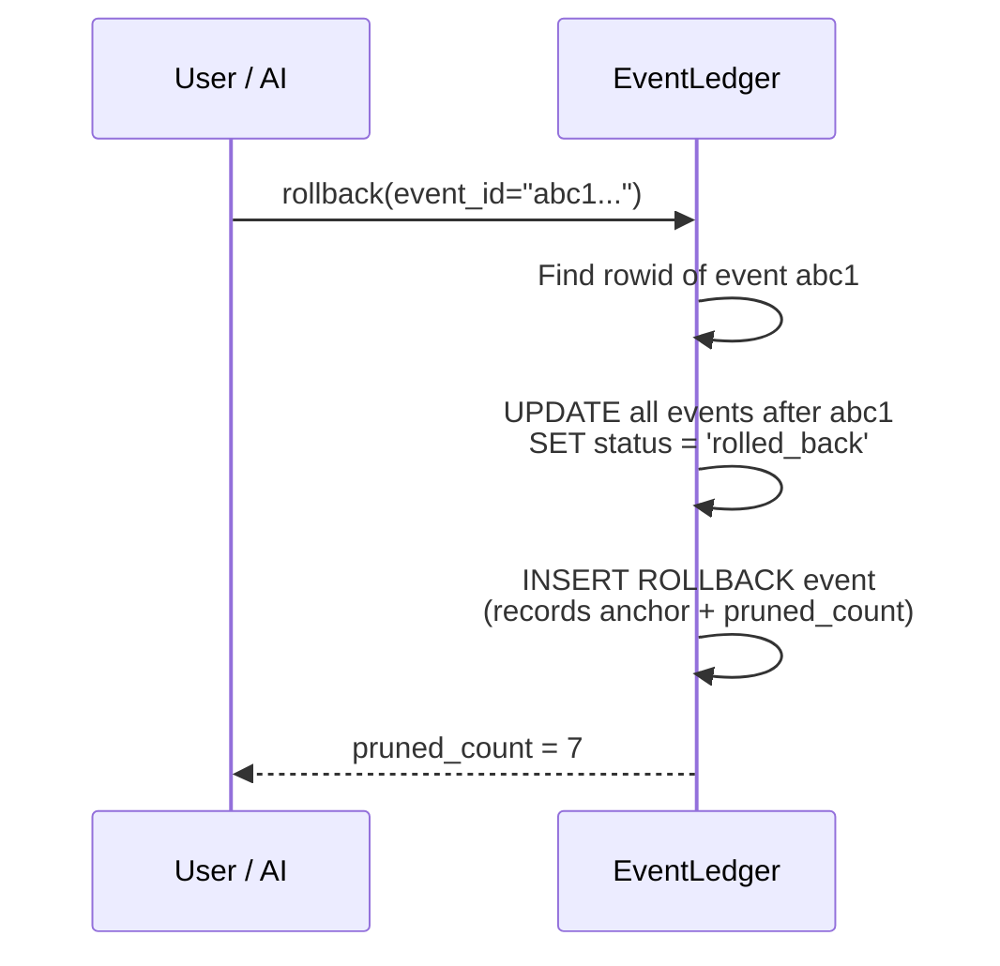

**What rollback does NOT do:**
- It does **not** touch `decision_nodes` or `tasks` tables
- It does **not** physically delete events — they remain in the database with `status='rolled_back'`
- It does **not** undo external effects (API calls made by agents, files written to disk)

**Known architectural gap:** After rollback, the `events` table and `decision_nodes` table can be out of sync. Use `deprecate_decision` to manually mark decision nodes as superseded after a ledger rollback. A future `rollback_graph(event_id)` tool could synchronize both atomically.

---

### 32. What are the biggest architectural trade-offs made in ContextForge?

| Decision | What was chosen | What was traded off |
|---|---|---|
| **SQLite over PostgreSQL** | Zero-config local-first storage; works on every developer machine | Single-writer bottleneck; not suitable for high-concurrency multi-host writes |
| **Append-only ledger** | Complete audit trail; tamper detection; rollback without schema changes | Storage grows monotonically; GC requires archiving to `historical_nodes` |
| **Word-level entropy gate (PAPER)** | Reproducible paper baseline; simple, fast, no dependencies | 64% FPR on edge cases; EXPERIMENT mode uses char-level entropy (18% FPR) |
| **OR-gate defense (any pass blocks)** | Maximizes adversarial recall (90%+) | Amplifies FPR — EXPERIMENT mode's soft Pass 2 reduces this without sacrificing recall |
| **MCP-native design** | Zero client-side code changes; works with any MCP IDE immediately | Requires MCP client support; custom agents need MCP SDK |
| **Offline-first** | No cloud dependency; data never leaves device | No built-in multi-device sync without SSE or snapshot workflow |
| **Python + TypeScript dual stack** | TypeScript for broader IDE compatibility; Python for full security stack | Maintaining two implementations; TypeScript server lacks ReviewerGuard |
| **Passive MCP mode vs autonomous agents** | MCP mode is predictable and integrates with existing AI clients | MCP mode doesn't auto-capture — requires explicit AI tool calls |

---

### 33. How does ContextForge handle outdated or conflicting decisions?

Four mechanisms:

**1. `deprecate_decision(node_id, reason, replacement_id)`** — Marks a node `deprecated` with a reason and optional pointer to its replacement. Deprecated nodes do not appear in `load_context` results but remain visible in `list_decisions`.

**2. `link_decisions(source_id, target_id, relationship)`** — Creates a typed edge between decisions (e.g., `"supersedes"`, `"depends_on"`, `"contradicts"`). Enables graph traversal to understand decision lineage.

**3. Historian GC (`@historian gc` in agent mode)** — The `HistorianAgent` scans all active nodes and computes pairwise Jaccard similarity. Nodes with J ≥ 0.53 are considered duplicates; the lower-confidence node is archived to `historical_nodes`. This keeps the active graph clean without human intervention.

**4. Shadow-Reviewer (agent mode only)** — Before a new node is approved, the `ShadowReviewer` computes cosine similarity between the new node's rationale and all existing active nodes. If it finds a contradiction (similarity < τ = 0.78 with an opposing node), it issues `REVISION_NEEDED`. This prevents conflicting decisions from coexisting in the graph.

---

### 34. What security risks exist when exposing the MCP server?

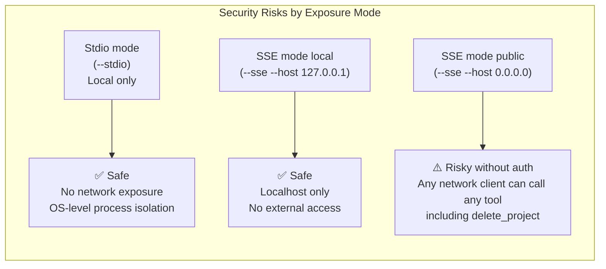

**Specific risks and mitigations:**

| Risk | Severity | Mitigation |
|---|---|---|
| **No auth on SSE** — anyone on the network can call any tool | High | Add nginx/Caddy reverse proxy with auth before exposing `--host 0.0.0.0` |
| **`skip_guard=True` on snapshot replay** — events skip ReviewerGuard on restore | Medium | Only replay snapshots you created yourself; validate `.forge` checksum |
| **Missing `PROJECT_CHARTER.md`** — ReviewerGuard goes inactive | Medium | Keep the charter in the project root; check on server startup |
| **`delete_project(archive_nodes=False)`** — permanent data loss | Medium | Always `snapshot` before destructive operations |
| **`merge_projects`** — source project deleted | Medium | Always `snapshot` before destructive operations |
| **`FORGE_SNAPSHOT_KEY` in `.env`** — committed to git by mistake | High | `.env` is in `.gitignore`; double-check with `git status` before push |
| **TypeScript server has no ReviewerGuard** — direct SQLite writes | Low (local trust) | Use Python server in any environment where charter enforcement matters |

---

### 35. How does ContextForge compare to tools like LangChain memory or vector databases?

| | **CLAUDE.md** | **LangChain Memory** | **MemGPT / Letta** | **Vector DB (Pinecone/Chroma)** | **ContextForge** |
|---|:---:|:---:|:---:|:---:|:---:|
| **Setup** | None | Python SDK | Python SDK | Cloud account or self-host | MCP server |
| **Storage** | Flat text | In-memory / Redis | SQLite | Cloud or local | SQLite (local-first) |
| **Retrieval** | Load all | Keyword / embedding | Hierarchical paging | Vector similarity | BM25 + cosine + DCI |
| **Token cost as project grows** | Linear ↑ | Configurable window | Managed by OS paging | Pay per query | Flat (capped top_k) |
| **Audit trail** | ❌ | ❌ | Partial | ❌ | ✅ SHA-256 hash chain |
| **Rollback** | Manual git | ❌ | ❌ | ❌ | ✅ by event_id or timestamp |
| **Charter / safety guard** | ❌ | ❌ | ❌ | ❌ | ✅ 3-pass defense |
| **Adversarial block rate** | 0% | ~0% | ~0% | 0% | **90%** (n=10 seeds) |
| **Works without cloud** | ✅ | Partial | ✅ | Ollama only | ✅ |
| **MCP-native** | N/A | ❌ | ❌ | ❌ | ✅ |
| **Multi-project** | ❌ | Manual | ❌ | Namespaces | ✅ project_id |
| **Encrypted snapshot** | ❌ | ❌ | ❌ | ❌ | ✅ AES-256-GCM |
| **Cost** | Free | Free | Free | $70+/mo cloud | **Free** |

**vs LangChain Memory:** `ConversationBufferMemory` loads the full history. `ConversationSummaryMemory` truncates with an LLM call (costs tokens to reduce tokens). Neither has an audit trail, charter guard, or rollback.

**vs MemGPT/Letta:** Conceptually closest — both do hierarchical memory paging. MemGPT requires its own agent loop; ContextForge exposes memory as MCP tools so any existing AI client can use it without changing its architecture. MemGPT has no hash-chain audit trail or charter guard.

**vs Vector DBs:** These are retrieval-only. No structured decisions, no tasks, no ledger, no rollback. ContextForge's `search_context` (LocalIndexer with sentence-transformers) covers the same use case for project-scale file search. For millions of vectors, a dedicated vector DB is the right tool; ContextForge is optimized for project-scale context (thousands of decisions).

---

### 36. Is ContextForge scalable for large projects or teams?

**For large projects:** SQLite handles millions of rows efficiently for read-heavy workloads.

| Scale | Expected behavior |
|---|---|
| < 10,000 decisions | All tools instant |
| 10,000–100,000 decisions | `load_context(top_k=10)` still < 5 ms (indexed) |
| > 100,000 decisions | Use `area` filters in `load_context` to limit result set |
| File search index | TF-IDF: ~50k chunks; sentence-transformers: scales further |
| SQLite concurrent writes | WAL mode: one writer at a time, unlimited readers |

**For teams:** The SSE transport (`--sse`) supports multiple simultaneous IDE clients against one shared SQLite instance. SQLite WAL serializes writes safely. For high-frequency concurrent writes from multiple machines, switch to the PostgreSQL backend (same `StorageAdapter` interface).

OR-Set CRDT mode (`CRDT_SYNC_MODE=or_set`) supports offline-first concurrent edits with convergent merge — designed for small teams (3–10 IDE clients). Gossip complexity is O(n²) in replicas; a delta-CRDT variant for larger teams is planned.

---

### 37. What is the long-term vision for ContextForge?

From the research paper (`research/contextforge_v2.tex`, §Future Work) and the architecture roadmap:

**Near-term (planned):**
- **Semantic L3 cache** — Replace recency-ranked research nodes with a FAISS-backed embedding index for true semantic similarity search over the full graph
- **Delta-CRDT sync** — Current gossip ships full replica state; delta-CRDT would ship only changed add-tags since last sync (O(Δ|S|) per round instead of O(|S|))
- **Online perplexity recalibration** — Update the trigram language model incrementally as the knowledge graph grows, adapting the threshold to domain drift without manual intervention
- **Automated entropy threshold recalibration** — Run the two-phase calibration sweep automatically at deployment time to adapt H\* to non-English or high-entropy technical domains

**Architectural improvements:**
- **Character-level entropy gate** — ✅ **Implemented** in `CF_MODE=experiment` (Suite 14 shows −46 pp edge-case FPR reduction)
- **Cross-process VOH** — HMAC token verification across process boundaries (currently in-process only) using a shared secret store or asymmetric token scheme
- **`rollback_graph(event_id)` tool** — Atomic rollback of both the event ledger and `decision_nodes` table (current gap: rollback only affects the ledger)

**Deployment improvements:**
- **Packaged installer** — One-command install via `pipx` or a standalone binary, eliminating the background-process requirement and lowering adoption friction
- **React dashboard (port 3777)** — Visual knowledge graph browser, agent activity feed, real-time CRDT convergence status
- **PostgreSQL first-class support** — Promote the PostgreSQL backend to default for team deployments

**Vision:** A standard, model-agnostic, adversarially-hardened memory protocol that any AI coding tool can adopt with zero client-side changes — the same way any browser adopted HTTP. The MCP standard makes this possible today; ContextForge is the reference implementation.

---

## Architecture Deep-Dive

ContextForge has **five architectural pillars**, each a standalone module:

| Pillar | File | What it does |
|---|---|---|
| **Transport** | `mcp/server.py`, `mcp/index.ts` | Exposes 22 tools over Stdio (local) or SSE/HTTP (remote) |
| **Router** | `src/router/nexus_router.py` | Tri-core LLM failover: Groq → Gemini → Ollama + circuit breaker |
| **Memory** | `src/memory/ledger.py` | Append-only event log with SHA-256 hash chain and charter guard |
| **Retrieval** | `src/retrieval/local_indexer.py` + `jit_librarian.py` | Local-edge RAG with DCI gate — zero cloud tokens |
| **Sync** | `src/sync/fluid_sync.py` | AES-256-GCM encrypted snapshots + 15-minute idle checkpoint |

On top of these pillars sits an **8-agent RAT engine** (Reasoning · Auditing · Tracking) for the interactive `python main.py` mode.

---

## Data Flow — What Happens When You Call `capture_decision`

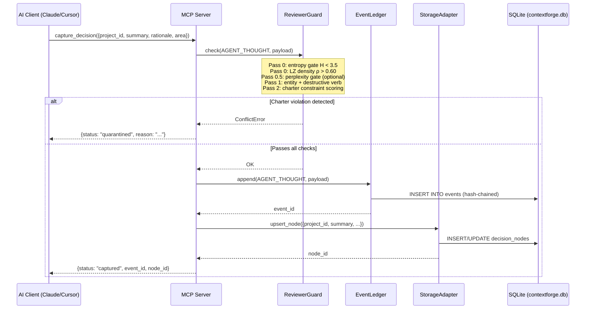

---

## With API Keys vs Without API Keys

ContextForge is fully functional without any API keys. Here is exactly what changes:

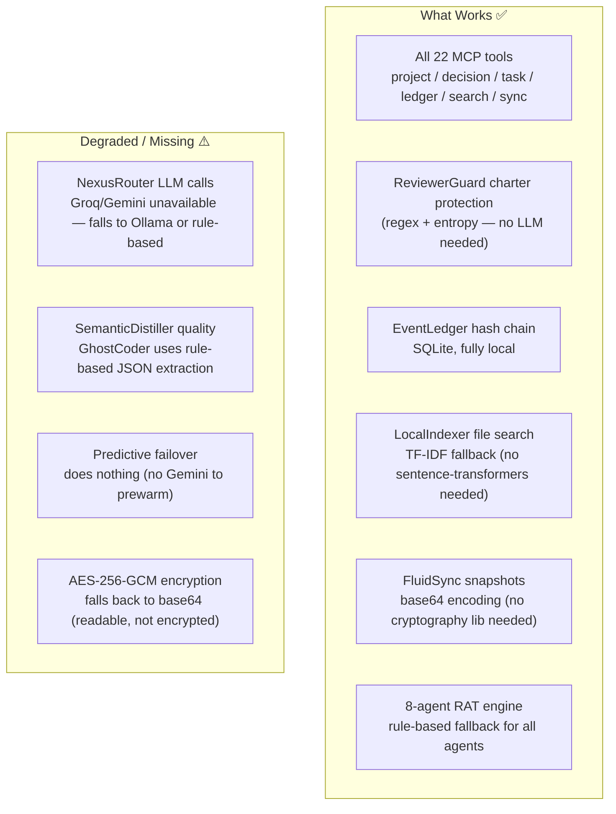

| Feature | No API keys | GROQ_API_KEY | GEMINI_API_KEY | Both |
|---|:---:|:---:|:---:|:---:|
| MCP tools (all 22) | ✅ | ✅ | ✅ | ✅ |
| Charter guard | ✅ | ✅ | ✅ | ✅ |
| Hash chain / ledger | ✅ | ✅ | ✅ | ✅ |
| File search (TF-IDF) | ✅ | ✅ | ✅ | ✅ |
| Snapshot encryption | base64 | base64 | base64 | AES-256-GCM |
| LLM distillation | rule-based | Llama-3.3-70B | Gemini 2.5 Flash | Groq primary + Gemini fallback |
| Predictive failover | ❌ | ❌ | ❌ | ✅ |

**Recommended setup for most users:** Set `GROQ_API_KEY` only. Groq's free tier covers all agent calls with sub-second latency.

---

## The Three-Tier Memory

Every `load_context` query goes through a cascade:

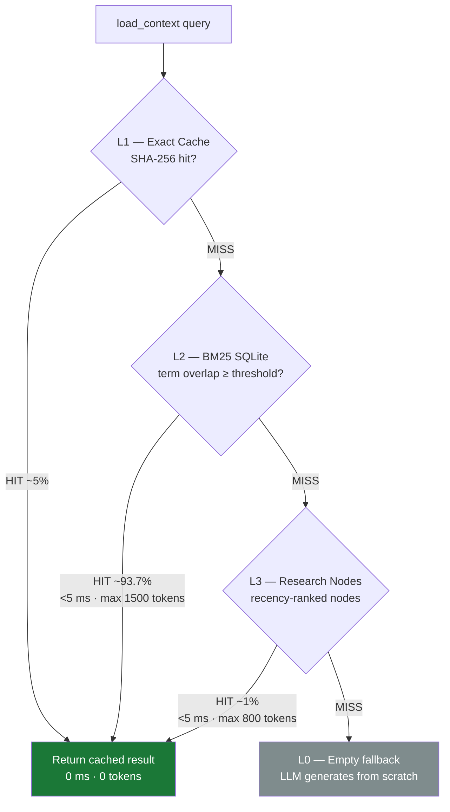

---

## Security — What Guards Each Layer

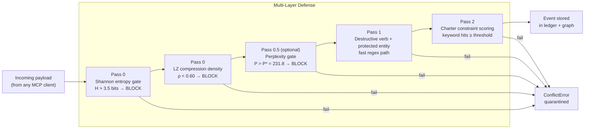

**What to be careful about:**

1. **`PROJECT_CHARTER.md` is the security ground truth.** If you delete it, ReviewerGuard goes inactive.
2. **`FORGE_SNAPSHOT_KEY` in `.env`.** Without this, snapshots fall back to base64.
3. **`skip_guard=True` in `replay_from_snapshot`.** Only replay snapshots you created yourself.
4. **`merge_projects` is irreversible.** Always `snapshot` first.
5. **`delete_project(archive_nodes=False)`** permanently destroys all nodes with no recovery path.
6. **No authentication on the SSE transport.** Add a reverse proxy with auth before exposing `--sse` remotely.

---

## Real Example — Starting a Project from Scratch

### Step 1: Start the MCP server

```bash
python mcp/server.py --stdio
```

The server:
- Creates `data/contextforge.db` if it doesn't exist, runs schema migrations
- Initializes `EventLedger` (reads `PROJECT_CHARTER.md`, loads constraints into `ReviewerGuard`)
- Initializes `LocalIndexer` (crawls `src/`, `mcp/`, `docs/` — builds TF-IDF index)
- Starts `FluidSync` idle watcher (15-min timer begins)
- Registers 22 MCP tools and waits for JSON-RPC frames on stdin

### Step 2: Create your project

```json
{"tool": "init_project", "arguments": {
  "project_id": "my-saas-app",
  "name": "My SaaS App",
  "project_type": "code",
  "description": "A subscription SaaS built on FastAPI + React",
  "goals": ["Launch MVP in 3 months", "100 paying users by Q3"],
  "tech_stack": {"backend": "FastAPI", "frontend": "React", "db": "PostgreSQL"}
}}
```

### Step 3: Capture a decision

```json
{"tool": "capture_decision", "arguments": {
  "project_id": "my-saas-app",
  "summary": "Use Stripe for payment processing instead of Paddle",
  "rationale": "Stripe has better FastAPI SDK, lower fees for international users",
  "area": "payments",
  "alternatives": ["Paddle — simpler tax handling", "LemonSqueezy — flat fee"],
  "confidence": 0.9
}}
```

**ReviewerGuard check on this payload:**
```
H   = 3.12 bits ✅  (< 3.5 — not obfuscated)
ρ   = 0.71       ✅  (> 0.60 — not repetitive)
No destructive verb ✅
Charter: 0 hits ✅
→ stored in 2 ms, zero tokens
```

### Step 4: Come back next session

```json
{"tool": "load_context", "arguments": {
  "project_id": "my-saas-app",
  "detail_level": "L2",
  "query": "payments"
}}
```

Returns project metadata + all decisions matching "payments" — everything the AI needs to continue where you left off, in ≈ 700 tokens.

### Where all your data lives

| Data | Location | Format | Notes |
|---|---|---|---|
| Projects | `data/contextforge.db` → `projects` | SQLite | Created on first `init_project` |
| Decisions | `data/contextforge.db` → `decision_nodes` | SQLite | Full text searchable |
| Tasks | `data/contextforge.db` → `tasks` | SQLite | Status: pending/in_progress/done |
| Event log | `data/contextforge.db` → `events` | SQLite, hash-chained | Append-only, auditable |
| Archives | `data/contextforge.db` → `historical_nodes` | SQLite | Deprecated/merged decisions |
| Snapshots | `.forge/*.forge` | Encrypted ZIP | Portable across machines |
| File index | `.forge/embeddings.npz` + `.forge/index_meta.json` | numpy / JSON | Rebuilt on file changes |

---

## ContextForge vs Traditional Approaches

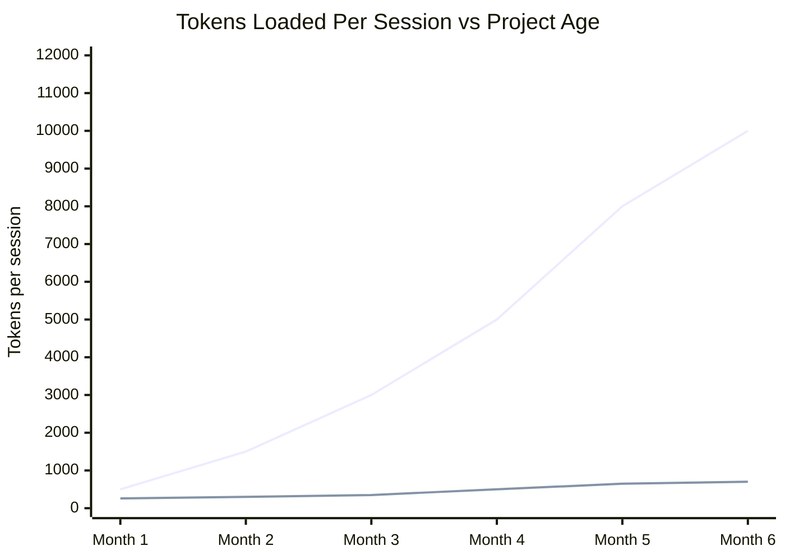

| Capability | CLAUDE.md / Flat file | ContextForge |
|---|:---:|:---:|
| Zero setup | ✅ | ❌ requires MCP server |
| Query-scoped retrieval | ❌ always loads all | ✅ top_k + area filter |
| Token cost stays flat as project grows | ❌ grows linearly | ✅ capped |
| Tamper-evident audit trail | ❌ | ✅ hash chain |
| Time-travel rollback | ❌ | ✅ by event_id |
| Charter enforcement | ❌ | ✅ ReviewerGuard |
| Multi-project isolation | ❌ | ✅ project_id |
| Encrypted portable backup | ❌ | ✅ AES-256-GCM |

---

## Quick Reference — All 22 MCP Tools

| Category | Tool | What it does |
|---|---|---|
| **Project** | `list_projects` | List all projects |
| | `init_project` | Create / update a project |
| | `rename_project` | Rename display name (slug unchanged) |
| | `merge_projects` | Merge source into target (irreversible) |
| | `delete_project` | Delete project, optionally archive nodes |
| | `project_stats` | Node/task count breakdown |
| **Decision** | `capture_decision` | Save a decision through ReviewerGuard |
| | `load_context` | L0/L1/L2 context for a project |
| | `get_knowledge_node` | Keyword search over decisions |
| | `list_decisions` | List with area/status filters |
| | `update_decision` | Edit summary, rationale, area, confidence |
| | `deprecate_decision` | Mark deprecated with reason + replacement |
| | `link_decisions` | Create typed edge between two decisions |
| **Task** | `list_tasks` | List tasks (filter by status) |
| | `create_task` | Create a new task |
| | `update_task` | Update task status |
| **Ledger** | `rollback` | Time-travel undo by event_id or timestamp |
| | `snapshot` | AES-256-GCM encrypted checkpoint |
| | `list_snapshots` | List all `.forge` snapshot files |
| | `replay_sync` | Restore from a `.forge` snapshot |
| | `list_events` | Inspect the append-only event log |
| **Search** | `search_context` | Semantic search over local files |

---

## What to Be Careful About

1. **Never delete `data/contextforge.db`** without a snapshot. This is your entire knowledge graph.
2. **Never delete `PROJECT_CHARTER.md`** — the charter guard goes inactive without it.
3. **Never set `DB_PATH` to a shared network drive** — SQLite is not safe for concurrent multi-host writes.
4. **Never expose `--sse` without a reverse proxy auth layer** on a networked machine.
5. **`merge_projects` and `delete_project` are permanent** — take a `snapshot` before using them.
6. **The `FORGE_SNAPSHOT_KEY` must not change** once snapshots exist — old snapshots are unreadable with a new key.
7. **Do not commit `data/contextforge.db` to git** — it contains your full decision history. `.gitignore` excludes it, but double-check with `git status` before pushing.
