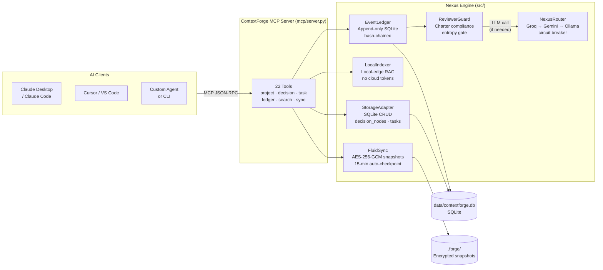
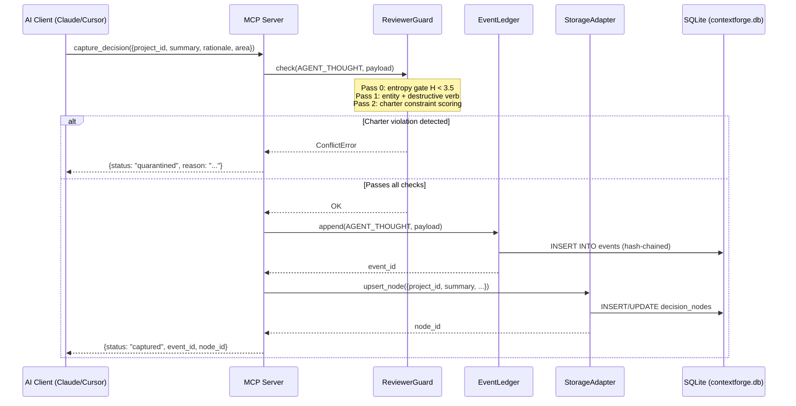
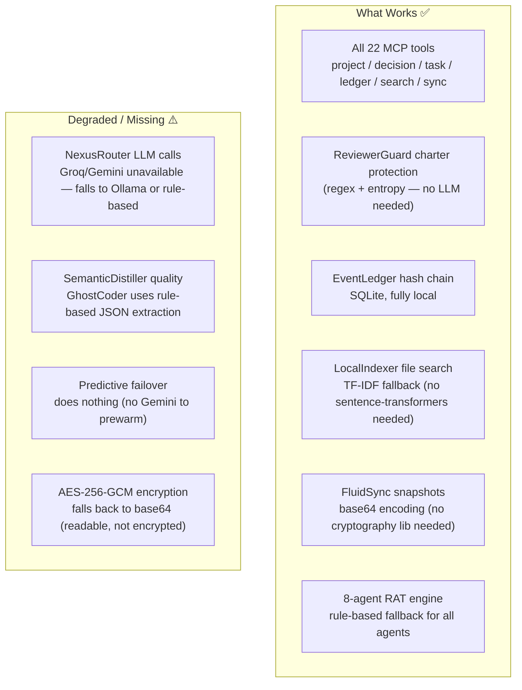
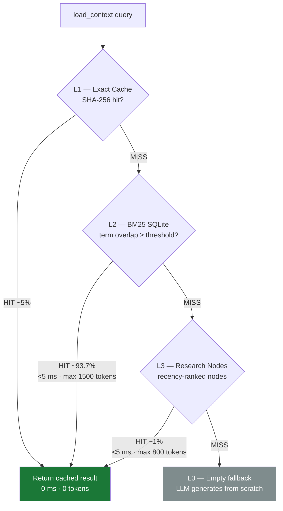
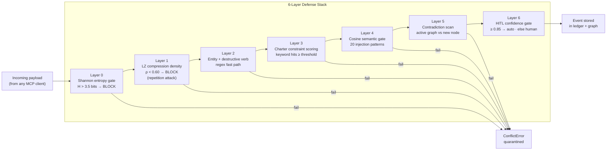
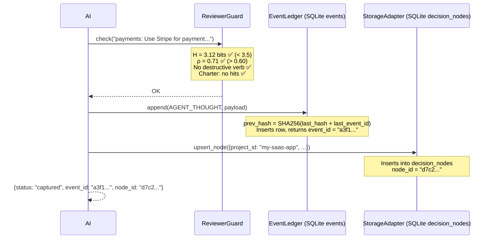

# What Is ContextForge?

> **Author:** Trilochan Sharma — [parnish007](https://github.com/parnish007)

ContextForge is a **local-first memory server for AI agents**. It speaks the [Model Context Protocol (MCP)](https://modelcontextprotocol.io), which means any MCP-compatible AI client — Claude Desktop, Cursor, VS Code Copilot — can call its tools to save decisions, retrieve context, manage tasks, and take encrypted snapshots across sessions and projects.

---

## The Problem It Solves

Every time you start a new conversation with an AI assistant, it forgets everything from the last one. You repeat yourself. You paste the same context. You lose architectural decisions, research findings, and task history.

ContextForge fixes that by acting as persistent, tamper-evident memory between you and any AI client. The AI calls `capture_decision` to save what it decided and why. It calls `load_context` to get that memory back in the next session. All stored locally — no cloud, no subscription.

---

## How It Works — Top Level



---

## Architecture Deep-Dive

ContextForge has **five architectural pillars**, each a standalone module:

| Pillar | File | What it does |
|--------|------|-------------|
| **Transport** | `src/transport/server.py` | Exposes tools over Stdio (local) or SSE/HTTP (remote) |
| **Router** | `src/router/nexus_router.py` | Routes LLM calls with circuit breakers and predictive failover |
| **Memory** | `src/memory/ledger.py` | Append-only event log with SHA-256 hash chain and charter guard |
| **Retrieval** | `src/retrieval/local_indexer.py` | Semantic file search — runs entirely on your machine |
| **Sync** | `src/sync/fluid_sync.py` | AES-256-GCM encrypted snapshots + 15-minute idle checkpoint |

On top of these pillars sits an **8-agent RAT engine** (Reasoning · Auditing · Tracking) for the interactive `python main.py` mode.

---

## Data Flow — What Happens When You Call `capture_decision`



---

## With API Keys vs Without API Keys

ContextForge is fully functional without any API keys. Here is exactly what changes:

### Without any API keys (fully offline)



| Feature | No API keys | GROQ_API_KEY | GEMINI_API_KEY | Both |
|---------|:-----------:|:------------:|:--------------:|:----:|
| MCP tools (all 22) | ✅ | ✅ | ✅ | ✅ |
| Charter guard | ✅ | ✅ | ✅ | ✅ |
| Hash chain / ledger | ✅ | ✅ | ✅ | ✅ |
| File search (TF-IDF) | ✅ | ✅ | ✅ | ✅ |
| File search (semantic) | requires `sentence-transformers` | same | same | same |
| Snapshot encryption | base64 | base64 | base64 | AES-256-GCM |
| LLM distillation | rule-based | Llama-3.3-70B | Gemini 2.5 Flash | Groq primary + Gemini fallback |
| Predictive failover | ❌ | ❌ | ❌ | ✅ |
| Cost per session | $0 | ~$0.001 | ~$0.001 | ~$0.002 |

**Recommended setup for most users:** set `GROQ_API_KEY` only. Groq's free tier is generous and covers all agent calls with sub-second latency.

For snapshot encryption, install `cryptography` (`pip install cryptography`) and set `FORGE_SNAPSHOT_KEY` in `.env`.

---

## The Three-Tier Memory

Every query goes through a cascade before hitting the LLM:



The local file indexer (`search_context`) runs **before** this — it pre-filters your codebase with cosine similarity (≥ 0.75) so the LLM only sees precise, relevant diffs, not whole files.

---

## Security — What Could Go Wrong and What Guards It



**What to be careful about:**

1. **`PROJECT_CHARTER.md` is the security ground truth.** If you delete it, `ReviewerGuard` goes inactive (no charter = no constraint check). Keep it.
2. **`FORGE_SNAPSHOT_KEY` in `.env`.** Without this env var, snapshots fall back to base64 — readable by anyone who can access your `.forge/` directory.
3. **`skip_guard=True` in `replay_from_snapshot`.** When replaying a `.forge` snapshot, events skip the guard on the assumption they were already validated on the originating device. Only replay snapshots you created yourself.
4. **The `merge_projects` tool is irreversible.** The source project is deleted. Always `snapshot` first.
5. **`delete_project` with `archive_nodes=False`** permanently destroys all nodes with no recovery path.
6. **No authentication on the MCP server.** The server assumes localhost trust. If you expose the SSE port (`--sse --host 0.0.0.0`) on a networked machine, add a reverse proxy with auth in front of it.

---

## Real Example — Starting a Project from Scratch

This walks through exactly what happens, and where every piece of data ends up.

### Step 1: Start the MCP server

```bash
python mcp/server.py --stdio
```

The server:
- Creates `data/contextforge.db` (SQLite) if it doesn't exist, runs schema migrations
- Initializes `EventLedger` (reads `PROJECT_CHARTER.md`, loads 11+ constraints into `ReviewerGuard`)
- Initializes `LocalIndexer` (crawls `src/`, `mcp/`, `docs/` — builds TF-IDF or sentence-transformer index, saved to `.forge/`)
- Starts `FluidSync` idle watcher thread (15-min timer begins)
- Registers 22 MCP tools and waits for JSON-RPC frames on stdin

### Step 2: Create your project

Your AI client calls:

```json
{"tool": "init_project", "arguments": {
  "project_id": "my-saas-app",
  "name": "My SaaS App",
  "project_type": "code",
  "description": "A subscription SaaS built on FastAPI + React",
  "goals": ["Launch MVP in 3 months", "100 paying users by Q3"],
  "tech_stack": {"backend": "FastAPI", "frontend": "React", "db": "PostgreSQL"}
}}
```

**What gets saved:**

In `data/contextforge.db`, table `projects`:
```
id          = "my-saas-app"
name        = "My SaaS App"
project_type= "code"
description = "A subscription SaaS built on FastAPI + React"
goals       = '["Launch MVP in 3 months", "100 paying users by Q3"]'
tech_stack  = '{"backend": "FastAPI", ...}'
created_at  = "2026-04-13T12:00:00Z"
```

### Step 3: Capture a decision

```json
{"tool": "capture_decision", "arguments": {
  "project_id": "my-saas-app",
  "summary": "Use Stripe for payment processing instead of Paddle",
  "rationale": "Stripe has better FastAPI SDK, lower fees for international users",
  "area": "payments",
  "alternatives": ["Paddle — simpler tax handling", "LemonSqueezy — flat fee"],
  "confidence": 0.9
}}
```

**What happens step by step:**



**Data saved in `data/contextforge.db`:**

Table `events`:
```
event_id   = "a3f1..."
event_type = "AGENT_THOUGHT"
content    = '{"text": "payments: Use Stripe...", "project_id": "my-saas-app", ...}'
status     = "active"
prev_hash  = "SHA256 of previous event"
project_id = "my-saas-app"
created_at = "2026-04-13T12:01:00Z"
```

Table `decision_nodes`:
```
id         = "d7c2..."
project_id = "my-saas-app"
area       = "payments"
summary    = "Use Stripe for payment processing instead of Paddle"
rationale  = "Stripe has better FastAPI SDK..."
alternatives = '["Paddle — simpler tax handling", "LemonSqueezy — flat fee"]'
confidence = 0.9
status     = "active"
created_at = "2026-04-13T12:01:00Z"
```

### Step 4: Come back next week — load context

```json
{"tool": "load_context", "arguments": {
  "project_id": "my-saas-app",
  "detail_level": "L2",
  "query": "payments"
}}
```

Returns all project metadata + filtered decision nodes matching "payments", with full rationale and alternatives — everything the AI needs to continue where you left off.

### Step 5: Auto-checkpoint (happens automatically)

After 15 minutes of idle time, `FluidSync` fires:
- Exports all `active` events from the ledger
- Creates `.forge/snapshot_20260413_120000_auto_idle.forge` (AES-256-GCM if `FORGE_SNAPSHOT_KEY` is set, base64 otherwise)
- Appends a `CHECKPOINT` event to the ledger

You can also trigger this manually:
```json
{"tool": "snapshot", "arguments": {"label": "before-payment-refactor"}}
```

### Where all your data lives

| Data | Location | Format | Notes |
|------|----------|--------|-------|
| Projects | `data/contextforge.db` → `projects` | SQLite | Created on first `init_project` |
| Decisions | `data/contextforge.db` → `decision_nodes` | SQLite | Full text searchable |
| Tasks | `data/contextforge.db` → `tasks` | SQLite | Status: pending/in_progress/done |
| Event log | `data/contextforge.db` → `events` | SQLite, hash-chained | Append-only, auditable |
| Archives | `data/contextforge.db` → `historical_nodes` | SQLite | Deprecated/merged decisions |
| Snapshots | `.forge/*.forge` | Encrypted ZIP | Portable across machines |
| File index | `.forge/embeddings.npz` + `.forge/index_meta.json` | numpy / JSON | Rebuilt on file changes |
| Audit log | `data/contextforge.db` → `audit_log` | SQLite | Hash-chained writes |

**To back up everything:** copy `data/contextforge.db` and `.forge/`.  
**To move to a new machine:** copy both, run `replay_sync` with your latest `.forge` snapshot.

---

## Pros and Cons

### Pros

| | |
|---|---|
| **Truly local-first** | All decision data stays on your machine. No vendor lock-in, no cloud accounts, no data leaving your network. |
| **Works without API keys** | Full MCP functionality with rule-based fallback. Ollama brings free local LLM support. |
| **Tamper-evident ledger** | SHA-256 hash chain means you can verify no events were silently deleted between any two known points. |
| **Multi-project isolation** | All data is scoped by `project_id`. One ContextForge instance serves unlimited projects simultaneously. |
| **Charter-enforced safety** | `PROJECT_CHARTER.md` is machine-enforced — agents cannot commit decisions that contradict it. |
| **Graceful degradation** | Every dependency (sentence-transformers, cryptography, groq, gemini) has an offline fallback. Nothing hard-fails. |
| **Time-travel rollback** | Roll back the ledger to any point in time, per project. |
| **MCP standard** | Works with any MCP client: Claude Desktop, Cursor, VS Code, custom scripts. |

### Cons / Honest Limitations

| | |
|---|---|
| **Single-writer SQLite** | SQLite WAL allows concurrent reads, but only one writer at a time. Not suitable for multi-process high-throughput writes. |
| **No vector search (yet)** | `search_context` uses TF-IDF or sentence-transformers cosine similarity — not a dedicated vector database. Scales to ~50k chunks before latency degrades. |
| **No auth on SSE transport** | The `--sse` HTTP server has no built-in authentication. Add a reverse proxy (nginx + basic auth, or Cloudflare Tunnel) before exposing it remotely. |
| **Charter guard is keyword-based** | ReviewerGuard catches explicit destructive language. It does not catch subtle semantic drift or multi-step Jailbreaks. The Shadow-Reviewer (agent mode) adds cosine-semantic checking, but this only runs in `python main.py` mode, not the MCP server. |
| **L1 cache is in-process** | The SHA-256 exact cache lives in Python's dict — it resets every time the MCP server restarts. Long-running servers benefit from it; short-lived CLI invocations don't. |
| **LLM calls are sequential** | The router tries providers in order (Groq → Gemini → Ollama), not in parallel. Tail latency on failures is cumulative. |
| **TypeScript server is partial** | `mcp/index.ts` has 12 of 22 tools. If you're using the TypeScript server path, `merge_projects`, `delete_project`, `deprecate_decision`, and others are not yet available. |

---

## What to Be Careful About

1. **Never delete `data/contextforge.db`** without a snapshot. This is your entire knowledge graph.
2. **Never delete `PROJECT_CHARTER.md`** — the charter guard goes inactive without it, removing the safety layer.
3. **Never set `DB_PATH` to a shared network drive** — SQLite is not safe for concurrent multi-host writes.
4. **Never expose `--sse` without a reverse proxy auth layer** on a networked or cloud machine.
5. **`merge_projects` and `delete_project` are permanent** — take a `snapshot` before using them.
6. **The `FORGE_SNAPSHOT_KEY` must not change** once snapshots exist — old snapshots are unreadable with a new key.
7. **Do not commit `data/contextforge.db` to git** — it contains your full decision history. The `.gitignore` excludes it (`data/*.db`), but double-check with `git status` before pushing.

---

## Quick Reference — All 22 MCP Tools

| Category | Tool | What it does |
|----------|------|-------------|
| **Project** | `list_projects` | List all projects |
| | `init_project` | Create / update a project |
| | `rename_project` | Rename display name (slug unchanged) |
| | `merge_projects` | Merge source into target (irreversible) |
| | `delete_project` | Delete project, optionally archive nodes |
| | `project_stats` | Node/task count breakdown |
| **Decision** | `capture_decision` | Save a decision through ReviewerGuard |
| | `load_context` | L0/L1/L2 context for a project |
| | `get_knowledge_node` | Keyword search over decisions |
| | `list_decisions` | List with area/status filters |
| | `update_decision` | Edit summary, rationale, area, confidence |
| | `deprecate_decision` | Mark deprecated with reason + replacement |
| | `link_decisions` | Create typed edge between two decisions |
| **Task** | `list_tasks` | List tasks (filter by status) |
| | `create_task` | Create a new task |
| | `update_task` | Update task status |
| **Ledger** | `rollback` | Time-travel undo by event_id or timestamp |
| | `snapshot` | AES-256-GCM encrypted checkpoint |
| | `list_snapshots` | List all `.forge` snapshot files |
| | `replay_sync` | Restore from a `.forge` snapshot |
| | `list_events` | Inspect the append-only event log |
| **Search** | `search_context` | Semantic search over local files |
